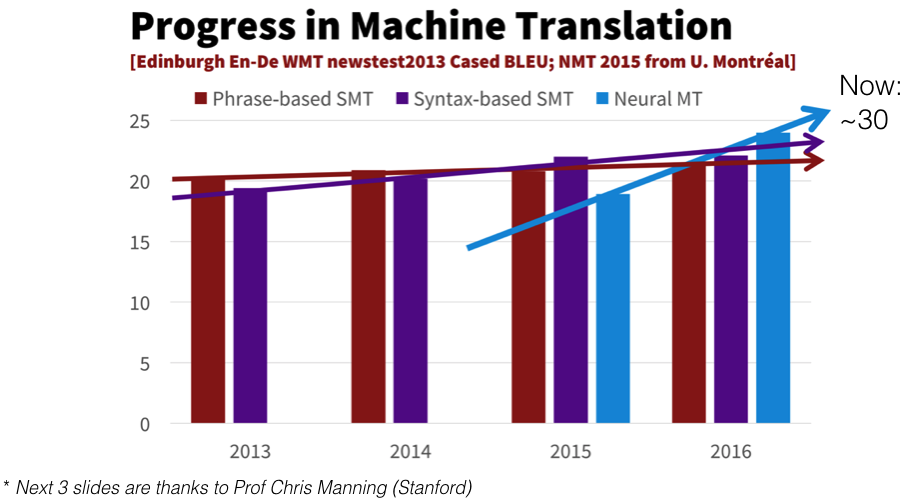
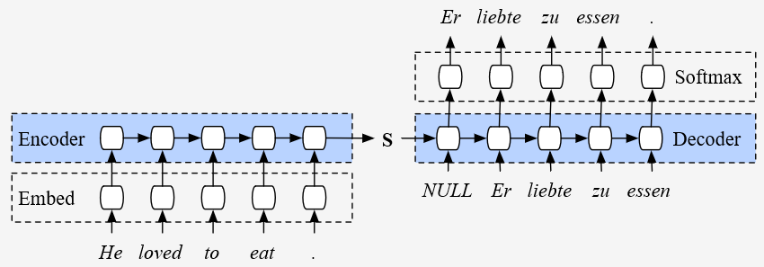
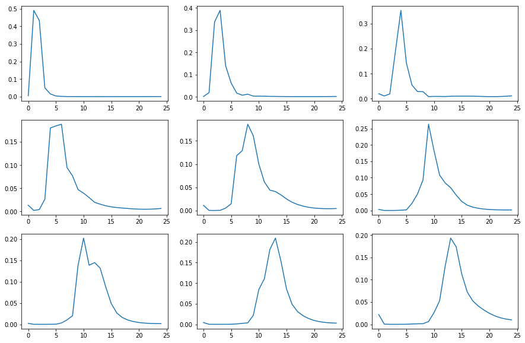
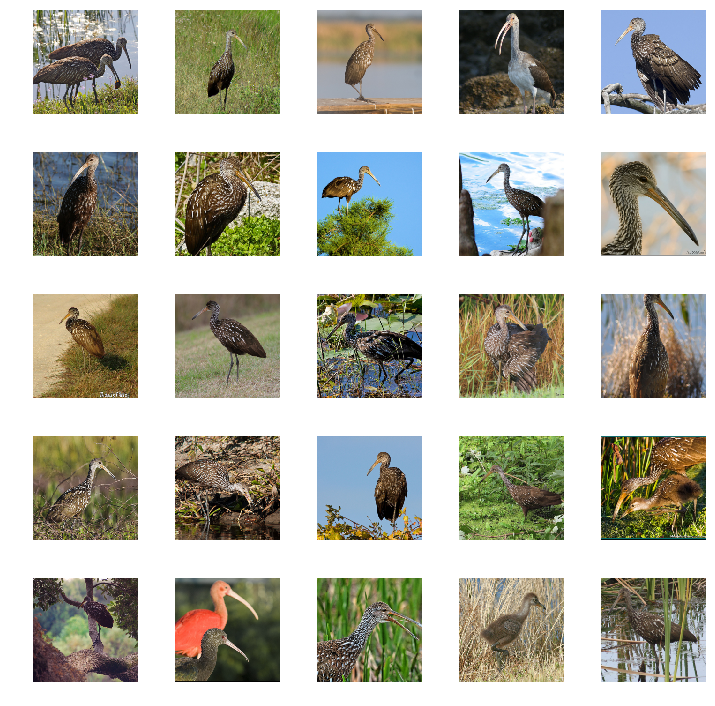
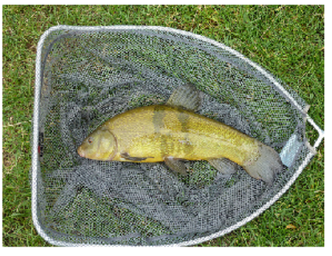

## Neural Machine Translation

In this lecture we're going to take a look into machine translation, the objective is to take a input sequence of a source langauge and outputing its translation in the target language, Machine translation has been around for a long time, but neural based machine translation only appeared a few years ago and it was not as good as the statistical machine translation approaches that use classic feature engineering and standard NLP approaches like stemming, fiddling around with word frequencies, n-grams, etc. But in recent years, the neural based methods surpased the more traditionnal ones, and their BLUE score is now getting better:

<p align="center">  </p>

In this lecture, we're going to use sequence to sequence model, in which we're going to encode the input sequence into a hidden representation, and pass this vector into the decoder network to then deocder the information in it the output the translation of the input sequence, but this type of network can be used in various types of applications, like video annotation, image captionning ...

#### Four big wins of Neural Machine Translation:

* End-to-end training: All the parameters are simultaneously optimized to minimise a loss function on the network's output.
* Distributed representation share stength, better exploitation of word and phrase similarities.
* Better exploitation of context, NMT can use much bigger context, both source and partial target text, to translate more accurately.
* More fluent text generation, deep learning text generation is much higher quality.

#### Application of BiLSTMs (& attention):

* Part of seepch tagging
* Named entity recognition
* Syntactic parsing (contituency & dependency)
* Reading comprehension
* Question anwsering
* Text summarization

### Translating French into English

We are going to try to translate French into English by following the standard neural network approach:

* Data
* Architecture
* Loss Function

### Data

As usual, we need `(x, y)` pairs. In this case, `x: French sentence`, `y: English sentence` which we will compare the model's predictions against. We need a lot of these tuples of French sentences with their equivalent English sentence, or what's called *parallel corpus*, which is harder to find than a corpus for a language model. For a language model, we just need text in some language, but for translation it's a bit harder, but there are some pretty good parallel corpus available for European languages. The European Parliament has every sentence in every European language. For French to English we can use some official canadian websites taht a have their content in both english and french, one of these datasets are the French/English parallel texts by Chris Callison-Burch: [link](http://www.statmt.org/wmt15/translation-task.html).

We then create the paths that hold the training data:

```python
PATH = Path('data/translate')
TMP_PATH = PATH/'tmp'
TMP_PATH.mkdir(exist_ok=True)
fname='giga-fren.release2.fixed'
en_fname = PATH/f'{fname}.en'
fr_fname = PATH/f'{fname}.fr'
```

Given that we're going to use a simple and small neural net, an RNN with two stacked layers (in comparaison, google uses an 8 layers RNN), we're going keep things simple, so rather than learning how to translate French into English for any sentence, we're going to learn to translate French questions into English questions, specifically questions that start with what/where/which/when. So here is a regex which looks for things that start with “wh” and end with a question mark, we go through the corpus, open up each of the two files, each line is one parallel text, zip them together, grab the English question and the French question, and check whether they match the regular expressions, and then add all the matched pairs into a list, and ofcourse we dump that out as a pickle so we don’t have to do it again,

```python
re_eq = re.compile('^(Wh[^?.!]+\?)')
re_fq = re.compile('^([^?.!]+\?)')

lines = ((re_eq.search(eq), re_fq.search(fq)) 
         for eq, fq in zip(open(en_fname, encoding='utf-8'), 
                           open(fr_fname, encoding='utf-8')))

qs = [(e.group(), f.group()) for e,f in lines if e and f]

pickle.dump(qs, (PATH/'fr-en-qs.pkl').open('wb'))
qs = pickle.load((PATH/'fr-en-qs.pkl').open('rb'))
```

And so now we have 52,000 sentence pairs and here are some examples:

```python
 [('What is light ?', 'Qu’est-ce que la lumière?'),
  ('Who are we?', 'Où sommes-nous?'),
  ('Where did we come from?', "D'où venons-nous?"), ...]
```

Note: Even if the question are generally sequences of limited size, the task of translation, from one language to an other with only 52,000 sentence pairs without any prior understanding of the taget and source langauge is quite a harde task to ask a neural net to do.

**Tokenization:** Now we msut construct the two vocabularies of the source and target language, we can unzip the list of pairs to get both the list of eng and fr question seperately, and then we can call the fastai Tokenizer, which is a wrapper over the spacy tokenizer; but to also tokenize the french sentences we need to first install the french model with the command: `python -m spacy download fr`, and then:

```python
en_tok = Tokenizer.proc_all_mp(partition_by_cores(en_qs))
fr_tok = Tokenizer.proc_all_mp(partition_by_cores(fr_qs), 'fr')
```

And here are the results of the tokenization process:

```python
en_tok[0], fr_tok[0]

(['what', 'is', 'light', '?'],
 ['qu’', 'est', '-ce', 'que', 'la', 'lumière', '?'])
```

We can see that the results of tokenization in english and french are quite different, if we use the same tokenizer we'll miss a lot of information in french, given that the apostrophes are par of the words unlike english, on a side there is some language in which we can directely use a tokenizer, like Chinese, one solution is to use [sentence piece](https://github.com/google/sentencepiece) which splits things into arbitrary sub-word.

Now we need to turn the examples into numerical values, in which each token in the sentence is reprented as its indices in the vocabulary, but first we'll only keep the small sentences, this is done by first finding the length of 90% of sentences, and then keeping the example that are less than 30 tokens, and save the results as pickles. 

```python
np.percentile([len(o) for o in en_tok], 90)
np.percentile([len(o) for o in fr_tok], 90)
# -> (23.0, 28.0)

keep = np.array([len(o)<30 for o in en_tok])
en_tok = np.array(en_tok)[keep]
fr_tok = np.array(fr_tok)[keep]

pickle.dump(en_tok, (PATH/'en_tok.pkl').open('wb'))
pickle.dump(fr_tok, (PATH/'fr_tok.pkl').open('wb'))

en_tok = pickle.load((PATH/'en_tok.pkl').open('rb'))
fr_tok = pickle.load((PATH/'fr_tok.pkl').open('rb'))
```

And then we turn every word into its index in the vocabulary. If there are more than 40,000 words that appear we're going to get rid of the less frequence words. We insert a few extra tokens for beginning of stream (`_bos_`), padding (`_pad_`), end of stream (`_eos_`), and unknown (`_unk_`). So if we try to look up something that wasn’t in the 40,000 most common, then we use a deraultdict to return 3 which is unknown, and we apply the same procedure for both the french and english corpuses, each one with their respective vocabularies, and save the results as per usual. We end up with an English vocab of 17,000 and our French vocab of 25,000, so that’s not too big and not too complex vocab that we are dealing with.

```python
def toks2ids(tok, pre):
   # count the token, for each token in each sentence in the examples
   freq = Counter(p for o in tok for p in o)
   # onlt create the indices for the 40000 most frequence words
   itos = [o for o,c in freq.most_common(40000)]
   # add the custom tokens
   itos.insert(0, '_bos_')
   itos.insert(1, '_pad_')
   itos.insert(2, '_eos_')
   itos.insert(3, '_unk')
   # create a string to index dict, with a default values of unk (3) for unfrequent words
   stoi = collections.defaultdict(lambda: 3, {v:k for k,v in enumerate(itos)})
   # convert all the token into their indices and add _eos_ token at the end of each sentence
   ids = np.array([([stoi[o] for o in p] + [2]) for p in tok])
   np.save(TMP_PATH/f'{pre}_ids.npy', ids)
   pickle.dump(itos, open(TMP_PATH/f'{pre}_itos.pkl', 'wb'))
   return ids, itos, stoi

en_ids, en_itos, en_stoi = toks2ids(en_tok, 'en')
fr_ids, fr_itos, fr_stoi = toks2ids(fr_tok, 'fr')

len(en_itos), len(fr_itos)
# -> 17573, 24793
```

Just to confirm it’s working, we can go through each ID, convert the int to a string, and spit that out, there we have our sentence back now with an end of stream marker at the end. 

```python
def load_ids(pre):
    ids = np.load(TMP_PATH/f'{pre}_ids.npy')
    itos = pickle.load(open(TMP_PATH/f'{pre}_itos.pkl', 'rb'))
    stoi = collections.defaultdict(lambda: 3, {v:k for k,v in enumerate(itos)})
    return ids,itos,stoi

en_ids,en_itos,en_stoi = load_ids('en')
fr_ids,fr_itos,fr_stoi = load_ids('fr')

[fr_itos[o] for o in fr_ids[0]]
# -> ['qu’', 'est', '-ce', 'que', 'la', 'lumière', '?', '_eos_']
```

#### Word representation

Now, in this case, we need to convert our word, from one hot representations into a embeddings, but in this case, unlink ULMFit we can first learn a language model (in both the target and source language) and then use its the embeddings in machine translation beacause we have so litte examples, so we're going to use already availble word vectors, like word2vec, glove, or fasttext, which is better than the previous two:

`fasttext` Python library is not available in PyPI but here is a handy trick [35:03]. given tha the github repo has `setup.py` and `reqirements.txt` in it, we can just use `git+` at the start of the url, and then stick that in the pip install, import it and load the word vector for french and english, but first we need to download the fasttext word vectors for both language from the [Wiki](https://fasttext.cc/docs/en/pretrained-vectors.html), there are a text version and a binary version, the binary version is faster.

```python
! pip install git+https://github.com/facebookresearch/fastText.git

import fastText as ft
en_vecs = ft.load_model(str((PATH/'wiki.en.bin')))
fr_vecs = ft.load_model(str((PATH/'wiki.fr.bin')))
```

We are going to convert it into a standard Python dictionary to make it a bit easier to work with. This is just going through each word with a dictionary comprehension and save it as a pickle dictionary, we're also going to get the words and their frequencoes 

```python
def get_vecs(lang, ft_vecs):
    vecd = {w:ft_vecs.get_word_vector(w) for w in ft_vecs.get_words()}
    pickle.dump(vecd, open(PATH/f'wiki.{lang}.pkl','wb'))
    return vecd

en_vecd = get_vecs('en', en_vecs)
fr_vecd = get_vecs('fr', fr_vecs)

en_vecd = pickle.load(open(PATH/'wiki.en.pkl','rb'))
fr_vecd = pickle.load(open(PATH/'wiki.fr.pkl','rb'))

ft_words = en_vecs.get_words(include_freq=True)
ft_word_dict = {k:v for k,v in zip(*ft_words)}
ft_words = sorted(ft_word_dict.keys(), key=lambda x: ft_word_dict[x])
```

Now we have our pickle dictionary, we can go ahead and look up a word, for example a comma, that will return a vector, the length of the vector is the dimensionality of this set of word vectors, in this case, we have 300 dimensional English and French word vectors.

```python
dim_en_vec = len(en_vecd[','])
dim_fr_vec = len(fr_vecd[','])
dim_en_vec,dim_fr_vec

# (300, 300)
```

We also want to find out what the mean and standard deviation of our vectors are. So the mean is about zero and standard deviation is about 0.3.

```python
en_vecs = np.stack(list(en_vecd.values()))
en_vecs.mean(),en_vecs.std()

# (0.0075652334, 0.29283327)
```

#### Creating the dataset model

Often corpuses have a pretty long tailed distribution of sequence length and it’s the longest sequences that tend to overwhelm how long things take, how much memory is used, etc. So in this case, we are going to grab 99th to 97th percentile of the English and French and truncate them to that amount.

```python
enlen_90 = int(np.percentile([len(o) for o in en_ids], 99))
frlen_90 = int(np.percentile([len(o) for o in fr_ids], 97))
enlen_90, frlen_90

# (29, 33)

en_ids_tr = np.array([o[:enlen_90] for o in en_ids])
fr_ids_tr = np.array([o[:frlen_90] for o in fr_ids])
```

We’ve got our tokenized, numerixalized English and French datasets, now we need to create a dataset pytorch object, and then use the dataset to create a datalaoder, the dataset is quite simple, we set our example in `__init__` and then we declare `__getitem__` that return a given example / label when an idex is passed, and the `__len__` method that return the number of examples, so we then create val and train dataset for both language, the validation partition is 10% of the total dataset.

```python
np.random.seed(42)
trn_keep = np.random.rand(len(en_ids_tr))>0.1
en_trn,fr_trn = en_ids_tr[trn_keep],fr_ids_tr[trn_keep]
en_val,fr_val = en_ids_tr[~trn_keep],fr_ids_tr[~trn_keep]
len(en_trn),len(en_val)

class Seq2SeqDataset(Dataset):
   def __init__(self, x, y):
      self.x,self.y = x,y
   def __getitem__(self, idx):
      return A(self.x[idx], self.y[idx])
   def __len__(self):
      return len(self.x)

trn_ds = Seq2SeqDataset(fr_trn,en_trn)
val_ds = Seq2SeqDataset(fr_val,en_val)
```

Now we need to create DataLoaders. We can just pass in our datasets and batch size, since we’ve already done all the pre-processing, there is no point spawning off multiple workers to do augmentation, etc because there is no work to do. So making `num_workers=1` will save us some time. and then we pass the padding axis, so that the pytorch dataloader will pad all the sequences to the size of the first and largest sequence, one important note, is that we want our padding to be at the end, not at the start.

* Classifier: padding in the beginning. Because we want that final token to represent the last word in the input sequence.
* Decoder: padding at the end so that we begin output the translation right away.

We also pass the samplers, that sort the example to have similar length and avoid adding a lot of padding and the losing some resources, with an exact sort for the validation set, and a somehow random sort for the training phase, like we've seen in the last lecture.

```python
bs=125

trn_samp = SortishSampler(en_trn, key=lambda x: len(en_trn[x]), bs=bs)
val_samp = SortSampler(en_val, key=lambda x: len(en_val[x]))

trn_dl = DataLoader(trn_ds, bs, transpose=True, transpose_y=True,
                    num_workers=1, pad_idx=1, pre_pad=False,
                    sampler=trn_samp)
val_dl = DataLoader(val_ds, int(bs*1.6), transpose=True,
                    transpose_y=True, num_workers=1, pad_idx=1,
                    pre_pad=False, sampler=val_samp)
md = ModelData(PATH, trn_dl, val_dl)
```

And that last thing, is to merge the val and train loader into a model data spectific to the fastai library, to then use them for the learner.

### Model

<p align="center">  </p>

For neural machine translation, unlike the RNN based models used in language modeling, where we can predict the upcoming word for each input, in MT we can have an output sequence of a different size than the input sequence, so we can simply output a predition at each time step, and the solution for this problem, is to first encode the input sentence, using an encoder RNN (similar to the RNN used in language modeling) with a the input encoded as tokens in the source language, and then use that last hidden activation (a compressed representation of the input sequence, we can use the same trick used in UMLFiT to cancat the upper activation, with the mean and max pool of the other activations) as an input to the decoder network to output the prediciton, which are probabilities over the whole vocabulaty of the target language.

Training a translation model takes a long time. Google’s translation model has eight layers of RNN stacked on top of each other. In our case we're only going to use a two layer network, but there is no conceptual difference between eight layers and two layers, the RNN cells we'll use are GRUs, which are simplification of LSTMs with similar performances.

First we need to create an embedding layer, and intilize it with th fastText weights, for both the decoder and the encoder, for the naming convention, we refer to the encoder parts as `enc` and the decoder parts as `dec`, so we'll a function that takes the word vectors and the vocabulary, creates a new embedding matrix and assign the word embedding of fasttext into the embedding matrix (after we see that from our vocabulary of 30000 words we're only missing ~3000 in english and ~2000 in french, and we're going to assign to them the mean).

```python
def create_emb(vecs, itos, em_sz):
    emb = nn.Embedding(len(itos), em_sz, padding_idx=1)
    wgts = emb.weight.data
    miss = []
    for i,w in enumerate(itos):
        try: wgts[i] = torch.from_numpy(vecs[w]*3)
        except: miss.append(w)
    print(len(miss),miss[5:10])
    return emb
```

Now we can implement our seq2seq model, and use the function above to initialize the embeddings:

```python
nh,nl = 256,2

class Seq2SeqRNN(nn.Module):
    def __init__(self, vecs_enc, itos_enc, em_sz_enc, vecs_dec, itos_dec, em_sz_dec, nh, out_sl, nl=2):
        super().__init__()
        self.nl, self.nh, self.out_sl = nl, nh, out_sl
        self.emb_enc = create_emb(vecs_enc, itos_enc, em_sz_enc)
        self.emb_enc_drop = nn.Dropout(0.15)
        self.gru_enc = nn.GRU(em_sz_enc, nh, num_layers=nl,dropout=0.25)
        self.out_enc = nn.Linear(nh, em_sz_dec, bias=False)
        self.emb_dec = create_emb(vecs_dec, itos_dec, em_sz_dec)
        self.gru_dec = nn.GRU(em_sz_dec, em_sz_dec, num_layers=nl, dropout=0.1)
        self.out_drop = nn.Dropout(0.35)
        self.out = nn.Linear(em_sz_dec, len(itos_dec))
        self.out.weight.data = self.emb_dec.weight.data

    def forward(self, inp):
        sl,bs = inp.size()
        h = self.initHidden(bs)
        emb = self.emb_enc_drop(self.emb_enc(inp))
        enc_out, h = self.gru_enc(emb, h)
        h = self.out_enc(h)

        dec_inp = V(torch.zeros(bs).long())
        res = []
        for i in range(self.out_sl):
            emb = self.emb_dec(dec_inp).unsqueeze(0)
            outp, h = self.gru_dec(emb, h)
            outp = self.out(self.out_drop(outp[0]))
            res.append(outp)
            dec_inp = V(outp.data.max(1)[1])
            if (dec_inp==1).all(): break
        return torch.stack(res)

    def initHidden(self, bs):
        return V(torch.zeros(self.nl, bs, self.nh))
```

So our seq2seq model, we'll contain two layers of RNN cells, each one with a hidden state of size 256, we create our two embedding matrices, both with 15% dropout, one for the decoder and one encoder and initialize them with our function above, and then we create the GRUs layers for the decoder (hidden size equal the embedding matrix size) and the encoder, and finaly two linear layers, one for the decoder taking the last hidden state and outputing a vector of size `emb_sz_dec` to be then fed to the decoder, and the decoder linear layer that also takes the output and gives us at each time step the probabilities over all the words in the vocabulary.

And at each forward step, we initialize the hidden activations with zeros, and then pass the input through the encoder to obtain the last hidden activation, that we pass to the linear layer and then to the decoder, in which, given a sequence length, at each time step we use the current hidden state to predict a possible translattion, in this case, at each time step, the next input to our decoder in the previous prediction, and at the end we return all the predicion (the probabilities) to then pass to the loss function.

**Loss function:** The loss function is categorical cross entropy loss. We have a list of probabilities for each of our classes where the classes are all the words in our English vocab and we have a target which is the correct class (i.e. which is the correct word at this location). There are two tweaks which is why we need to write our own loss function but we can see basically it is going to be cross entropy loss:

1. If the generated sequence length is shorter than the sequence length of the target, we need to add some padding. PyTorch padding function requires a tuple of 6 to pad a rank 3 tensor (sequence length, batch size, number of words in the vocab). Each pair represents padding before and after that dimension.
2. Flatten out the predictions given that F.cross_entropy expects a rank 2 tensor.

```python
def seq2seq_loss(input, target):
    sl,bs = target.size()
    sl_in,bs_in,nc = input.size()
    if sl>sl_in: input = F.pad(input, (0,0,0,0,0,sl-sl_in))
    input = input[:sl]
    return F.cross_entropy(input.view(-1,nc), target.view(-1))
```

And per usual, we create our optimizer, our model, and then use them to creata a learner, find the correct learing rate and then fit our model.

```python
opt_fn = partial(optim.Adam, betas=(0.8, 0.99))
rnn = Seq2SeqRNN(fr_vecd, fr_itos, dim_fr_vec, en_vecd, en_itos, 
                 dim_en_vec, nh, enlen_90)
learn = RNN_Learner(md, SingleModel(to_gpu(rnn)), opt_fn=opt_fn)
learn.crit = seq2seq_loss
learn.lr_find()
learn.sched.plot()

lr=3e-3
learn.fit(lr, 1, cycle_len=12, use_clr=(20,10))
```

And we can then test our model, but simply passing some examples from the validation set and then taking the argmax of the predictions, and converting the index to a string, and the print the results until we encouter an `_eos_` token, we print the source language, the prediction and the ground truth.

```python
x,y = next(iter(val_dl))
probs = learn.model(V(x))
preds = to_np(probs.max(2)[1]) # max over the dim of probabilities

for i in range(180,190):
    print(' '.join([fr_itos[o] for o in x[:,i] if o != 1]))
    print(' '.join([en_itos[o] for o in y[:,i] if o != 1]))
    print(' '.join([en_itos[o] for o in preds[:,i] if o!=1]))
    print()

# que faites - vous ? _eos_
# what do we do ? _eos_
# what do we do ? _eos_

# qui réglemente les pylônes d' antennes ? _eos_
# who regulates antenna towers ? _eos_
# who regulates the doors doors ? _eos_
```

### Going further

#### Bidirectionnality

One simple trick to add, is to process the input sequence in the encoder in a bidirectionnal way, for language modeling with UMLFiT, we first trained to model using the original corpus for language modeling and then classification, and then fliped the whole corpus the then trained another model to do language modeling and text classification, and then use both models an an ensemble and average their predictions, in our case, to incorporate the bidirectionnality into our model, all we need to do is create a bidirectionnal GRUs, that will take two hidden vectors as an input (forward and backward) and at the end of the sequence will give us also two vectors, that we are going to feed to a linear layer (taking this time arround a vector of size N_h * 2), and pass the output to the deocder, for the decoder, if we used bidirectionnality, at each prediction the hidden state will contain information about the output, so we can't use directely, but we can use the same approach as ULMFiT to have two decoders and use them as an ensemble.

```python
class Seq2SeqRNN_Bidir(nn.Module):
    def __init__(self, vecs_enc, itos_enc, em_sz_enc, vecs_dec, itos_dec, em_sz_dec, nh, out_sl, nl=2):
        # ........
        self.gru_enc = nn.GRU(em_sz_enc, nh, num_layers=nl, dropout=0.25, bidirectional=True)
        self.out_enc = nn.Linear(nh*2, em_sz_dec, bias=False)
        # ........
    # ........
```

We then retrain our model and find better performances.

#### Teacher forcing

In our current implementation, at each time step we pass as input to the decoder that last prediction, but the problem with such approach, is that we're we start learning the predictions are totally random, and it will take a lot of time to get to good predcition, so the solution is to pass the labels, or the correct tanslation at each time step, as the input of the next time step, but this is done just during training, and during inference we use ealier approach.

To implement this, we use going to use teacher forcing for a random number of times during training process.

```python
class Seq2SeqStepper(Stepper):
    def step(self, xs, y, epoch):
        self.m.pr_force = (10-epoch)*0.1 if epoch<10 else 0
        xtra = []
        output = self.m(*xs, y)
        if isinstance(output,tuple): output,*xtra = output
        self.opt.zero_grad()
        loss = raw_loss = self.crit(output, y)
        if self.reg_fn: loss = self.reg_fn(output, xtra, raw_loss)
        loss.backward()
        if self.clip:   # Gradient clipping
            nn.utils.clip_grad_norm(trainable_params_(self.m), self.clip)
        self.opt.step()
        return raw_loss.data[0]
```

At the start of training, let’s set `pr_force` really high (at epoch 0: 100%, epoch 1: 90% ...) so that nearly always it gets the actual correct previous word and so it has a useful input. Then as we train our model a bit more, let’s decrease `pr_force` so that by the end (epoch 10) `pr_force` is zero and then we can use our predictions directly given that the model started to give correct predictions, during the training loop, for pr_force% of time, we'll pass as the next input the labels instead of the current predictions.

```python
class Seq2SeqRNN_TeacherForcing(nn.Module):
    def __init__(self, vecs_enc, itos_enc, em_sz_enc, vecs_dec,
                 itos_dec, em_sz_dec, nh, out_sl, nl=2):
        # .........
        self.pr_force = 1.

    def forward(self, inp, y=None):
        # .........
        for i in range(self.out_sl):
            # .........
            if (y is not None) and (random.random()<self.pr_force):
                if i>=len(y): break
                dec_inp = y[i]
        # .........
```

And with this additional trick, we get better results in a shorter time.

#### Attention Mecanism

Expecting the entirety of the input sentence to be summarized into a single hidden vector from the encoder is asking a lot. It has to know what was said, when and how, to be able to create the correct translation. The idea of attention is giving the decoder the posibility to look back at the input hidden states at each step of the decoding process, so at each time step, the decoder will get 3 inputs, the usual two, the last hidden state of the RNN cell, the current input, and a vector containing a weighted sum of all the hidden states in the input, this vector in constructed with a set of leanable weights for each time step, the total number of these weights are of size: # input sq length x # output sq length.

<p align="center">  </p>

These weights are learned / constructed using a linear layer, at each time step, a linear layer takes an input the last hidden state of the decoder and a concatenation of all the input hidden states, and using a softmax, it outputs a set of weights over all the input sequence.

```python
def rand_t(*sz): return torch.randn(sz)/math.sqrt(sz[0])
def rand_p(*sz): return nn.Parameter(rand_t(*sz))

class Seq2SeqAttnRNN(nn.Module):
    def __init__(self, vecs_enc, itos_enc, em_sz_enc, vecs_dec, 
                 itos_dec, em_sz_dec, nh, out_sl, nl=2):
        # .........
        self.W1 = rand_p(nh, em_sz_dec)
        self.l2 = nn.Linear(em_sz_dec, em_sz_dec)
        self.l3 = nn.Linear(em_sz_dec+nh, em_sz_dec)
        self.V = rand_p(em_sz_dec)

    def forward(self, inp, y=None, ret_attn=False):
        # .........

        dec_inp = V(torch.zeros(bs).long())
        res,attns = [],[]
        w1e = enc_out @ self.W1
        for i in range(self.out_sl):
            w2h = self.l2(h[-1])
            u = F.tanh(w1e + w2h)
            a = F.softmax(u @ self.V, 0)
            attns.append(a)
            Xa = (a.unsqueeze(2) * enc_out).sum(0)
            emb = self.emb_dec(dec_inp)
            wgt_enc = self.l3(torch.cat([emb, Xa], 1))

        # .........
```

So the implementation of the attention based s2s is not that different, we only add a simple neural net that computes the weights over the input hidden states, so we first initialize the weights to be used:

* W1: to convert all the input hidden states into the size of the hidden states of the decoder,
* l2: a linear layer to pass the last hidden states of the decoder into,
* l3: to compute the new input to the decoder, using the weighted sum of the input hidden states and the last hidden states of the decoder
* V: holding the last hidden states of the decoder

1. So we first addapt the size of all the input hidden states into the same size as the decoder `w1e = enc_out @ self.W1`
2. Then use both the last hidden states of the deocoder and all the encoder hidden states to computes the weights:
    ```python
    u = F.tanh(w1e + w2h)
    a = F.softmax(u @ self.V, 0)
    ```

3. And then computes a new hidden states for decoder composed of the both the last hidden state and weighted sum of the encoder hidden staes.
    ```python
    Xa = (a.unsqueeze(2) * enc_out).sum(0)
    emb = self.emb_dec(dec_inp)
    wgt_enc = self.l3(torch.cat([emb, Xa], 1))
    ```

Teacher forcing had 3.49 and now with nearly exactly the same thing but we’ve got this little minimal neural net figuring out what weightings to give our inputs and we are down to 3.37, the loss are logs, so e^3.37 is quite a significant change.

**Visualization**: At the output of our network we can return all the attention weights for all the output sequence, and plot them to see on what the decoder focuses at each time step / for a given word.

<p align="center">  </p>

And we see that there is a clear correlation between the position of the current word we want to translate, and the input words the decoder focuses on, which is totaly reasonable.

## Devise [Paper](http://papers.nips.cc/paper/5204-devise-a-deep-visual-semantic-embedding-model.pdf)

In this last section of the lecture, we're going to try to merge both world, the visual and textual representations, the objective here is to represent the images and their classes (words) in the same space / manifold, this way we can use a search word (given its word vector) and find the images with similar representation, that will hopefully be of the classes we're trying to find.

To do this, we can train the network, a simple classification net, to output representations, of vectors of the same size as the fasttext embeddings, and match the embedding of the category of the image.

So we need to map do now, is to map all the classes of image net into word vectors, to do this we'll use WordNet that contains a list of all the nouns in the english language, so first we'll grab all the words and their vectors in fastText, and then we'll create a dict mapping the wordnet words to their fasttext embedddings, and we'll have a dict `syn2wv`, that contains keys in the form of classids (n00002137, n00002452 ...) to the word vectors, we're not using the words directly, because we want to use the imagenet classids that are the same ones like wordnet to find the word vecotrs for each image.

So we start by getting the wordnet classes and their ids, and the same thing for imagenet classes, load them and then create a list of tuples (class name, class id) for both.

```python
from fastai.io import get_data

# Get the classes for Wordnet and imagenet
CLASSES_FN = 'imagenet_class_index.json'
get_data(f'http://files.fast.ai/models/{CLASSES_FN}', TMP_PATH/CLASSES_FN)

WORDS_FN = 'classids.txt'
get_data(f'http://files.fast.ai/data/{WORDS_FN}', PATH/WORDS_FN)

# Turn them into a list of tuples
class_dict = json.load((TMP_PATH/CLASSES_FN).open())
classids_1k = dict(class_dict.values())
# class_dict['0'] -> ['n01440764', 'tench']
classid_lines = (PATH/WORDS_FN).open().readlines()
# classid_lines[0] -> 'n00001740 entity\n'
classids = dict(l.strip().split() for l in classid_lines)
# len(classids), len(classids_1k) -> (82115, 1000)
```

Now we get all the words in fastText, and create a dictionnary mapping from all the words to their representations, and then use this dict to create a mapping from classids of wordnet and imagenet to word representations (we found 49469 word in fasttext out of 82115), and save the results.

```python
ft_words = ft_vecs.get_words(include_freq=True)
ft_word_dict = {k:v for k,v in zip(*ft_words)}
ft_words = sorted(ft_word_dict.keys(), key=lambda x: ft_word_dict[x])
lc_vec_d = {w.lower(): ft_vecs.get_word_vector(w) for w in ft_words[-1000000:]}

syn_wv = [(k, lc_vec_d[v.lower()]) for k,v in classids.items()
          if v.lower() in lc_vec_d]
syn_wv_1k = [(k, lc_vec_d[v.lower()]) for k,v in classids_1k.items()
          if v.lower() in lc_vec_d]
syn2wv = dict(syn_wv)
# len(syn2wv) -> 49469

pickle.dump(syn2wv, (TMP_PATH/'syn2wv.pkl').open('wb'))
pickle.dump(syn_wv_1k, (TMP_PATH/'syn_wv_1k.pkl').open('wb'))

syn2wv = pickle.load((TMP_PATH/'syn2wv.pkl').open('rb'))
syn_wv_1k = pickle.load((TMP_PATH/'syn_wv_1k.pkl').open('rb'))
```

Now we're going to go trough all the images in imagenet (1M images, 28650 Val, we can download them from kaggle), and then create a new labels, that are the word vectors of the category of each image, and save the results, and we endup with a list of images `images` and a list of word representations for each image `img_vecs`.

```python
images = []
img_vecs = []

for d in (PATH/'train').iterdir():
    if d.name not in syn2wv: continue
    vec = syn2wv[d.name]
    for f in d.iterdir():
        images.append(str(f.relative_to(PATH)))
        img_vecs.append(vec)

n_val=0
for d in (PATH/'valid').iterdir():
    if d.name not in syn2wv: continue
    vec = syn2wv[d.name]
    for f in d.iterdir():
        images.append(str(f.relative_to(PATH)))
        img_vecs.append(vec)
        n_val += 1

img_vecs = np.stack(img_vecs)

pickle.dump(images, (TMP_PATH/'images.pkl').open('wb'))
pickle.dump(img_vecs, (TMP_PATH/'img_vecs.pkl').open('wb'))

images = pickle.load((TMP_PATH/'images.pkl').open('rb'))
img_vecs = pickle.load((TMP_PATH/'img_vecs.pkl').open('rb'))
```

We can then pass these images and their labels, and the validation indices, and in this case we'll have a regression (`continuous=True`, is_reg=True) and not multi class classification (`is_multi=False`), and the number of output is the size of fastext embeddings (`md.c`), and this way we're going to have a custom head for our resnet backbone (the custom head, output_resnet(2048) -> 1024 -> 300, with dropout for these two layers), and like always, we create a model data, a leaner, and an optimizer, and also a loss functin, for the loss function we can use MSE of L1 for a regression prolem, but in this case we'll care a lot about the scale of the vectors, but we care more about the angles between these word vectors, the close it is to 0 (cos == 1) the more similar they are, and given that the sclae of these vectors are not very important in very high dimensionnal data, we use 1 - cos, and then find the learning rate and freeze all the layer but the custom head the train for some epochs (`learn.precompute=True`), and then unfreeze all the layers and fine tune them (`learn.precompute=False`) with much smaller learning rates.

```python
val_idxs = list(range(n-28650, n))

tfms = tfms_from_model(arch, 224, transforms_side_on, max_zoom=1.1)
md = ImageClassifierData.from_names_and_array(PATH, images, img_vecs, val_idxs=val_idxs,
        classes=None, tfms=tfms, continuous=True, bs=256)

tfms = tfms_from_model(arch, 224, transforms_side_on, max_zoom=1.1)
md = ImageClassifierData.from_names_and_array(PATH, images, img_vecs, val_idxs=val_idxs,
        classes=None, tfms=tfms, continuous=True, bs=256)

models = ConvnetBuilder(arch, md.c, is_multi=False, is_reg=True, xtra_fc=[1024], ps=[0.2,0.2])

learn = ConvLearner(md, models, precompute=True)
learn.opt_fn = partial(optim.Adam, betas=(0.9,0.99))

def cos_loss(inp,targ): return 1 - F.cosine_similarity(inp,targ).mean()
learn.crit = cos_loss

lr = 1e-2
wd = 1e-7
learn.precompute=True
learn.fit(lr, 1, cycle_len=20, wds=wd, use_clr=(20,10))
learn.bn_freeze(True)
learn.fit(lr, 1, cycle_len=20, wds=wd, use_clr=(20,10))

lrs = np.array([lr/1000,lr/100,lr])

learn.precompute=False
learn.freeze_to(1)
```

### Search imagenet classes using an image

Now we can use our model to find the classes of a given image (some classes that are not even in imagenet categories), so we take some images from the validation set, pass them through our model in eval mode, denormalize them (from tensor to images), and we can display them.

```python
start=300
denorm = md.val_ds.denorm

def show_img(im, figsize=None, ax=None):
    if not ax: fig,ax = plt.subplots(figsize=figsize)
    ax.imshow(im)
    ax.axis('off')
    return ax

def show_imgs(ims, cols, figsize=None):
    fig,axes = plt.subplots(len(ims)//cols, cols, figsize=figsize)
    for i,ax in enumerate(axes.flat): show_img(ims[i], ax=ax)
    plt.tight_lawet()

show_imgs(denorm(md.val_ds[start:start+25][0]), 5, (10,10))
```

<p align="center">  </p>

Now the objective is to find the words / classes in imagenet that have similar representation as the predict image representation of our model using nearest neighboor seach (a great library called nmslib which is fast even if the problem is O(n²)) using angular distance, and using the indices of the closes four words, we can see that the prediction representation is close to the correct classes, and after finding the correct class in ImageNet (`syns[id]`), we can the class to find all the nouns in WordNet (`classids`).

```python
# Get the word vectors of 1000 imagenet classes
syns, wvs = list(zip(*syn_wv_1k))
wvs = np.array(wvs)

import nmslib

# Create indices for all the 1000 word vectors
def create_index(a):
    index = nmslib.init(space='angulardist')
    index.addDataPointBatch(a)
    index.createIndex()
    return index

# Find the indices of the 10 closes vectors to vec (prediction)
def get_knns(index, vec):
     return zip(*index.knnQueryBatch(vecs, k=10, num_threads=4))

nn_wvs = create_index(wvs)
idxs, dists = get_knns(nn_wvs, pred_wv)

# Get the words with the same synset as the closest ones
[[classids[syns[id]] for id in ids[:3]] for ids in idxs[start:start+10]]

#   [['limpkin', 'oystercatcher', 'spoonbill'],
#    ['limpkin', 'oystercatcher', 'spoonbill'],
#    ['limpkin', 'oystercatcher', 'spoonbill'],
#    ['spoonbill', 'bustard', 'oystercatcher'], ...
```

### Search images using a class

Now we can do the inverse, and given a class, we'll get its fasttext embeddings, and compare to all the embeddings of imagenet images, and get the images with the word embeddings with class we're searching.

So we get the embeddings of all the val images in imagenet (using the trained model to predict them), and then we create KNN indices of these images, and then take a word vector (of boat in this example) and find the images with the most similar embedding.

```python
# Predict the embeddings of images and create their KNN indices
pred_wv = learn.predict()
nn_predwv = create_index(pred_wv)
# Load the word vectors of wordnet classes
en_vecd = pickle.load(open(TRANS_PATH/'wiki.en.pkl','rb'))
# Find the images with an embedding closset to the target word's embd
vec = en_vecd['boat']
idxs,dists = get_knn(nn_predwv, vec)
show_imgs([open_image(PATH/md.val_ds.fnames[i]) for i in idxs[:3]], 3, figsize=(9,3))
```

And we get quite good results:

<p align="center">  </p>

We can also search images using a combination of words, by taking the sum of their word vectors and searching imagenet:

```python
vec = (en_vecd['engine'] + en_vecd['boat'])/2

idxs,dists = get_knn(nn_predwv, vec)
show_imgs([open_image(PATH/md.val_ds.fnames[i]) for i in idxs[:3]], 3, figsize=(9,3));
```

<p align="center">  </p>

```python
vec = (en_vecd['sail'] + en_vecd['boat'])/2

idxs,dists = get_knn(nn_predwv, vec)
show_imgs([open_image(PATH/md.val_ds.fnames[i]) for i in idxs[:3]], 3, figsize=(9,3));
```

<p align="center">  </p>

### Image to image search

We can also seach the imagenet images using their emebeddings, and find the images with similar embeddings:

So given a source image, we want to find similar images in our dataset:

```python
fname = 'valid/n01440764/ILSVRC2012_val_00007197.JPEG'
img = open_image(PATH/fname)
show_img(img)
```

<p align="center">  </p>

So we get the embedding of the source image (`pred`), and seach similar words in all dataset (`nn_predwv`):

```python
t_img = md.val_ds.transform(img)
pred = learn.predict_array(t_img[None])

pred_wv = learn.predict()
nn_predwv = create_index(pred_wv)
idxs,dists = get_knn(nn_predwv, pred)
show_imgs([open_image(PATH/md.val_ds.fnames[i]) for i in idxs[1:4]], 3, figsize=(9,3))
```

And we get images with a similar type of fish:

<p align="center">  </p>
