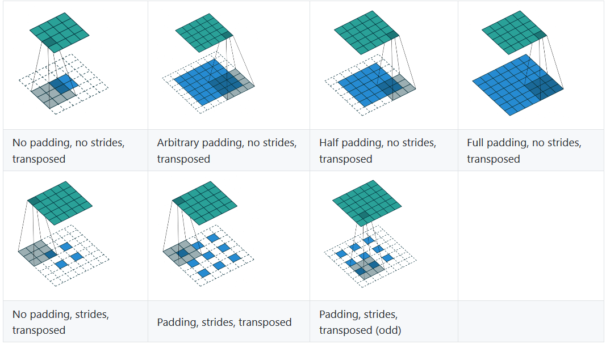
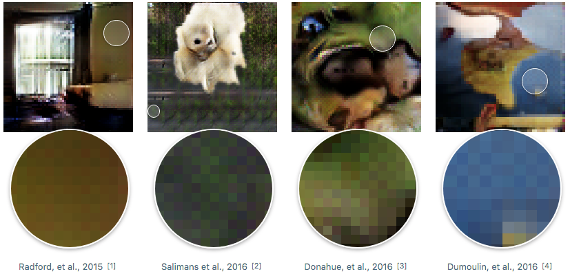
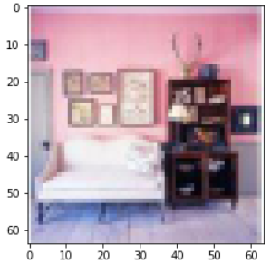
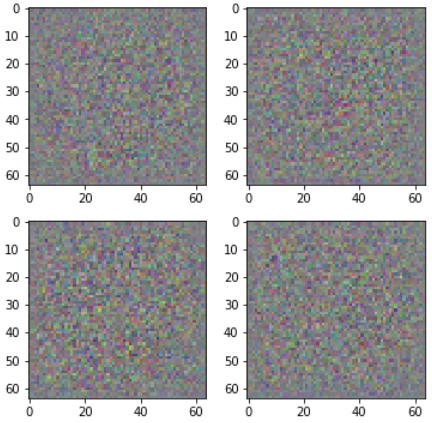
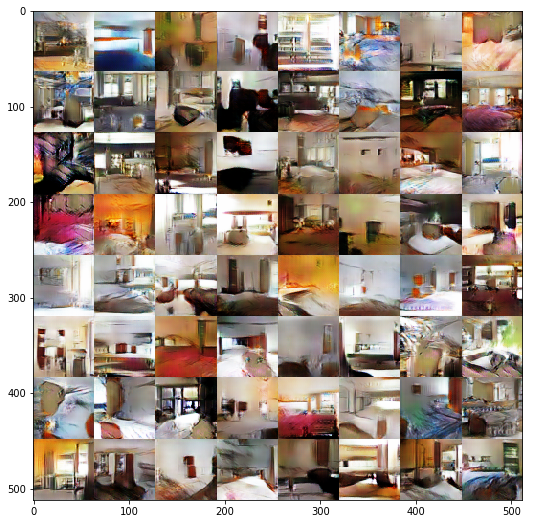
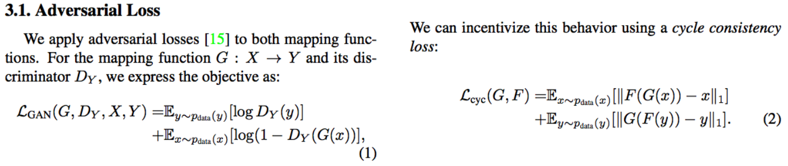
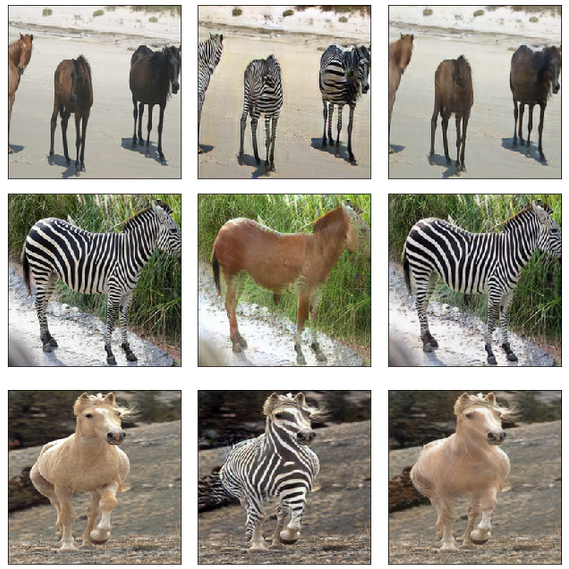

# Lecture 12: Generative Adversarial Networks (GANs)

<!-- vscode-markdown-toc -->
* 1. [WGAN](#WGAN)
	* 1.1. [discriminator](#discriminator)
	* 1.2. [Generator](#Generator)
	* 1.3. [Training](#Training)
* 2. [Cycle GaNs](#CycleGaNs)

<!-- vscode-markdown-toc-config
	numbering=true
	autoSave=true
	/vscode-markdown-toc-config -->
<!-- /vscode-markdown-toc -->


##  1. <a name='WGAN'></a>WGAN

In this lecture we are going to focus on generative adversarial networks also known as GANs, and more Wasserstein GAN paper which was heavily influenced by the deep convolutional generative adversarial network (DCGaN).

The most important part of the paper is the algorithm:

<p align="center">  </p>

The basic idea of GaNs, is an having two models, a generative model that generates fake samples, that need to be quite similar to the real samples of the dataset, and a critic, which given a sample, need to differentiate between fake and real samples, we first began by training the generative model for a few epochs, calculating the loss and updating its parameters, and then alternating between training the critic and the generative models.

So the main task is to create the models, which are going to be simple CNN networks, a classification network for the critic and a CNN with an encoding the decoding blocks for the generator, and the losses for both networks, training GaNs is quite difficult, and the real addition WGaN paper brings, is the new loss fuction and how to control the gradients to ensure training convergence.

We are going to the LSUN dataset classification dataset and use the bedroom category of images to create real images ones, so we are going to download the dataset, unzip it, and convert it to jpg files (using the `lsun-data.py` script):

```python
curl 'http://lsun.cs.princeton.edu/htbin/download.cgi?tag=latest&category=bedroom&set=train' -o bedroom.zip
unzip bedroom.zip
pip install lmdb
python lsun-data.py {PATH}/bedroom_train_lmdb --out_dir {PATH}/bedroom
```

And here is the content of the `lsun-data.py` script:

```python
def export_images(db_path, out_dir, flat=False):
    print('Exporting', db_path, 'to', out_dir)
    env = lmdb.open(db_path, map_size=1099511627776,
                    max_readers=100, readonly=True)
    with env.begin(write=False) as txn:
        cursor = txn.cursor()
        for key, val in tqdm(cursor):
            key = key.decode()
            if not flat: image_out_dir = join(out_dir, '/'.join(key[:3]))
            else: image_out_dir = out_dir
            if not exists(image_out_dir): os.makedirs(image_out_dir)
            image_out_path = join(image_out_dir, key + '.jpg')
        with open(image_out_path, 'wb') as fp: fp.write(val)
```

And then we create the paths to be used for load the stored images, and store then file in the form of CSV,

```python
PATH = Path('data/lsun/')
IMG_PATH = PATH/'bedroom'
CSV_PATH = PATH/'files.csv'
TMP_PATH = PATH/'tmp'
TMP_PATH.mkdir(exist_ok=True)
```

As always, it is much easier toe use CSV files when it comes to handling the data, so we generate a CSV with the list of files that we want, and a fake label “0” because we don’t really have labels for these at all. One CSV file contains everything in the bedroom dataset, and another one contains a random sample of 10% that we are experimenting with, because there is well over a million files even just reading in the list takes a while.

```python
files = PATH.glob('bedroom/**/*.jpg')

# Write all the path to the images of class bedroom, we write the files with a label 0
with CSV_PATH.open('w') as fo:
    for f in files: fo.write(f'{f.relative_to(IMG_PATH)},0\n')

# Optional - sampling a subset of files to experiment
CSV_PATH = PATH/'files_sample.csv'
files = PATH.glob('bedroom/**/*.jpg')
with CSV_PATH.open('w') as fo:
    for f in files:
        if random.random()<0.1:
            fo.write(f'{f.relative_to(IMG_PATH)},0\n')
```

Now we are going to create out convolutional models, for the cretic / discriminator and the generative model, first we're going to build a discriminator, it'll receive an image and outputs a probability of the image being real, so the output is a single number, we first construct a conv module, containing a convolution with or without a batch norm, and a non linearity, and the padding is calculating based on the stride and the size of the filter we've chosen.

```python
class ConvBlock(nn.Module):
    def __init__(self, ni, no, ks, stride, bn=True, pad=None):
        super().__init__()
        if pad is None: pad = ks // 2 // stride
        self.conv = nn.Conv2d(ni, no, ks, stride, padding=pad, bias=False)
        self.bn = nn.BatchNorm2d(no) if bn else None
        self.relu = nn.LeakyReLU(0.2, inplace=True)

    def forward(self, x):
        x = self.relu(self.conv(x))
        return self.bn(x) if self.bn else x
```

###  1.1. <a name='discriminator'></a>discriminator

Now we can create out discriminator, the input dimensions of the image must be multiples of 16, so that with a succession of convolution with a stride of two, we can endup with a 4x4 volume; so we create a series of conv modules, each one with a convolutional kernel of size 4 and a stride of 2, and each times the number of channels is doubled (`cndf *= 2; csize /= 2`), until we endup with a 4x4xchannels feature maps, that we then fed into a 4x4 convolution with a single output channel and no stide, so the output is a 4x4x1 feature map, and we take the mean of these 16 values to get our prediction.

```python
class DCGAN_D(nn.Module):
    def __init__(self, isize, nc, ndf, n_extra_layers=0):
        super().__init__()
        assert isize % 16 == 0, "isize has to be a multiple of 16"

        self.initial = ConvBlock(nc, ndf, 4, 2, bn=False)
        csize,cndf = isize/2,ndf
        self.extra = nn.Sequential(*[ConvBlock(cndf, cndf, 3, 1)
                                    for t in range(n_extra_layers)])

        pyr_layers = []
        while csize > 4:
            pyr_layers.append(ConvBlock(cndf, cndf*2, 4, 2))
            cndf *= 2; csize /= 2
        self.pyramid = nn.Sequential(*pyr_layers)

        self.final = nn.Conv2d(cndf, 1, 4, padding=0, bias=False)

    def forward(self, input):
        x = self.initial(input)
        x = self.extra(x)
        x = self.pyramid(x)
        return self.final(x).mean(0).view(1)
```

And to train the discriminator, given an existing generator, we can generate a set of images and label them as fake (say label 0), and then take some images from the LSUN dataset and label them as real, and train the model, but first we need to create out discriminator.

###  1.2. <a name='Generator'></a>Generator

The generator takes as input a prior, which is a vector of randomly generated numbers, and outputz a picture of the same size as the LSUN dataset images, and the idea is that each time, with a random vector, we'll get a new generated image.

First we'll create a deconvolution block, that upsamples the inputs given a specific kernel size, padding and a given stride, each element in the inputs is multiplied by the learned filters, and added to the inputs, and the stride is applied to the outputs this time, so that in the next step we'll add the results to the outputs after the given stride, this figure illustrates the procedure:

<p align="center">  </p>

It is also called transposed convolution given that the deconvolution is the same as the calculations done in the backward step, this is a comprehensive guide to the convolution arithmetics [arxiv](https://arxiv.org/abs/1603.07285)

One problem with deconvolutions are the check board artifacts, this is due to the fact that if we have an odd filter, say 3x3 filter, at the end of deconvolution one in three pixels will have its values coming from two different convolution (added together), so their values will be greated, and this will create checkboard artifacts as seen in the figure bellow, this is explained is this [distill post](https://distill.pub/2016/deconv-checkerboard/).

<p align="center">  </p>

The deconvolution block is implemented in the same way as the conv block, the only difference is the usa of `ConvTranspose2d`, and this time striding enlarges the image insted of decreasing its size:

```python
class DeconvBlock(nn.Module):
    def __init__(self, ni, no, ks, stride, pad, bn=True):
        super().__init__()
        self.conv = nn.ConvTranspose2d(ni, no, ks, stride, padding=pad, bias=False)
        self.bn = nn.BatchNorm2d(no)
        self.relu = nn.ReLU(inplace=True)

    def forward(self, x):
        x = self.relu(self.conv(x))
        return self.bn(x) if self.bn else x
```

And now with a given input vector of random values, we want to add a number of deconvolution until we get to the image size (`isize`), in our case the upsampling factor is x64, given that the input will be vec_size x 1 x 1, and the desired output is 3x64x64, so we want the input size to be a multiple of 16 to apply the correct calculations, so first we add a deconv with a kernel of size 4 and with no padding, so an upsampling is applied with factor of 4 just in this case, given that the output is a scalar, and we then add a number of deconvolutions with a factor of 2 (stride 2, so with a filter of four, with an input of say 20x20 we'll 42x42, to get 40x40 and pad of 1, so we'll remove from the outputs two pixels) until we're 1/2 of the desired size, and a number of extra layers without any upsamling and finally, a deconvolution with k=4 / s=2 / p=1 to get to the correct size, and we pass the output through tanh h so that the pixel value is in the correct range.

```python
class DCGAN_G(nn.Module):
    def __init__(self, isize, nz, nc, ngf, n_extra_layers=0):
        super().__init__()
        assert isize % 16 == 0, "isize has to be a multiple of 16"

        cngf, tisize = ngf//2, 4
        while tisize!=isize: cngf*=2; tisize*=2
        layers = [DeconvBlock(nz, cngf, 4, 1, 0)]

        csize, cndf = 4, cngf
        while csize < isize//2:
            layers.append(DeconvBlock(cngf, cngf//2, 4, 2, 1))
            cngf //= 2; csize *= 2

        layers += [DeconvBlock(cngf, cngf, 3, 1, 1) for t in range(n_extra_layers)]
        layers.append(nn.ConvTranspose2d(cngf, nc, 4, 2, 1, bias=False))
        self.features = nn.Sequential(*layers)

    def forward(self, input): return F.tanh(self.features(input))
```

We then create our model, we'll use a batch of 64 and an input of size 64, first we resize the images to 128 and then use transformation to get to size 64:

```python
bs,sz,nz = 64,64,100

tfms = tfms_from_stats(inception_stats, sz)
md = ImageClassifierData.from_csv(PATH, 'bedroom', CSV_PATH, tfms=tfms, bs=128, skip_header=False, continuous=True)

md = md.resize(128)
```

We can load a sample image from out dataloader and display it:

```python
x,_ = next(iter(md.val_dl))
plt.imshow(md.trn_ds.denorm(x)[0])
```

<p align="center">  </p>

###  1.3. <a name='Training'></a>Training

Now we'll create out two models, the generator and the discriminator, and also out noise generator, that output nz random vectors of size b, in our case, we create a noise matrix of size 4 x 100, or four random vectors of size 100 each, pass them through the generator to get an output of size 4x3x64x64, denormalize the outputs and display the four images, which will obviously be random given that our generator is untrained:

```python
# Models
netG = DCGAN_G(sz, nz, 3, 64, 1).cuda()
netD = DCGAN_D(sz, 3, 64, 1).cuda()
# Noise generator
def create_noise(b):
    return V(torch.zeros(b, nz, 1, 1).normal_(0, 1))
# Pass the noise through the network
preds = netG(create_noise(4))
pred_ims = md.trn_ds.denorm(preds)
# Show the first 4 outputs
fig, axes = plt.subplots(2, 2, figsize=(6, 6))
for i,ax in enumerate(axes.flat): ax.imshow(pred_ims[i])
```

<p align="center">  </p>

And then we create an optimize, and following the WGAN paper, we create an RMS Prop optimizer:

```python
optimizerD = optim.RMSprop(netD.parameters(), lr = 1e-4)
optimizerG = optim.RMSprop(netG.parameters(), lr = 1e-4)
```

Non, we go through the training loop:

- We're setting our models into training mode,
- creating an iterator over our real dataset,
- We'll iterate over the batches, for each iteration of training for the generator, we'll do `d_iters` of training for the desriminator, generally `d_iters = 5`, but in the beginning it doesn't make sence to train the generator if the discriminator can't recognize the fake images from the real ones, so we start by 100 iterations of training the discriminator, and then we'll equal `d_iters = 5`, but after 500 iterations `d_iters = 100`,
- So to train the discriminator, we set its weights to trainable, and freeze the generator's weights,
- We clamp the parameters of the discriminator following the WGaN paper,
- Get a real image, and pass through the discriminator to get the real loss, and then get a vector of random values, create a fake image using the generator, and pass it through the discriminator to get the fake loss,
- We zero the gradient with respect to the loss from the pytorch dynamic graph, and then calculate the new value of the loss: `lossD = real_loss-fake_loss`, calculate the new derivatives and update the weights,
- After `d_iters` of training the discriminator, we now train the generator, we freeze the discriminator weights, zero out the gradients, and then pass the fake image created by the generator through the discriminator to get the generator's loss, we then calculate the gradients and update the weights.

```python
def train(niter, first=True):
    gen_iterations = 0
    for epoch in trange(niter):
        netD.train()
        netG.train()
        data_iter = iter(md.trn_dl)
        i,n = 0,len(md.trn_dl)
        with tqdm(total=n) as pbar:
            while i < n:
                set_trainable(netD, True)
                set_trainable(netG, False)
                d_iters = 100 if (first and (gen_iterations < 25) or (gen_iterations % 500 == 0)) else 5
                j = 0
                while (j < d_iters) and (i < n):
                    j += 1; i += 1
                    for p in netD.parameters(): p.data.clamp_(-0.01, 0.01)
                    real = V(next(data_iter)[0])
                    real_loss = netD(real)
                    fake = netG(create_noise(real.size(0)))
                    fake_loss = netD(V(fake.data))
                    netD.zero_grad()
                    lossD = real_loss-fake_loss
                    lossD.backward()
                    optimizerD.step()
                    pbar.update()

                set_trainable(netD, False)
                set_trainable(netG, True)
                netG.zero_grad()
                lossG = netD(netG(create_noise(bs))).mean(0).view(1)
                lossG.backward()
                optimizerG.step()
                gen_iterations += 1
```

We then train the GaN for one epoch, deacrease the leraning rate and train for an other epoch this time without the pretraining of the discriminator,

```python
train(1, False)

set_trainable(netD, True)
set_trainable(netG, True)
optimizerD = optim.RMSprop(netD.parameters(), lr = 1e-5)
optimizerG = optim.RMSprop(netG.parameters(), lr = 1e-5)

train(1, False)
```

We can then evaluate our model, by simply setting the models into eval mode (freezing the batch norm metrics & and not using dropout), we create 64 four vectors of noise, pass them through the generator, and denormalize the images and display them, and we see that we get somehow similar images to bedrooms in the LSUN dataset.

```python
fixed_noise = create_noise(bs)
netD.eval()
netG.eval()
fake = netG(fixed_noise).data.cpu()
faked = np.clip(md.trn_ds.denorm(fake),0,1)

plt.figure(figsize=(9,9))
plt.imshow(gallery(faked, 8))
```

<p align="center">  </p>

##  2. <a name='CycleGaNs'></a>Cycle GaNs

The idea of cycle gans, is to take an image X, and transform it into a new image Y using a mapping funcion G (i.e a generator), so for example, in the paper we want to turn a horse image X into a zebra image X, but we don't have a dateset pairs horse / zebra to train our model, for this we'll use GaNs with a new type of loss, called a cycle loss.

We'll have two generator, G turning horses X into zebras Y, and Y generator doing the inverse, tuning zebras into horses, and two discriminator Dx and Dy to tell if X and Y are real instances or fake one, and we'll have two losses, the GaN loss, in wich the discriminators Dx and Dy must detect if X and Y are fake or real, and a cycle consistency loss that compare the original image of hosres / zerbras, and then recreated one, to recreate an instance of X / Y, we turn the original of a horse X (or Y) image into an image of zebra Y (of X) using the generator G, and turn it back to a horse X (or Y) using the generator Y, and the recreated image X' must be quite similar to the original one,

<p align="center">  </p>

Ane the losses are expressed as follows, we have the GaN loss, in two terms, does the discriminator recognise a real image (log Dy), and a fake one created by the generator (1 - logDy (G)), and the consistency loss that compares the original image x / y to the recreated one generated by passing the original image through the two generators F(G(x)) / G(F(y)).

<p align="center">  </p>

So the full objective contain the two gan losses, for the pair genrators G and Dx, and Y and Dy, and the cycle consistency loss, and we weights the two terms usign a hyperparameter lambda, and training objective is to maximise the discriminators loss and minimise that of the generators,

<p align="center">  </p>

Now let's see the code, we start by creating a dataloader, to create a data loader, we create custom dataloser that takes the options passed, create a dataset (in our case an unaligned, given that we don't have pairs of horse zebra), this unaligned loader to instances of A and B, say horses and zebras, apply some transformation, and turn them into grey images if it is specified in the options, and then if we want to turn A to B we return A as inputs and B as outputs and vice versa, now that we have our dataset, we can create a pytorch dataloader given a batch size, a shuffling option and a number of threads.

```python
class BaseDataLoader():
    def __init__(self): pass
    def load_data(): return None
    def initialize(self, opt): self.opt = opt

class CustomDatasetDataLoader(BaseDataLoader):
    def initialize(self, opt):
        BaseDataLoader.initialize(self, opt)
        self.dataset = CreateDataset(opt)
        self.dataloader = torch.utils.data.DataLoader(
            self.dataset, batch_size=opt.batchSize,
            shuffle=not opt.serial_batches, num_workers=int(opt.nThreads))

    def __iter__(self):
        for i, data in enumerate(self.dataloader):
            if i >= self.opt.max_dataset_size: break
            yield data

    def name(self): return 'CustomDatasetDataLoader'
    def load_data(self): return self
    def __len__(self): return min(len(self.dataset), self.opt.max_dataset_size)

def CreateDataLoader(opt):
    data_loader = CustomDatasetDataLoader()
    print(data_loader.name())
    data_loader.initialize(opt)
    return data_loader

def CreateDataset(opt):
    dataset = None
    if opt.dataset_mode == 'aligned':
        from .aligned_dataset import AlignedDataset
        dataset = AlignedDataset()
    elif opt.dataset_mode == 'unaligned':
        from .unaligned_dataset import UnalignedDataset
        dataset = UnalignedDataset()
    elif opt.dataset_mode == 'single':
        from .single_dataset import SingleDataset
        dataset = SingleDataset()
    else:
        raise ValueError("Dataset [%s] not recognized." % opt.dataset_mode)

    print("dataset [%s] was created" % (dataset.name()))
    dataset.initialize(opt)
    return dataset

class UnalignedDataset(BaseDataset):
    def initialize(self, opt):
        self.opt = opt
        self.root = opt.dataroot
        self.dir_A = os.path.join(opt.dataroot, opt.phase + 'A')
        self.dir_B = os.path.join(opt.dataroot, opt.phase + 'B')

        self.A_paths = make_dataset(self.dir_A)
        self.B_paths = make_dataset(self.dir_B)

        self.A_paths = sorted(self.A_paths)
        self.B_paths = sorted(self.B_paths)
        self.A_size = len(self.A_paths)
        self.B_size = len(self.B_paths)
        self.transform = get_transform(opt)

    def __getitem__(self, index):
        A_path = self.A_paths[index % self.A_size]
        if self.opt.serial_batches:
            index_B = index % self.B_size
        else:
            index_B = random.randint(0, self.B_size - 1)
        B_path = self.B_paths[index_B]
        # print('(A, B) = (%d, %d)' % (index_A, index_B))
        A_img = Image.open(A_path).convert('RGB')
        B_img = Image.open(B_path).convert('RGB')

        A = self.transform(A_img)
        B = self.transform(B_img)
        if self.opt.which_direction == 'BtoA':
            input_nc = self.opt.output_nc
            output_nc = self.opt.input_nc
        else:
            input_nc = self.opt.input_nc
            output_nc = self.opt.output_nc

        if input_nc == 1:  # RGB to gray
            tmp = A[0, ...] * 0.299 + A[1, ...] * 0.587 + A[2, ...] * 0.114
            A = tmp.unsqueeze(0)

        if output_nc == 1:  # RGB to gray
            tmp = B[0, ...] * 0.299 + B[1, ...] * 0.587 + B[2, ...] * 0.114
            B = tmp.unsqueeze(0)

        return {'A': A, 'B': B, 'A_paths': A_path, 'B_paths': B_path}

    def __len__(self): return max(self.A_size, self.B_size)

    def name(self): return 'UnalignedDataset'

data_loader = CreateDataLoader(opt)
dataset = data_loader.load_data()
dataset_size = len(data_loader)
dataset_size
```

And how let's see our model (for the detailed code visite [this](https://github.com/fastai/fastai/tree/master/courses/dl2/cgan/models)), in the creating of our model, we create the generators and discriminator, the loss fuctions, and then optimizers (one for both the generators, and one for each discriminator):

```python
model = create_model(opt)

class CycleGANModel(BaseModel):
    def name(self):
        return 'CycleGANModel'

    def initialize(self, opt):
        BaseModel.initialize(self, opt)
        self.netG_A = networks.define_G(opt.input_nc, opt.output_nc,
                                        opt.ngf, opt.which_model_netG, opt.norm, not opt.no_dropout, opt.init_type, self.gpu_ids)
        self.netG_B = networks.define_G(opt.output_nc, opt.input_nc,
            opt.ngf, opt.which_model_netG, opt.norm, not opt.no_dropout, opt.init_type, self.gpu_ids)

    ## .............
        self.fake_A_pool = ImagePool(opt.pool_size)
        self.fake_B_pool = ImagePool(opt.pool_size)
        # define loss functions
        self.criterionGAN = networks.GANLoss(use_lsgan=not opt.no_lsgan, tensor=self.Tensor)
        self.criterionCycle = torch.nn.L1Loss()
        self.criterionIdt = torch.nn.L1Loss()
        # initialize optimizers
        self.optimizer_G = torch.optim.Adam(itertools.chain(self.netG_A.parameters(), self.netG_B.parameters()),
                                            lr=opt.lr, betas=(opt.beta1, 0.999))
        self.optimizer_D_A = torch.optim.Adam(self.netD_A.parameters(), lr=opt.lr, betas=(opt.beta1, 0.999))
self.optimizer_D_B = torch.optim.Adam(self.netD_B.parameters(), lr=opt.lr, betas=(opt.beta1, 0.999))
```

And the model is a set resnet blocks with instance normalization (norm over one image) and a reflection padding, and then a set of deconvolutions, and finnaly the training loop, at each time step we get the data (inputs and outputs depending on the direction AtoB or BtoA), send them to the GPUs, and then we optimize the prameters of the model, we first oprimizer the generator, in which we pass both the fake A and B into the two generators, and then trough the two discriminators, get eh fake loss for both the generators, and then we passe the two fake version into the other generators to get a recreationg and calculate the cycle loss, and calculate the total loss with a given lambdas; and then we train the two discriminators like we did with WGAN.

```python
for epoch in range(opt.epoch_count, opt.niter + opt.niter_decay+1):
    epoch_start_time = time.time()
    iter_data_time = time.time()
    epoch_iter = 0

    for i, data in tqdm(enumerate(dataset)):
        iter_start_time = time.time()
        if total_steps % opt.print_freq == 0: 
             t_data = iter_start_time - iter_data_time
        total_steps += opt.batchSize
        epoch_iter += opt.batchSize
        model.set_input(data)
        model.optimize_parameters()

class CycleGANModel(BaseModel):
    # ...................
    def set_input(self, input):
        AtoB = self.opt.which_direction == 'AtoB'
        input_A = input['A' if AtoB else 'B']
        input_B = input['B' if AtoB else 'A']
        if len(self.gpu_ids) > 0:
            input_A = input_A.cuda(self.gpu_ids[0], async=True)
            input_B = input_B.cuda(self.gpu_ids[0], async=True)
        self.input_A = input_A
        self.input_B = input_B
        self.image_paths = input['A_paths' if AtoB else 'B_paths']

    # ...................
    def optimize_parameters(self):
        # forward
        self.forward()
        # G_A and G_B
        self.optimizer_G.zero_grad()
        self.backward_G()
        self.optimizer_G.step()
        # D_A
        self.optimizer_D_A.zero_grad()
        self.backward_D_A()
        self.optimizer_D_A.step()
        # D_B
        self.optimizer_D_B.zero_grad()
        self.backward_D_B()
        self.optimizer_D_B.step()

    def backward_D_basic(self, netD, real, fake):
        # Real
        pred_real = netD(real)
        loss_D_real = self.criterionGAN(pred_real, True)
        # Fake
        pred_fake = netD(fake.detach())
        loss_D_fake = self.criterionGAN(pred_fake, False)
        # Combined loss
        loss_D = (loss_D_real + loss_D_fake) * 0.5
        # backward
        loss_D.backward()
        return loss_D

    def backward_D_A(self):
        fake_B = self.fake_B_pool.query(self.fake_B)
        loss_D_A = self.backward_D_basic(self.netD_A, self.real_B, fake_B)
        self.loss_D_A = loss_D_A.data[0]

    def backward_D_B(self):
        fake_A = self.fake_A_pool.query(self.fake_A)
        loss_D_B = self.backward_D_basic(self.netD_B, self.real_A, fake_A)
        self.loss_D_B = loss_D_B.data[0]

    # ...................
    def backward_G(self):
        # ...................
        # GAN loss D_A(G_A(A))
        fake_B = self.netG_A(self.real_A)
        pred_fake = self.netD_A(fake_B)
        loss_G_A = self.criterionGAN(pred_fake, True)

        # GAN loss D_B(G_B(B))
        fake_A = self.netG_B(self.real_B)
        pred_fake = self.netD_B(fake_A)
        loss_G_B = self.criterionGAN(pred_fake, True)

        # Forward cycle loss
        rec_A = self.netG_B(fake_B)
        loss_cycle_A = self.criterionCycle(rec_A, self.real_A) * lambda_A

        # Backward cycle loss
        rec_B = self.netG_A(fake_A)
        loss_cycle_B = self.criterionCycle(rec_B, self.real_B) * lambda_B
        # combined loss
        loss_G = loss_G_A + loss_G_B + loss_cycle_A + loss_cycle_B + loss_idt_A + loss_idt_B
        loss_G.backward()
```

We train our model for 200 epochs, and here we can show some reconstruction of horse / zebra images:

<p align="center">  </p>
