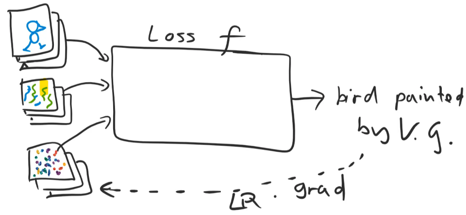
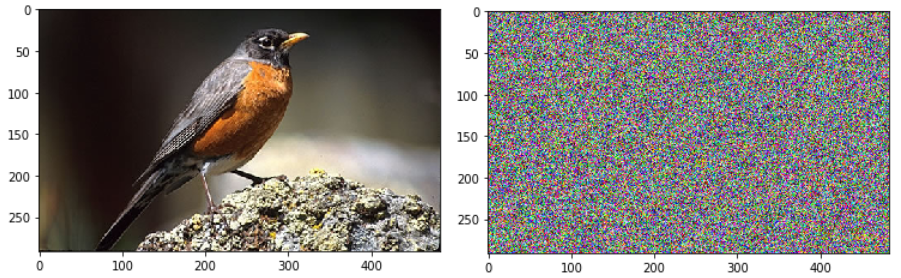
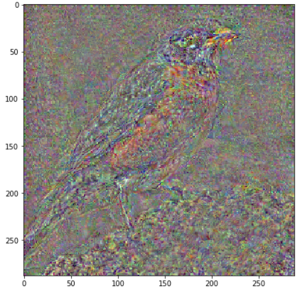
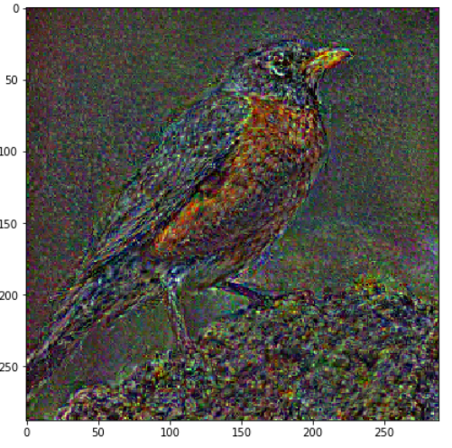
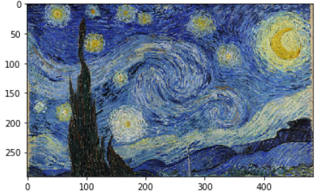
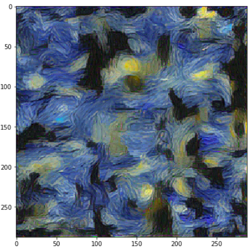
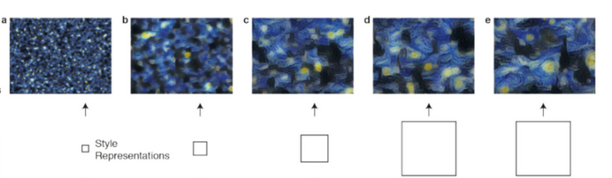
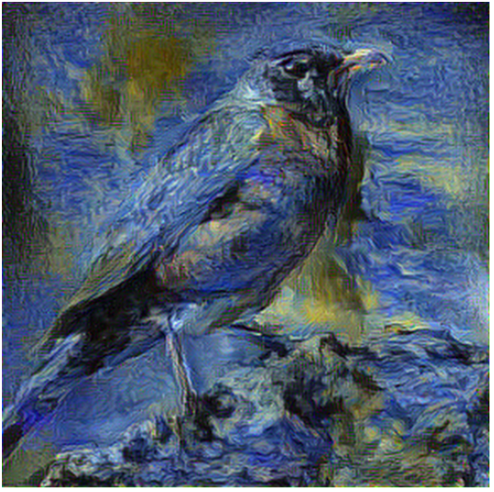

# Lecture 13: Style Transfer

<!-- vscode-markdown-toc -->
- [Lecture 13: Style Transfer](#Lecture-13-Style-Transfer)
  - [1. <a name='Leaningratetricksschedulers'></a>Leaning rate tricks / schedulers](#1-a-nameLeaningratetricksschedulersaLeaning-rate-tricks--schedulers)
  - [2. <a name='Inception'></a>Inception](#2-a-nameInceptionaInception)
  - [3. <a name='Styletransfer'></a>Style transfer](#3-a-nameStyletransferaStyle-transfer)
    - [3.1. <a name='Contentloss'></a>Content loss](#31-a-nameContentlossaContent-loss)
    - [3.2. <a name='Forwardhooks'></a>Forward hooks](#32-a-nameForwardhooksaForward-hooks)
    - [3.3. <a name='Styleloss'></a>Style loss](#33-a-nameStylelossaStyle-loss)
    - [3.4. <a name='Styletransfer-1'></a>Style transfer](#34-a-nameStyletransfer-1aStyle-transfer)

<!-- vscode-markdown-toc-config
	numbering=true
	autoSave=true
	/vscode-markdown-toc-config -->
<!-- /vscode-markdown-toc -->

##  1. <a name='Leaningratetricksschedulers'></a>Leaning rate tricks / schedulers

There is a lot of possible learning rates to use / test when expermenting, this type of adjustable learning rates are implemented in the fastai API using training phases, let's go through some of them:

1- Step learning rate: used a lot when traninig on imagenet, we start by a high leaning rate and after a given number of epochs, we change it to a lower leanring rate:

<p align="center">  </p>

So here we train for 1 epoch with 1e-2 learning rate and then 1e-3 for 3 epochs.
```python
phases = [TrainingPhase(epochs=1, opt_fn=optim.SGD, lr = 1e-2),
          TrainingPhase(epochs=2, opt_fn=optim.SGD, lr = 1e-3)]
```

2- Decaying LR in between two fixed LRs: Starting by a fixed LR for a given number of iteration for exploration, then a decaying leraning rate for zooming in on a local optima and then finetuning with a small learning rate:

`lr_i = start_lr + (end_lr - start_lr) * i/n`

<p align="center">  </p>

Instead of using a linear decaying learning rate, we can use a consine annealing:

`lr_i = end_lr + (start_lr - end_lr)/2 * (1 + np.cos(i * np.pi)/n)`

<p align="center">  </p>

Same way, we can use exponenetial decay:

`lr_i = start_lr * (end_lr/start_lr)**(i/n)`

<p align="center">  </p>

or a Polynomial, which given quite good resutls and not very popular in the literature:

`lr_i = end_lr + (start_lr - end_lr) * (1 - i/n) ** p`

<p align="center">  </p>

And one possibility is instead of decay to the lower learning rate, we can decay to zero and then step up back to the lower bound of the learning rate:

<p align="center">  </p>

3- Stochastic gradient descient with restarts: using these type of learning rate, we can constuct a cyclic learning rate, we start by a small learning rate of a small number of ierations, then step up to max learning rate, and then use cos anneling to step down to the lower learning rate and repeate the same thing by this time with a larger preiode, 

<p align="center">  </p>

4- One cycle: We can also use a one cycle leanring rate, having an upward step learning rate for 30% of epochs, and then downward lr rate step back the the base learning rate and continuing for some iteration to lower values, and the inverse is done for the momentum:

<p align="center">  </p>

##  2. <a name='Inception'></a>Inception

Inception network is quite similar to resnet, we also pass the incoming features into a given layer directly to the next layer, and also elevate it by transforming the input thorugh some convolutions, in resnet we add to the input its convolved version, in inception we concatenate a convolved version of the input to it.

<p align="center">  </p>

We see here that we have two additional branches, the first one with only 1x1 convolutions, used to compress the input along its channels dimensions, and for the second additional branch we first use a 1x1 conv to reduce the upcoming computations, and the interesting thing is the usage of two symetric filters, so to capture a wide amount of spatial information, we need to use bigger filters like 5x5 or 7x7, but these types of filters are very computationally heavy, for 7x7 filters we have 49 x number of input pixels x number of input channels, and in the last layer we have a large number of channels and we'll endup with a large number of computations, this is why we rarely use kernels larger than 3x3 and if so, only at the beginning like resenet, one solution is to approximate the 7x7 kernel using two 7x1 and 1x7 filters, and representation learned by these two filters will certainly not be able to capture all of that of 7x7 filters, but will be very close to it and even help out model avoid overfitting and reduce the number of computations.

An other important trick to use during training is progressive resizing of the image, this is detailed in [Progressive Growing of GANs](https://research.nvidia.com/publication/2017-10_Progressive-Growing-of)

##  3. <a name='Styletransfer'></a>Style transfer

The goal is to take two pictures and generate a new picture with the style of one picture and the content of the other one, this is done through a loss function that will be lower if the generated image style and content are the ones we want, after we have our function we can start from a noise image, with the style and content image to calculate the loss and backpropagate the error and this time instead of changing the weights of the network we change the values of the pixels to get the correct image.

<p align="center">  </p>

The loss will contain two terms, the content loss and the style loss with a hyperparameter as a weighting factor for content and style reconstruction: 

*Style transfer loss = lambda * style loss + content loss*

For the content loss one is to compare the pixels of the content picture and update its pixels until (MSE loss) the noise image will be very similar / identical to the content image, but that's not our objective, we don't want to generate an image that is identical to the content image, but a one that similar in its content in a general manner, for this we'll use a CNN, a VGG network to be more specific, and rather than comparing pixels for the two images, we can compare the intermediate activations in the VGG network (say conv5), and given that these layer will contain a higher level of semantic entites that are translation invariant, we'll end up comparing the high level representations instead of the extact values of the pixels, called **perceptual loss**

###  3.1. <a name='Contentloss'></a>Content loss

We'll use imagenet samples, but given how big imagenet is we'll only take a small sample from it (can be found [here](http://files.fast.ai/data/)), we'll create the path to the imagenet sample, and load VGG net and freeze it given that we'll only use its representation to calculate the loss and not for predictions:

```python
from fastai.conv_learner import *
from pathlib import Path
from scipy import ndimage

PATH = Path('data/imagenet')
PATH_TRN = PATH/'train'

m_vgg = to_gpu(vgg16(True)).eval()
set_trainable(m_vgg, False)
```

We than take a sample image, create some custom transforms with a resizing to 288x288 and create a noise image of the same shape as the image and blur it (this gives better resutls, if not it is very hard for the optimizer to get the correct gradients for all the pixels):

```python
img_fn = PATH_TRN/'n01558993'/'n01558993_9684.JPEG'
img = open_image(img_fn)

sz=288
trn_tfms,val_tfms = tfms_from_model(vgg16, sz)
img_tfm = val_tfms(img)
img_tfm.shape # (3, 288, 288)

opt_img = np.random.uniform(0, 1, size=img.shape).astype(np.float32)
```

<p align="center">  </p>

Now we'll need to first pass our content image through the VGG network to get the target features, and then at each iteration pass the generated image, which is a simple noise image through the VGG and calculate the loss, and backpropagate the loss and update the pixels, first we divide the noise image values by two to have the same std as the content image, and then add a batch axis to the image using the numpy `np.newaxis` which will be called if we index `None` in the image, and specify that we want the gradients to be caculated with respect to the image:

```python
opt_img = val_tfms(opt_img)/2
opt_img_v = V(opt_img[None], requires_grad=True)
opt_img_v.shape #   torch.Size([1, 3, 288, 288])
```

Now we need to extract only the layers we want from the VGG, we choose the 37th layer as the layer we want to extract the features from, we then pass the content image though it (after adding the batch dimension) and get the target features:

```python
m_vgg = nn.Sequential(*children(m_vgg)[:37])
targ_t = m_vgg(VV(img_tfm[None]))
targ_v = V(targ_t)
targ_t.shape # torch.Size([1, 512, 18, 18])
```

We then create our loss funcion, which is a simple MSE loss between the content VGG features and the generated image, we multiply it by 1000 so that the gradients scale will be correct and be able to change the values of the pixels, if not the loss is very small the gradients vanish (happens often when training with hald precision)

```python
def actn_loss(x):
   return F.mse_loss(m_vgg(x), targ_v)*1000
```

In this case, we use LBFGS, which is a second order optimization method, which uses both the first (jacobian matrix) and second derivatives (hessian matrix), for efficiancy thet BFSG doen't compute the hessian directly for every possible direction, but approximates the Hessian based on differences of gradients over several iterations, the BFGS Hessian approximation can either be based on the full history of gradients, in which case it is referred to as BFGS, or it can be based only on the most recent m gradients, in which case it is known as limited memory BFGS, abbreviated as L-BFGS. The advantage of L-BFGS is that is requires only retaining the most recent m gradients, where m is usually around 10 to 20.

To use LBFGS in pytorch, we first create optimizer and the iteration, and then instead of having to call the step function at each iteration inside our traninig loop, we create a function that contain the step of a training loop (zero out the gradients, pass the image thought the vgg and get the loss, calculate the gradients and print some information), and then we loop and only call the optimiez.step with the step function we created (the the loss fct that is an argumnet for it):

```python
max_iter = 1000
show_iter = 100
optimizer = optim.LBFGS([opt_img_v], lr=0.5)

def step(loss_fn):
    global n_iter
    optimizer.zero_grad()
    loss = loss_fn(opt_img_v)
    loss.backward()
    n_iter+=1
    if n_iter%show_iter==0: print(f'Iteration: {n_iter}, loss: {loss.data[0]}')
    return loss

n_iter=0
   while n_iter <= max_iter: optimizer.step(partial(step,actn_loss))
```

We can show the generated image after denormalizing it and we can clearly see the the content we wish to obtain is apparent:

```python
x = val_tfms.denorm(np.rollaxis(to_np(opt_img_v.data),1,4))[0]
plt.figure(figsize=(7,7))
plt.imshow(x)
```

<p align="center">  </p>

###  3.2. <a name='Forwardhooks'></a>Forward hooks

Until now, we only tried one layer from which the activations will be extracted, and if we want to test different layers we need to create different networks contrainng the VGG network up to the given layer, which is not very efficient, as an alternative we can use `register_forward_hook`, that, given a module, will automatically store a the activation when the forward function of that module s called, to imlement it, we create a class SaveFeature, that will have a hook, this hook is a function that will be called each time `m.forward` is executed, and it will get the as argument the module in question, its inputs, and its outputs, and we're going to store its activation in a features variable to use for the loss calculations.$

```python
class SaveFeatures():
   features=None
   def __init__(self, m):
      self.hook = m.register_forward_hook(self.hook_fn)
   def hook_fn(self, module, input, output):
      self.features = output
   def close(self):
      self.hook.remove()
```

And all we need is to add some hooks in the correct locations in the VGG network, first we get the indices of the layers we want to extract the features from, which will be the last layer before the maxpooling (containg the most information at each block), and we'll then test the 32 layers features and see if it gives better resutls:

```python
m_vgg = to_gpu(vgg16(True)).eval()
set_trainable(m_vgg, False)

block_ends = [i-1 for i,o in enumerate(children(m_vgg))
              if isinstance(o,nn.MaxPool2d)]
block_ends # [5, 12, 22, 32, 42]

sf = SaveFeatures(children(m_vgg)[block_ends[3]])
```

We then create our noise image, and create our optimizer that takes the noise image to be updates, get the target features, create the loss function and call the optimize step inside the loop by passing the stepping function.

```python
def get_opt():
    opt_img = np.random.uniform(0, 1, size=img.shape).astype(np.float32)
    opt_img = scipy.ndimage.filters.median_filter(opt_img, [8,8,1])
    opt_img_v = V(val_tfms(opt_img/2)[None], requires_grad=True)
    return opt_img_v, optim.LBFGS([opt_img_v])

opt_img_v, optimizer = get_opt()
m_vgg(VV(img_tfm[None]))
targ_v = V(sf.features.clone())
targ_v.shape

def actn_loss2(x):
    m_vgg(x)
    out = V(sf.features)
    return F.mse_loss(out, targ_v)*1000

n_iter=0
while n_iter <= max_iter: optimizer.step(partial(step,actn_loss2))
```

And we see that we optain better resutls:

<p align="center">  </p>

###  3.3. <a name='Styleloss'></a>Style loss

The objective of the style function is to detect the reoccuring styles/textures in the image without having a relation to its content, and one way to obtain this is to get the correlation between different feature maps in the same layer, so to calculate the style loss, we choose a number of layers, and for each one we will calculate the dot product between each features map in that layer (n² dot products), sum them and normalize them, and this is called the gramm matrix, now if we take each feature map of a given layer l of size (H x W) and flatten it into one vector, then to calculate the gram matrix we need to multiply each vector by all the other vectors, so n² dot product to get the gram matric for one layer, and the gram matrix for layer l between only two feature maps (i and j) is simply the formula of the two product between two vectors:

$$G _ { i j } ^ { l } = \sum _ { k } F _ { i k } ^ { l } F _ { j k } ^ { l }$$

For the style loss, we're going to use all the layer after maxpool in the VGG network instead of only one like we did for the content loss, so first we load our style image (extracted from wikipedia) and resize it to the same size as the content image, and apply the tansformation we created ealier:

```python
def scale_match(src, targ):
    h,w,_ = img.shape
    sh,sw,_ = style_img.shape
    rat = max(h/sh,w/sw); rat
    res = cv2.resize(style_img, (int(sw*rat), int(sh*rat)))
    return res[:h,:w]

style = scale_match(img, style_img)
style_tfm = val_tfms(style_img)
```

<p align="center">  </p>

And now we're going create a forward hook for all the layers after a max pool, and then pass the style image (after adding one axis for the batch dimension) through the network and see the saved features:

```python
sfs = [SaveFeatures(children(m_vgg)[idx]) for idx in block_ends]

m_vgg(VV(style_tfm[None]))
targ_styles = [V(o.features.clone()) for o in sfs]
[o.shape for o in targ_styles]

# [torch.Size([1, 64, 288, 288]),
# torch.Size([1, 128, 144, 144]),
# torch.Size([1, 256, 72, 72]),
# torch.Size([1, 512, 36, 36]),
# torch.Size([1, 512, 18, 18])]
```

Now we're going to create our losses, first for the gram matrix, we take our input, which is the feature maps of a given layer, flaten them into C (here batch = 1) vectors of size (HxW), and calculate the gramm matrix as the matrix multiply between the vectors and their transpose, and normalize it by the number of elements and given how small the results are, we scale them up to get good grandients:

```python
def gram(input):
        b,c,h,w = input.size()
        x = input.view(b*c, -1)
        return torch.mm(x, x.t())/input.numel()*1e6
```

We pass the noise image thouth the network, we get all the features of the layers we've selected,and now the style loss is the sum of the MSE losses between the gram of the noise image and the target style image for all the layer we've chosen:

```python
def gram_mse_loss(input, target):
        return F.mse_loss(gram(input), gram(target))

def style_loss(x):
    m_vgg(opt_img_v)
    outs = [V(o.features) for o in sfs]
    losses = [gram_mse_loss(o, s) for o,s in zip(outs, targ_styles)]
    return sum(losses)
```

And now we create our optimizer and call its step function, and show the results:

```python
n_iter=0
while n_iter <= max_iter:
    optimizer.step(partial(step,style_loss))

x = val_tfms.denorm(np.rollaxis(to_np(opt_img_v.data),1,4))[0]
plt.figure(figsize=(7,7))
plt.imshow(x)
```

<p align="center">  </p>

We can see that we've got good resutls, but we can do better if we weight the loss of the latter layer higher than the ealier one, because as we can see bellow the later layers gives better reslts (from the original paper):

<p align="center">  </p>

###  3.4. <a name='Styletransfer-1'></a>Style transfer

And now all we need to do is in the loss calculation function, add the two losses, the style and the content loss with a weighting factor (here we don't), we get the optimize and call its step function:

```python
opt_img_v, optimizer = get_opt()
sfs = [SaveFeatures(children(m_vgg)[idx]) for idx in block_ends]

def comb_loss(x):
    m_vgg(opt_img_v)
    outs = [V(o.features) for o in sfs]
    losses = [gram_mse_loss(o, s) for o,s in zip(outs, targ_styles)]
    cnt_loss   = F.mse_loss(outs[3], targ_vs[3])*1000000
    style_loss = sum(losses)
    return cnt_loss + style_loss

n_iter=0
while n_iter <= max_iter: optimizer.step(partial(step,comb_loss))
```

And we get good results:

```python
x = val_tfms.denorm(np.rollaxis(to_np(opt_img_v.data),1,4))[0]
plt.figure(figsize=(9,9))
plt.imshow(x, interpolation='lanczos')
plt.axis('off')
```

<p align="center">  </p>
