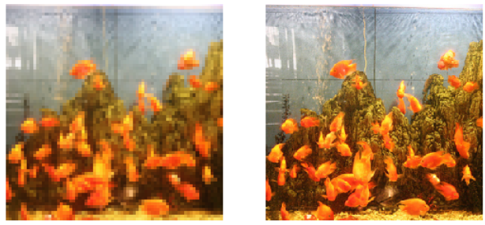
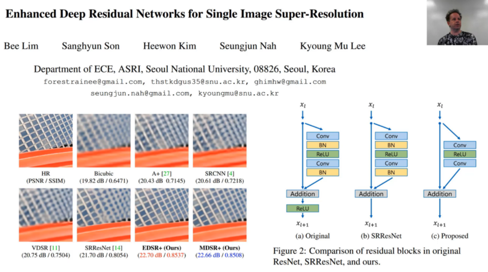
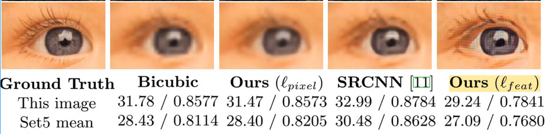
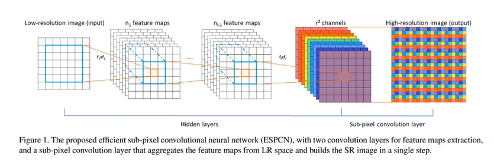
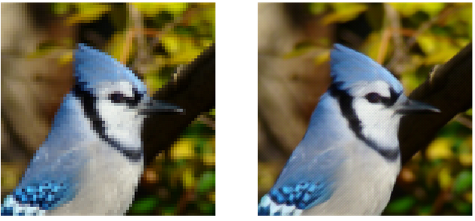
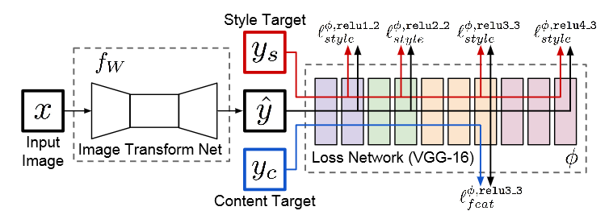
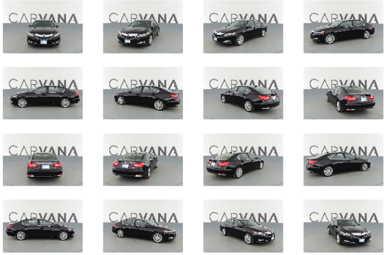
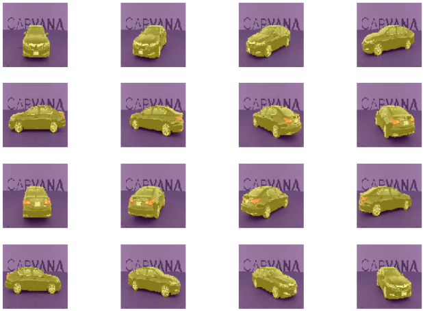
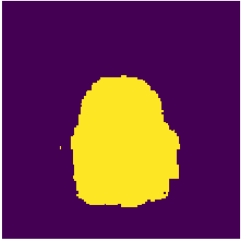
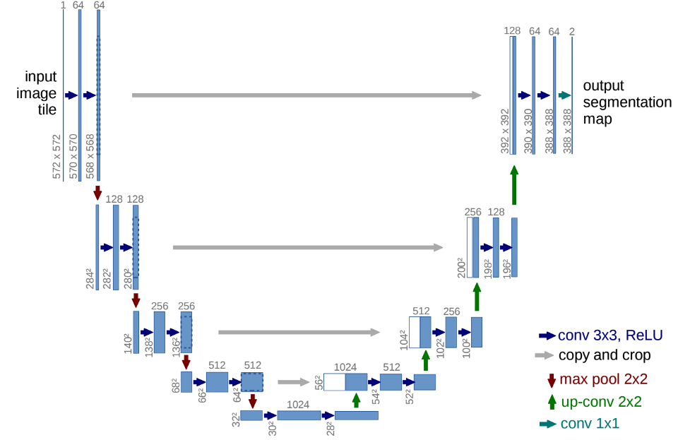

# Lecture 14: Super-resolution and image segmentation 

<!-- TOC -->

- [Lecture 14: Super-resolution and image segmentation](#Lecture-14-Super-resolution-and-image-segmentation)
  - [Super-Resolution](#Super-Resolution)
    - [Model](#Model)
    - [Losses](#Losses)
    - [Perceptual loss](#Perceptual-loss)
    - [Style transfer](#Style-transfer)
  - [Semantic Segmentation](#Semantic-Segmentation)
      - [Model](#Model-1)
    - [Unet](#Unet)

<!-- /TOC -->

## Super-Resolution

Super resolution is where we take a low resolution image (say 72x72) and upscale it to a larger image (say 288x288) trying to recreate a higher resolution image that looks as real as possible. This is a challenging thing to do because at 72x72, there’s not that much information about a lot of the details. The cool thing is that we are going to do it in a way as we tend to do with vision models which is not tied to the input size so we could then take this model and apply it to a 288 by 288 image and get something that’s four times bigger on each side so 16 times bigger than the original.

One of the benefits of super-resolution, is that we don't need labeled data (this is a self-supervised task), we can simply create it as we like by down sampling a number of image, set them up as our inputs and then have the original sized images as our targets, we can do the same thing for a number of other tasks like de-skewing, colorization, noise-reduction, ect.

In this lecture we're going to use imagenet as our dataset, so we're going to set our path to the correct location, and instead of using the all of image net (1M image), we're only going to use a subset of 2% (20 000 images) by creating an array of number of the size of imagenet, and only setting the indices < 0.02 to true and use it to index the filenames and labels:

```python
from fastai.conv_learner import *
from pathlib import Path

torch.backends.cudnn.benchmark=True

PATH = Path('data/imagenet')
PATH_TRN = PATH/'train'

np.random.seed(42)
keep_pct = 0.02
keeps = np.random.rand(len(fnames_full)) < keep_pct
fnames = np.array(fnames_full, copy=False)[keeps]
label_arr = np.array(label_arr_full, copy=False)[keeps]
```

In this lecture we're going to use VGG16 network, VGG16 is being less used these days, this generally due to the number of parameters of the network (the majority of which are in the last fully connected layers), contrary to resnet where we directly reduce the input spatial dimensions by 4 (conv 7x7 with stride 2 then a maxpool) and lose a lot of low level information that is very important for per-pixel tasks like image segmentation and super resolution, with VGG16 we reduce the spatial dimension of the image gradually, by applying by some 3x3 convolutions followed by a max pooling operation periodically until we get to 7x7x512 and then apply fully connected layers.

<p align="center">  </p>

We're going to take an input image with size 72x72, and a batch size of 64, and scale it up to 144x144:

```python
arch = vgg16
sz_lr = 72
scale,bs = 2,64
sz_hr = sz_lr*scale
```

Now we're going to create our dataset, in the default dataset the labels passed are not images, so we're going to inherite from the `FilesDataset` and extend it by adding a variable `y` and a method `get_y` to open the passed image:

```python
class MatchedFilesDataset(FilesDataset):
   def __init__(self, fnames, y, transform, path):
      self.y=y
      assert(len(fnames)==len(y))
      super().__init__(fnames, transform, path)
   def get_y(self, i):
      return open_image(os.path.join(self.path, self.y[i]))
   def get_c(self):
      return 0
```

And now we're going to create our transformations to be applied to both the input and output images, which is a `RandomDihedral` transformation, and for the output will also add the rescaling transformation `tfm_y=TfmType.PIXEL`, we passed the reduced image for the input `sz_lr`, and the higher resolution size for the output image `sz_hr`, and then split out files into val and train, both the inputs and outputs passed will be the same (`np.array(fnames)`), and now we can go ahead and create our dataset and our model data:

```python
aug_tfms = [RandomDihedral(tfm_y=TfmType.PIXEL)]
tfms = tfms_from_model(arch, sz_lr, tfm_y=TfmType.PIXEL, aug_tfms=aug_tfms, sz_y=sz_hr)

((val_x,trn_x),(val_y,trn_y)) = split_by_idx(val_idxs, np.array(fnames), np.array(fnames))
len(val_x),len(trn_x)
# (12811, 1268356)
datasets = ImageData.get_ds(MatchedFilesDataset, (trn_x,trn_y), (val_x,val_y), tfms, path=PATH_TRN)
md = ImageData(PATH, datasets, bs, num_workers=16, classes=None)

val_idxs = get_cv_idxs(len(fnames), val_pct=min(0.01/keep_pct, 0.1))
```

We can now get an image from our dataload `md`, denormzlize it and show the input and target images:

```python
denorm = md.val_ds.denorm.

def show_img(ims, idx, figsize=(5,5), normed=True, ax=None):
    if ax is None: fig,ax = plt.subplots(figsize=figsize)
    if normed: ims = denorm(ims)
    else:      ims = np.rollaxis(to_np(ims),1,4)
    ax.imshow(np.clip(ims,0,1)[idx])
    ax.axis('off')

x,y = next(iter(md.val_dl))
x.size(),y.size() # (torch.Size([32, 3, 72, 72]), torch.Size([32, 3, 288, 288]))
idx=1
fig,axes = plt.subplots(1, 2, figsize=(9,5))
show_img(x,idx, ax=axes[0])
show_img(y,idx, ax=axes[1])
```

<p align="center">  </p>

### Model

For the model, we want our output image to be x scale larger that the input image, so we have two choise either start by upsamling the input image (using either bilinear upsampling followed by 1x1 conv or transposed convolutions) and then do a number of stided one convolutions, or first apply a number of computation using strided one convolutions and then upsample it to the desired image scale at the end, we'll choose the second approach because we'll reduce the number of computations needed, and given that for super-resolution, the input is very similar to the input so we don't need to transform the inputs completely, so we'll use a number of resnet block (5 blocks) to create our model.

For our resnet blocks, we're going to use a number of tricks browed from [Enhanced Deep Residual Networks](https://arxiv.org/abs/1707.02921) paper

<p align="center">  </p>

First we are not going to use batch norm layers to help maintain a flow of information, and another trick is instead of having x + convs(x) in a resnet block, we going to scale down the activation by 0.1 or 0.2: x + convs(x) * 0.1, this was observed to help have more stable activation when training with very large batch size (e.g. 32k) where the activation are very large and the training becomes harder to control,

So first we're going to construct our resnet block, first we define a simple function to create a 3x3 conv followed by an optionnal relu, and then we create a conv - relu - conv layer, which we than pass though `ResSequential` to that will automatically create a number of layer from the list of modules using `nn.Sequential` and apply the identity operation (x + self.res_scale * forward(x)), and the scaling down factor in this case is `self.res_scale = 0.1`.

```python
def conv(ni, nf, kernel_size=3, actn=False):
   layers = [nn.Conv2d(ni, nf, kernel_size, padding=kernel_size//2)]
   if actn:
      layers.append(nn.ReLU(True))
   return nn.Sequential(*layers)

class ResSequential(nn.Module):
   def __init__(self, layers, res_scale=1.0):
      super().__init__()
      self.res_scale = res_scale
      self.m = nn.Sequential(*layers)

   def forward(self, x):
      return x + self.m(x) * self.res_scale

def res_block(nf):
    return ResSequential([conv(nf, nf, actn=True), conv(nf, nf)], 0.1)
```

And now that we have our resnet blocks we can create our super resolution model, containing 8 resnet blocks, each one with an input an output channels equal 64, nad finnaly add a single conv 3x3, upsampling operation to get to the desired output scale, a batch norm to normalize the output and a final conv to go from 64 channels to 3 channels (RGB).

```python
class SrResnet(nn.Module):
   def __init__(self, nf, scale):
      super().__init__()
      features = [conv(3, 64)]
      for i in range(8): features.append(res_block(64))
      features += [conv(64,64), upsample(64, 64, scale),
                  nn.BatchNorm2d(64),
                  conv(64, 3)]
      self.features = nn.Sequential(*features)

   def forward(self, x):
      return self.features(x)
```

For the upsampling, we can use a simple deconvolution or a bilinear convolution, but in both we'll endup with a lot of artifacts (more details [here](https://distill.pub/2016/deconv-checkerboard/)), and like we see here in the right most image:

<p align="center">  </p>

One alternative is to use pixel shuffle, in pixel shuffle introduced in [Real-Time Single Image and Video Super-Resolution](https://arxiv.org/abs/1609.05158), say we have H x W x C features and we want to sclae them with r, and endup with Hr x Wr x C, the solution with pixel shuffle is to use a convlution and extend the number of channels by a factor of r² and have an output of size! H x W x Cr², and then we can all the pixel from the channels, and reorger them, so for 1 x 1 x r² volume, we take the r² pixel and reorder them into r x r, and if we apply this to our feature we'll endup with Hr x Wr x C:

<p align="center">  </p>

But the problem of artifact still presists, because from the beginning each feature maps (of the r²) is initialized differently, so when we order them, in the r² pixels each one is comming from a different feature maps with a slightly different pixel values, so the same authors of the paper [Real-Time Single Image and Video Super-Resolution](https://arxiv.org/abs/1609.05158) found that the solution to this problem is to simply randomly intialize ont feature maps of the r² (more specifically the conv layer responsible of computing it), and copy the values for the other layers, this is detailed in: [checkerboard artifact free sub-pixel convolution](https://arxiv.org/abs/1707.02937).

So we now we can upsample our features to the desired scales with a series of x2 upsamling (log2(scaling) times), and then we call the function to initialise the conv layers with the correct weights to avoid any chechboard artifacts:

```python
def upsample(ni, nf, scale):
    layers = []
    for i in range(int(math.log(scale,2))):
        layers += [conv(ni, nf*4), nn.PixelShuffle(2)]
    return nn.Sequential(*layers)

def icnr(x, scale=2, init=nn.init.kaiming_normal):
    new_shape = [int(x.shape[0] / (scale ** 2))] + list(x.shape[1:])
    subkernel = torch.zeros(new_shape)
    subkernel = init(subkernel)
    subkernel = subkernel.transpose(0, 1)
    subkernel = subkernel.contiguous().view(subkernel.shape[0],
                                            subkernel.shape[1], -1)
    kernel = subkernel.repeat(1, 1, scale ** 2)
    transposed_shape = [x.shape[1]] + [x.shape[0]] + list(x.shape[2:])
    kernel = kernel.contiguous().view(transposed_shape)
    kernel = kernel.transpose(0, 1)
    return kernel
```

### Losses

The first thing we can try is to use MSE loss between the prediction and the high resolution loss, so first we find the correct learning rate, create a learner and then fit our model.

```python
learn = Learner(md, SingleModel(m), opt_fn=optim.Adam)
learn.crit = F.mse_loss

learn.lr_find(start_lr=1e-5, end_lr=10000)
learn.sched.plot()

lr=2e-3

learn.fit(lr, 1, cycle_len=1, use_clr_beta=(40,10))
```

And if we show our results, we can see that our ourput is blured, which is the best way to reduce the loss without the need to output high resolution image.

```python
x,y = next(iter(md.val_dl))
preds = learn.model(VV(x))
show_img(preds,idx,normed=False)
```

<p align="center">  </p>

### Perceptual loss

We're going to use the same approach we saw in the last lecture, and use the VGG and its intermediate layers to calculate the loss between the generated features of the low and high resolution image, so first we are going to find all the layer before a max pool which are the layers `[5, 12, 22, 32, 42]`, in super-resolution, we not interested in features that are too much scaled down, so we're only going to use `5, 12, 22`, we then going to set VGG to eval mode and set all it the parameters require grandient to false so we won't save any gradient in the forward pass and also use batch norm and dropout in the eval mode:

```python
m_vgg = vgg16(True)

blocks = [i-1 for i,o in enumerate(children(m_vgg)) if isinstance(o,nn.MaxPool2d)]
blocks, [m_vgg[i] for i in blocks]

vgg_layers = children(m_vgg)[:13]
m_vgg = nn.Sequential(*vgg_layers).cuda().eval()
set_trainable(m_vgg, False)
```

Now now we can set our forward hooks for the layers we've selected using the same `SaveFeatures` class we've used ealier, and for the perceptual loss, we'll take an input downsampled image and a high resolution output image, a set of weights (in our case three weights for the 3 layers we've selected) to weight the loss of each VGG features, so we pass the input through the VGG, copy its features stored in `SaveFeatures` instance, and then pass the target image and get its activation and calculate the L1 loss between the two activations with the weights we've passed, we also add L1 loss between the original images.

```python
class SaveFeatures():
    features=None
    def __init__(self, m): self.hook = m.register_forward_hook(self.hook_fn)
    def hook_fn(self, module, input, output): self.features = output
    def remove(self): self.hook.remove()

class FeatureLoss(nn.Module):
    def __init__(self, m, layer_ids, layer_wgts):
        super().__init__()
        self.m,self.wgts = m,layer_wgts
        self.sfs = [SaveFeatures(m[i]) for i in layer_ids]

    def forward(self, input, target, sum_layers=True):
        self.m(VV(target.data))
        res = [F.l1_loss(input,target)/100]
        targ_feat = [V(o.features.data.clone()) for o in self.sfs]
        self.m(input)
        res += [F.l1_loss(flatten(inp.features),flatten(targ))*wgt
               for inp,targ,wgt in zip(self.sfs, targ_feat, self.wgts)]
        if sum_layers: res = sum(res)
        return res

    def close(self):
        for o in self.sfs: o.remove()
```

We can then create our model and then intialize the pixel shuffle (we scale by two so we have two conv 3x3 with 2² x in_ch number of channels), copy the weights of the first 2² layers into the rest (using the function `icnr`)  find the learning rate and fit the model, we start by only traning the last layers, and the unfreeze the whole model and training for 4 more cycles, change the learning rate and then train them for some more:

```python
m = SrResnet(64, scale)

conv_shuffle = m.features[10][0][0]
kernel = icnr(conv_shuffle.weight, scale=scale)
conv_shuffle.weight.data.copy_(kernel)

conv_shuffle = m.features[10][2][0]
kernel = icnr(conv_shuffle.weight, scale=scale)
conv_shuffle.weight.data.copy_(kernel)

learn = Learner(md, SingleModel(m), opt_fn=optim.Adam)
learn.freeze_to(999)
for i in range(10,13): set_trainable(m.features[i], True)

lr=6e-3
wd=1e-7
learn.fit(lr, 1, cycle_len=1, wds=wd, use_clr=(20,10))
learn.unfreeze()
learn.fit(lr, 1, cycle_len=1, wds=wd, use_clr=(20,10))
learn.fit(lr, 1, cycle_len=1, wds=wd, use_clr=(20,10))
learn.fit(lr, 1, cycle_len=1, wds=wd, use_clr=(20,10))
learn.fit(lr, 1, cycle_len=1, wds=wd, use_clr=(20,10))

lr=3e-3
learn.fit(lr, 1, cycle_len=1, wds=wd, use_clr=(20,10))
learn.fit(lr/3, 1, cycle_len=1, wds=wd, use_clr=(20,10))
```

Rescaling and retraining: now we are going to rescale our input image by a facor of 4, so we are going to reload our trained model, but the only different this time is that we'll one more pixel shuffle added, so we're going to use the option `strict=False` in `model.load_state_dict`, and retrain it for some more:

```python
t = torch.load(learn.get_model_path('sr-samp0'), map_location=lambda storage, loc: storage)
learn.model.load_state_dict(t, strict=False)
```

And we end up with quite the good results:

<p align="center">  </p>

### Style transfer

We can reuse the same approach with style transfer, but this time the perceptual loss will be calculated using the style and transfer losses like we did in the last lecture:

<p align="center">  </p>

The approach is quite similar to the one used in super resolution with some minor changes, first we're going to using conv 3x3 without any padding, but we'll start by padding the input image with 40 pixel using reflective mode, and for the losses we'll use the MSR for the content and the gram matrix (we use matrix multiply per batch) with all the features before the max pool layer and not only the first three like super resolution:

```python
def res_block(nf):
    return ResSequentialCenter([conv(nf, nf, actn=True, pad=0), 
              conv(nf, nf, pad=0)])

class StyleResnet(nn.Module):
    def __init__(self):
        super().__init__()
        features = [nn.ReflectionPad2d(40),
                    conv(3, 32, 9),
                    conv(32, 64, stride=2), conv(64, 128, stride=2)]
        for i in range(5): features.append(res_block(128))
        features += [upsample(128, 64), upsample(64, 32),
                     conv(32, 3, 9, actn=False)]
        self.features = nn.Sequential(*features)

    def forward(self, x): return self.features(x)
```

```python
def ct_loss(input, target): return F.mse_loss(input,target)

def gram(input):
        b,c,h,w = input.size()
        x = input.view(b, c, -1)
        return torch.bmm(x, x.transpose(1,2))/(c*h*w)*1e6

def gram_loss(input, target):
    return F.mse_loss(gram(input), gram(target[:input.size(0)]))

class CombinedLoss(nn.Module):
    def __init__(self, m, layer_ids, style_im, ct_wgt, style_wgts):
        super().__init__()
        self.m,self.ct_wgt,self.style_wgts = m,ct_wgt,style_wgts
        self.sfs = [SaveFeatures(m[i]) for i in layer_ids]
        m(VV(style_im))
        self.style_feat = [V(o.features.data.clone()) for o in self.sfs]

    def forward(self, input, target, sum_layers=True):
        self.m(VV(target.data))
        targ_feat = self.sfs[2].features.data.clone()
        self.m(input)
        inp_feat = [o.features for o in self.sfs]

        res = [ct_loss(inp_feat[2],V(targ_feat)) * self.ct_wgt]
        res += [gram_loss(inp,targ)*wgt for inp,targ,wgt
                in zip(inp_feat, self.style_feat, self.style_wgts)]

        if sum_layers: res = sum(res)
        return res

    def close(self):
        for o in self.sfs: o.remove()
```

## Semantic Segmentation

The objective of semantic segmentation is to label every pixel in the image, so the output is a mask of the same size as the input image and each element of the mask is the pixel label.

We're going to try to do binary segmentation, where the objective is to differential between the foreground (cars) and the background pixel using the [Carvana](https://www.kaggle.com/c/carvana-image-masking-challenge) dataset, so we start by downloading the dataset and setting the correct path, we have both CSV files containing masks as polygon coordinates, and we also have the masks as images, and it is easier to directly use the image masks:

```python
PATH = Path('data/carvana')
list(PATH.iterdir())

MASKS_FN = 'train_masks.csv'
META_FN = 'metadata.csv'
TRAIN_DN = 'train'
MASKS_DN = 'train_masks'
```

For each car with a unique ID, we have 16 views of the same car with 16 different masks:

```python
CAR_ID = '00087a6bd4dc'
ims = [open_image(PATH/TRAIN_DN/f'{CAR_ID}_{i+1:02d}.jpg') for i in range(16)]
fig, axes = plt.subplots(4, 4, figsize=(9, 6))
for i,ax in enumerate(axes.flat): show_img(ims[i], ax=ax)
plt.tight_lawet(pad=0.1)
```

<p align="center">  </p>

Now the original size of the image is quite big, so instead of resizing the image each time we want to pass it through the network, we can save a new resized version of all the images, first we have gif images, so we need to convert them to png images using PIL and then use opencv to resize them, we create a `train_masks_png` folder and launch 8 threads to convert the images:

```python
(PATH/'train_masks_png').mkdir(exist_ok=True)
def convert_img(fn):
    fn = fn.name
    Image.open(PATH/'train_masks'/fn).save(PATH/'train_masks_png'/f'{fn[:-4]}.png')
files = list((PATH/'train_masks').iterdir())
with ThreadPoolExecutor(8) as e:
    e.map(convert_img, files)
```

And now we resize the images and the masks and write to the correct locations:

```python
(PATH/'train_masks-128').mkdir(exist_ok=True)
def resize_mask(fn):
    Image.open(fn).resize((128,128)).save((fn.parent.parent)/'train_masks-128'/fn.name)

files = list((PATH/'train_masks_png').iterdir())
with ThreadPoolExecutor(8) as e:
    e.map(resize_mask, files)

(PATH/'train-128').mkdir(exist_ok=True)
def resize_img(fn):
    Image.open(fn).resize((128,128)).save((fn.parent.parent)/'train-128'/fn.name)

files = list((PATH/'train').iterdir())
with ThreadPoolExecutor(8) as
    e: e.map(resize_img, files)
```

And we can then display both the image and the masks overlayer one over another by calling show succesively and the second time we pass the transparency facor `alpha`:

```python
fig, axes = plt.subplots(4, 4, figsize=(9, 6))
for i,ax in enumerate(axes.flat):
    ax = show_img(ims[i], ax=ax)
    show_img(im_masks[i][...,0], ax=ax, alpha=0.5)
plt.tight_lawet(pad=0.1)

ims = [open_image(PATH/TRAIN_DN/f'{CAR_ID}_{i+1:02d}.jpg') for i in range(16)]
im_masks = [open_image(PATH/MASKS_DN/f'{CAR_ID}_{i+1:02d}_mask.png') for i in range(16)]
```

<p align="center">  </p>

Now we need to create our dataset, we do the same step as ealier in super resolution, the only thing we need to avoid, is having a shuffled subset of the dataset as our validation set, because we might end up with some picture of the same cars and the accuracy will be high and not refletive of the real performances, so we chose a subset of image that is divisible by 16:

```python
val_idxs = list(range(1008))
((val_x,trn_x),(val_y,trn_y)) = split_by_idx(val_idxs, x_names, y_names)
len(val_x),len(trn_x)
```

And for the transforms, we will have a type classes transform because don't want to average the masks when we apply some random flipping or rotation

```python
aug_tfms = [RandomRotate(4, tfm_y=TfmType.CLASS),
            RandomFlip(tfm_y=TfmType.CLASS),
            RandomLighting(0.05, 0.05)]
```

#### Model

Our first model will be very simple, a simple resnet and then we add a head to upsample the image 6 times (x32), and for the output we have batch x C x H x W and C = 1, so we add a lambda function to remove this axis, and will use a threshold of 0.5 to differentiate between the cars and the background:

```python
class StdUpsample(nn.Module):
    def __init__(self, nin, nout):
        super().__init__()
        self.conv = nn.ConvTranspose2d(nin, nout, 2, stride=2)
        self.bn = nn.BatchNorm2d(nout)
    def forward(self, x): return self.bn(F.relu(self.conv(x)))

flatten_channel = Lambda(lambda x: x[:,0])

simple_up = nn.Sequential(
    nn.ReLU(),
    StdUpsample(512,256),
    StdUpsample(256,256),
    StdUpsample(256,256),
    StdUpsample(256,256),
    nn.ConvTranspose2d(256, 1, 2, stride=2),
    flatten_channel)

models = ConvnetBuilder(resnet34, 0, 0, 0, custom_head=simple_up)
```

We can then create our learner, our binary cross entropy loss and the accuracy to measure the model's performaces, we find the correct learning rate, and only train the head for some epochs:

```python
models = ConvnetBuilder(resnet34, 0, 0, 0, custom_head=simple_up)
learn = ConvLearner(md, models)
learn.opt_fn=optim.Adam
learn.crit=nn.BCEWithLogitsLoss()
learn.metrics=[accuracy_thresh(0.5)]

lr=4e-2
learn.fit(lr,1,cycle_len=5,use_clr=(20,5))
```

We end up with an accuracy of 96% which might seem high but is deciving, given that when we show the masks it is quite apparent the it is now very sharp:

<p align="center">  </p>

so we fine tune the whole model, and retrain with progressive resizing, first with 256 and then 512, and we also reduce the batch size of fit the model and the data into the GPU:

```python
learn.unfreeze()
learn.bn_freeze(True)
lrs = np.array([lr/100,lr/10,lr])/4
learn.fit(lrs,1,cycle_len=20,use_clr=(20,10))

sz = 512
bs = 16
#### Resizing the images nad appyling the transformations
lr=4e-2
learn.fit(lr,1,cycle_len=5,use_clr=(20,5))

sz = 1024
bs = 4
#### Resizing the images nad appyling the transformations
lrs = np.array([lr/100,lr/10,lr])/8
learn.fit(lrs,1,cycle_len=40,use_clr=(20,10))
```

And we end up with 99,81% accuracy and good results, but we can do better:

<p align="center">  </p>

### Unet

The problem with the model above, it that we downsample the image by a factor of 32, and then upsample it but in the process we lost a lot of finer details and are very import for low level segmentation, and especially in the border, so the solution in a model called [Unet](https://arxiv.org/abs/1505.04597), in to have a number of skip connection to copy the downward path feature to the upward path features, giving us a symetric network:

<p align="center">  </p>

This time we use the dice loss as a metric for better representation of the results, in the model above the dice loss is 96% which is not quite good.

For the model's implementation, we not going to impelement the same arhitecture, but a similar one, so that we can reuse the trained resnet 34 backbone, and then turn it into unet-resnet, in the forward pass we use a forward hook to save the inputs of the resent blocks (2, 4, 5 and 6), and then we create a unet block that takes the outputs of the last layer, and features of the downward path, so first we reduce the number of channels of the upcoming feature from the downward path s by two, and for the incoming features from the last layer, we upsamle then with a deconv with 1/2 number of channels as input, concatenate the results and pass them though a batch norm and relu and return the results.

```python
class SaveFeatures():
    features=None
    def __init__(self, m): self.hook = m.register_forward_hook(self.hook_fn)
    def hook_fn(self, module, input, output): self.features = output
    def remove(self): self.hook.remove()

class UnetBlock(nn.Module):
    def __init__(self, up_in, x_in, n_out):
        super().__init__()
        up_out = x_out = n_out//2
        self.x_conv  = nn.Conv2d(x_in,  x_out,  1)
        self.tr_conv = nn.ConvTranspose2d(up_in, up_out, 2, stride=2)
        self.bn = nn.BatchNorm2d(n_out)

    def forward(self, up_p, x_p):
        up_p = self.tr_conv(up_p)
        x_p = self.x_conv(x_p)
        cat_p = torch.cat([up_p,x_p], dim=1)
        return self.bn(F.relu(cat_p))

class Unet34(nn.Module):
    def __init__(self, rn):
        super().__init__()
        self.rn = rn
        self.sfs = [SaveFeatures(rn[i]) for i in [2,4,5,6]]
        self.up1 = UnetBlock(512,256,256)
        self.up2 = UnetBlock(256,128,256)
        self.up3 = UnetBlock(256,64,256)
        self.up4 = UnetBlock(256,64,256)
        self.up5 = nn.ConvTranspose2d(256, 1, 2, stride=2)

    def forward(self,x):
        x = F.relu(self.rn(x))
        x = self.up1(x, self.sfs[3].features)
        x = self.up2(x, self.sfs[2].features)
        x = self.up3(x, self.sfs[1].features)
        x = self.up4(x, self.sfs[0].features)
        x = self.up5(x)
        return x[:,0]

    def close(self):
        for sf in self.sfs: sf.remove()

class UnetModel():
    def __init__(self,model,name='unet'):
        self.model,self.name = model,name

    def get_layer_groups(self, precompute):
        lgs = list(split_by_idxs(children(self.model.rn), [lr_cut]))
        return lgs + [children(self.model)[1:]]

m_base = get_base()
m = to_gpu(Unet34(m_base))
models = UnetModel(m)

learn = ConvLearner(md, models)
learn.opt_fn=optim.Adam
learn.crit=nn.BCEWithLogitsLoss()
learn.metrics=[accuracy_thresh(0.5),dice]
```

We find the learning rate, train the unet head, fine tune the whole model and use progressive resizing and we endup with a dice loss of 99.5%, which is quite good.

<p align="center">  </p>
