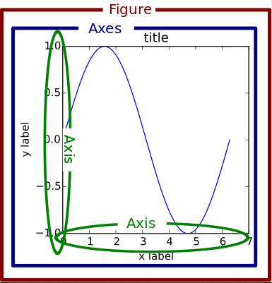
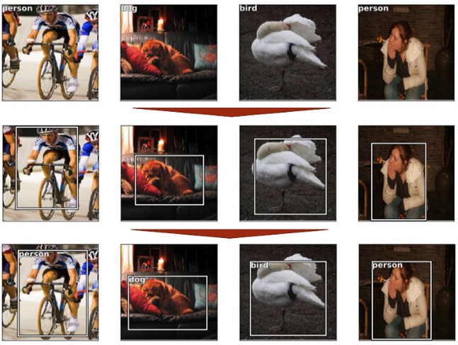
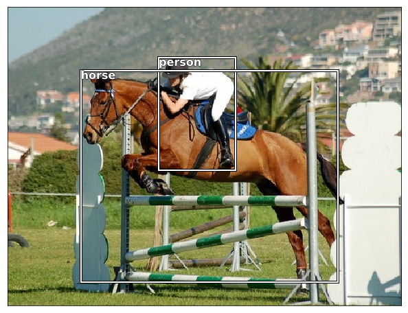
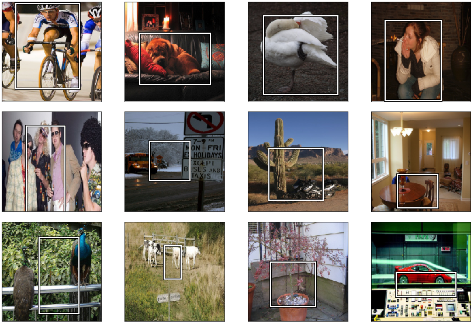

## Tools

### Pathlib

- [Cheat Sheet](https://pbpython.com/pathlib-intro.html)

Let's take a look at pathlib which was introduced in Python 3.4 and simplifies our work with files tremendously. With pathlib, we can directly call read_text from a pathlib variable, and the same process to write to a file:

```python
from pathlib import Path
import json
# Reading
path = Path('file.json')
contents = path.read_text()
json_content = json.load(contents)
# Writing
json_content['name'] = 'Rad'
path.write_text(json.dump(json_content))
```

We can also easily rename the file, and check if it exits or not:

```python
path = Path('file.json')
new_path = path.with_name('myfile.json') # PosixPath('myfile.json')
path.rename(new_path)
path.with_suffix('.txt') # To change the extension only
path.exists() # False
new_path.exists() # True
```

Our file was renamed in a few easy steps, in a nice object oriented fashion. The paths returned by json areof type PosixPath, PosixPath represents our path instance, which enables us to do all sorts of operations, like creating a new directory, checking for existence, checking for file type, getting size, checking for user, group, permissions, etc. Basically everything we would previously do with the os.path module. Like fetching a certain type of files with `glob`:

```python
from pathlib import Path
tmp = Path('json')
files = list(tmp.glob('*.json'))
# We can also iterate through sub-directories using iterdir
tmp = Path('tmp')
files_in_dir = list(tmp.iterdir())
```

We can also traverse folder (append to the original path) using a simple backslash / operator and even creating new paths.

```python
tmp = Path('tmp')
new_path = tmp / 'pictures' / 'camera' # PosixPath('tmp/pictures/camera')
new_path.mkdir(parents=True)
new_path.exists() # True
```

### Tricks to using IDEs

Some VScode tricks and shortcuts:

* Command palette (`Ctrl-shift-p`)
   * Select interpreter
* Go to symbol (`Ctrl-t`)
* Find references (`Shift-F12`)
* Go to definition (`F12`)
* Go back (`alt-left`)
* Hide sidebar (`Ctrl-b`)
* Zen mode (`Ctrl-k,z`)

### Matplotlib
One important big-picture matplotlib concept is its object hierarchy. `plt.plot([1, 2, 3])` hides the fact that a plot is really a hierarchy of nested Python objects. A “hierarchy” here means that there is a tree-like structure of matplotlib objects underlying each plot.

A Figure object is the outermost container for a matplotlib graphic, which can contain multiple Axes objects. One source of confusion is the name: an Axes actually translates into what we think of as an individual plot or graph (rather than the plural of “axis,” as we might expect).

We can think of the Figure object as a box-like container holding one or more Axes (actual plots). Below the Axes in the hierarchy are smaller objects such as tick marks, individual lines, legends, and text boxes. Almost every “element” of a chart is its own manipulable Python object, all the way down to the ticks and labels:

<p align="center">  </p>

[More info](https://forums.fast.ai/t/deeplearning-lec8-notes/13684)

### Python debugger

We can use the python debugger pdb to step through code, to do this we have to choices:

* pdb.set_trace() to set a breakpoint
* %debug magic to trace an error (after the exception happened)

Useful Commands:

* h (help)
* s (step into)
* n (next line / step over — you can also hit enter)
* c (continue to the next breakpoint)
* u (up the call stack)
* d (down the call stack)
* p (print) — force print when there is a single letter variable that’s also a command.
* l (list) — show the line above and below it
* q (quit) — very important

Documentation:

```
Documented commands (type help <topic>):
========================================
EOF    c          d        h         list      q        rv       undisplay
a      cl         debug    help      ll        quit     s        unt      
alias  clear      disable  ignore    longlist  r        source   until    
args   commands   display  interact  n         restart  step     up       
b      condition  down     j         next      return   tbreak   w        
break  cont       enable   jump      p         retval   u        whatis   
bt     continue   exit     l         pp        run      unalias  where    

Miscellaneous help topics:
==========================
exec  pdb
```


## Object Detection

The goal of object detection is to classify multiple things, and find the bounding boxes around the objects which we're classifying, the object has to be entirelt within the bounding box, but not bigger then it needs to be.

We'll tackle this problem in three stages:

1. Find the largest item in the image, classic image classification.
2. Propose a bounding box for the main object in the image.
3. Do both of things with an end to end network.

<p align="center">  </p>

### Load the data / annotations

We'll use Pascal Voc 2007 ([Download link](http://pjreddie.com/media/files/VOCtrainval_06-Nov-2007.tar) with json annotation, a more simpler version than the original xml ones), which is a dataset that provides the annotations (bounding boxes) of the objects present in the image, there is another version (2012), containing more images, but it this lecture we're only going to use the smaller one, we could combine them, but we need to be careful to not have any data leakage between the two validation sets if we do this.

```python
PATH = Path('data/pascal')
list(PATH.iterdir())
# [PosixPath('data/pascal/VOCdevkit'), ...

trn_j = json.load((PATH/'pascal_train2007.json').open())
trn_j.keys() # ['images', 'type', 'annotations', 'categories']
```

The images field contains all the infomation about the images in the dataset, their name, the height and width and their IDs. fot the annotations, here we have the bounding box annotations, the category ID of the object enclosed in the box, the segmentation, the box (xmin, ymin, xmax, ymax). and the categories

IMAGES,ANNOTATIONS,CATEGORIES = ['images', 'annotations', 'categories']

```python
trn_j[IMAGES][0] # {'file_name': '000012.jpg', 'height': 333, 'id': 12, 'width': 500}
trn_j[CATEGORIES][0] # {'id': 1, 'name': 'aeroplane', 'supercategory': 'none'}
trn_j[ANNOTATIONS][0]
```

```
{'area': 34104,
  'bbox': [155, 96, 196, 174],
  'category_id': 7,
  'id': 1,
  'ignore': 0,
  'image_id': 12,
  'iscrowd': 0,
  'segmentation': [[155, 96, 155, 270, 351, 270, 351, 96]]}
```

It’s helpful to use constants instead of strings, since we get tab-completion and don’t mistype. so then we can create dits to convert from IDs to class names, the same thing for image IDs and their names, and we also create a list containing all of the image IDs in the training set.

```python
FILE_NAME, ID, IMG_ID, CAT_ID, BBOX = 'file_name', 'id', 'image_id', 'category_id', 'bbox'

cats = dict((o[ID], o['name']) for o in trn_j[CATEGORIES])
trn_fns = dict((o[ID], o[FILE_NAME]) for o in trn_j[IMAGES])
trn_ids = [o[ID] for o in trn_j[IMAGES]]
```

Now, after loading the annotations, we'll take a look into the folder containing the images, in PASCAL VOC, the images are in the folder `VOCdevkit/VOC2007/JPEGImages`

```python
JPEGS = 'VOCdevkit/VOC2007/JPEGImages'
IMG_PATH = PATH/JPEGS
```

To simplify the process of using the annotations, we create a dictionnary, where the keys are image IDs and the the values are a list of all the bounding boxes in the image, in such cases, a `defaultdict` is useful any time we want to have a default dictionary entry for new keys, so in case we want to access a new key, if it is not in the dict it'll be created, depending on the type we desire, in this case we'd like lists to be created.

```python
trn_anno = collections.defaultdict(lambda:[])
for o in trn_j[ANNOTATIONS]:
    if not o['ignore']:
        bb = o[BBOX]
        bb = np.array([bb[1], bb[0], bb[3]+bb[1]-1, bb[2]+bb[0]-1])
        trn_anno[o[IMG_ID]].append((bb,o[CAT_ID]))
```

Here we switched between x and y, in the original annotation, we have (xmin, ymin, xmax, ymax), which is the standard in computer vision, but given that in matrix / tensors, we start by the row (y) and then we index the columns (x), we changed them, and we create a new function to convert between the two.

```python
def bb_hw(a): return np.array([a[1],a[0],a[3]-a[1],a[2]-a[0]])
```

#### Polting

Matplotlib’s `plt.subplots` is a useful wrapper for creating plots, regardless of whether we have more than one subplot. Here is a simple function used to create an axis with a subplot, that we'll pass to other function to add / draw some new elements in the plot.

```python
def show_img(im, figsize=None, ax=None):
   if not ax: fig,ax = plt.subplots(figsize=figsize)
   ax.imshow(im)
   ax.get_xaxis().set_visible(False)
   ax.get_yaxis().set_visible(False)
   return ax
```

A simple but rarely used trick to making text visible regardless of background is to use white text with black outline, or visa versa. Here’s how to do it in matplotlib.

```python
def draw_outline(o, lw):
    o.set_path_effects([patheffects.Stroke(
        linewidth=lw, foreground='black'), patheffects.Normal()])
```

And here are two little function to draw the bounding boxes, passing the x, y and H / W, that are unpacked, and the text (box labels)

```python
def draw_rect(ax, b):
    patch = ax.add_patch(patches.Rectangle(b[:2], *b[-2:], fill=False, edgecolor='white', lw=2))
    draw_outline(patch, 4)

def draw_text(ax, xy, txt, sz=14):
    text = ax.text(*xy, txt,
        verticalalignment='top', color='white', fontsize=sz, weight='bold')
    draw_outline(text, 1)
```

And now we can reuse the created function above to show multiple objects on a single image by simply ploting the image and iterating over the bounding boxes and one by one.

```python
def draw_im(im, ann):
    ax = show_img(im, figsize=(16,8))
    for b,c in ann:
        b = bb_hw(b)
        draw_rect(ax, b)
        draw_text(ax, b[:2], cats[c], sz=16)
```

And a more general function, that takes the ID, loads the image and the annotation, and then displays them.

```python
def draw_idx(i):
    im_a = trn_anno[i]
    im = open_image(IMG_PATH/trn_fns[i])
    print(im.shape)
    draw_im(im, im_a)
```

<p align="center">  </p>

### Image classification

#### The data

The first and easiest step is to begin with a simple image classification task, by predicting the classes of the largest objecet in the image, so we need to start by creating the labels of the images in the dataset using the areas of each bounding box, for this we can use a simple lambda function, and call it in the appropriate function that returns the largest box, and then call the function in a dictionnary comprehension to associate with each image / image ID the largest box, and each box is a tuple with its four coordinates and the associated class (or its category id to be precise).

```python
sorted(b, key=lambda x: np.product(x[0][-2:]-x[0][:2]), reverse=True)

def get_lrg(b):
    if not b: raise Exception()
    b = sorted(b, key=lambda x: np.product(x[0][-2:]-x[0][:2]), reverse=True)
    return b[0]

trn_lrg_anno = {a: get_lrg(b) for a,b in trn_anno.items()}
```

To avoid the need to apply these steps each time we want to use the dataset, we stor the image img id and the corresponding largest box in a Pandas data frame, we also specify the columns to force the correct ordering of them.

```python
(PATH/'tmp').mkdir(exist_ok=True)
CSV = PATH/'tmp/lrg.csv'
df = pd.DataFrame({'fn': [trn_fns[o] for o in trn_ids],
                   'cat': [cats[trn_lrg_anno[o][1]] for o in trn_ids]}, columns=['fn','cat'])
df.to_csv(CSV, index=False)
```

#### The model

First we'll resize all the image to a fixed size, and without any croping, only rescaling the image to the right size given that the largest object may not be centred in the image unlike the instances in imagenet per example, and we then choose the model (a simple resnet 34) and create a data loader of the dataset, a data loader is an iterator that will provide a mini-batch of data at each training iteration. But first we need to ensure that we start at the beginning of the dataset. Pythons’ iter() method will create an iterator object and start at the beginning of the dataset. And afterwards our iterator will have __next__ that can be used to pull a mini-batch, the element returned by the dataloader are in the GPU, and are in the form of torch tensors, and are normelized between 0 and 1.

```python
f_model = resnet34
sz=224
bs=64

tfms = tfms_from_model(f_model, sz, aug_tfms=transforms_side_on, crop_type=CropType.NO)
md = ImageClassifierData.from_csv(PATH, JPEGS, CSV, tfms=tfms)
md.trn_dl # <fastai.dataloader.DataLoader at 0x7fba10572908>
```

And like in earlier lessons, we start by doing a learning rate finder `lrf = learn.lr_find(1e-5,100)`, and we find that a learning rate of `lr = 2e-2` is appropriate, and then we fit our model for one cycle, and then we freeze all layers except the last two layers and use differential learning rates for each one (last two + the head), find new learning rate and retrain the model for one cycle, and then unfreeze all the layers and fine tuning a little bit, but we see that the accuracy is stuck at 0.83 given that sometime the biggest box is not the obvious one to be detected.

```python
lr = 2e-2
learn.fit(lr, 1, cycle_len=1)
learn.freeze_to(-2)

lrs = np.array([lr/1000,lr/100,lr])
learn.freeze_to(-2)
learn.fit(lrs/5, 1, cycle_len=1)

learn.unfreeze()
learn.fit(lrs/5, 1, cycle_len=2)
```

The results are quite good:

<p align="center">  </p>

### Object localization

Now instead of only predecting the label of the largest object, we're also going to predict the 4 coordinates of the box of the object in question. To predict the bounding box, we'll need a new output branch of the model, this branch will be a regression branch outputing real values corresponding to image coordinates, and the loss function will be a MSE or a L1 lossn to not overblow the loss when the error is large, and for the classification we have the same classification output with a softmax output and a cross entropy loss.

#### Boxes only

First we only going to have a regression output, given that the original resnet output a classification with a vector of 1000 for the probabilities of all the classes in the imagenet dataset, or a 21 classes in our case of PASCAL VOC, we're going to have a model with only four output, so we're going to have a conv layer going from 7x7x512 to 1x1x4 instead of an average pool folowed by a linear layer, and we can also flatten the 7x7x512 == 25088 and then add a linear layer of 25088 -> 4.

For the dataset, we creat a new datafama, and this time with two fieald image filenames and their bounding boxes:

```python
bb = np.array([trn_lrg_anno[o][0] for o in trn_ids])
bbs = [' '.join(str(p) for p in o) for o in bb]

df = pd.DataFrame({'fn': [trn_fns[o] for o in trn_ids], 'bbox': bbs}, columns=['fn','bbox'])
df.to_csv(BB_CSV, index=False)
```

Adding a custom head to the resnet 34, and then per the usual, find the leanring rate, and train the head, gradually unfreeze the layers and train them with differential leanring rates:

```python
head_reg4 = nn.Sequential(Flatten(), nn.Linear(25088,4))
learn = ConvLearner.pretrained(f_model, md, custom_head=head_reg4)
learn.opt_fn = optim.Adam
learn.crit = nn.L1Loss()

lr = 2e-3
learn.fit(lr, 2, cycle_len=1, cycle_mult=2)
lrs = np.array([lr/100,lr/10,lr])
learn.freeze_to(-2)
learn.fit(lrs, 2, cycle_len=1, cycle_mult=2)
learn.fit(lrs, 1, cycle_len=2)
learn.freeze_to(-3)
```

And then results are somehow correct, when there is only one object the network predicts a correct bounding box, but when there is multipple object the model does not knowq which one to choose the chooses the middle, or when the object is small and not the obvious:

<p align="center">  </p>