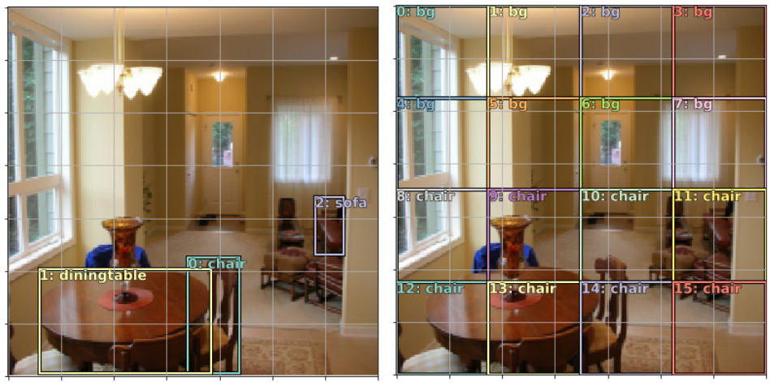
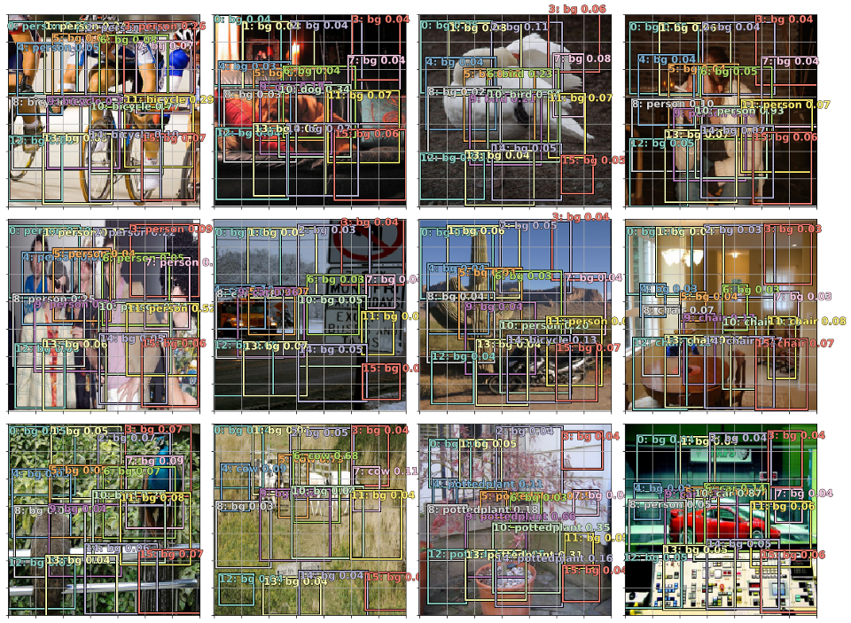
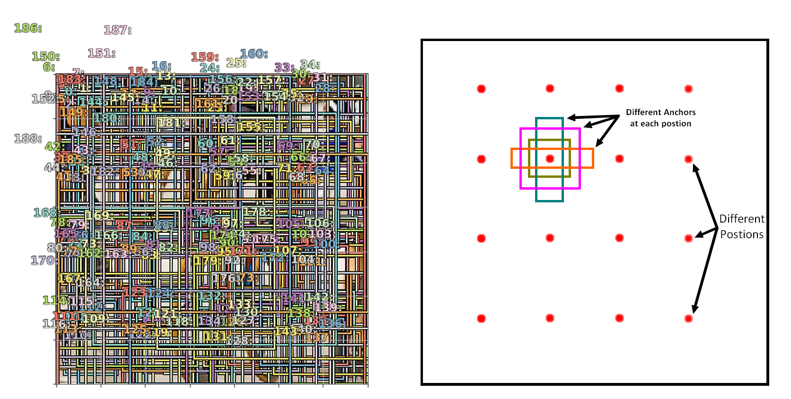
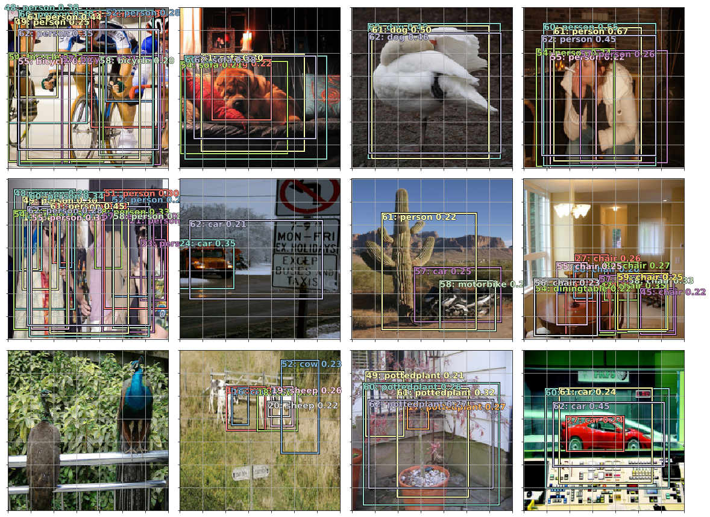
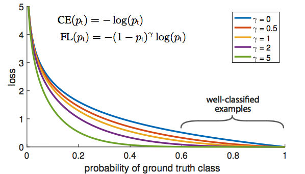
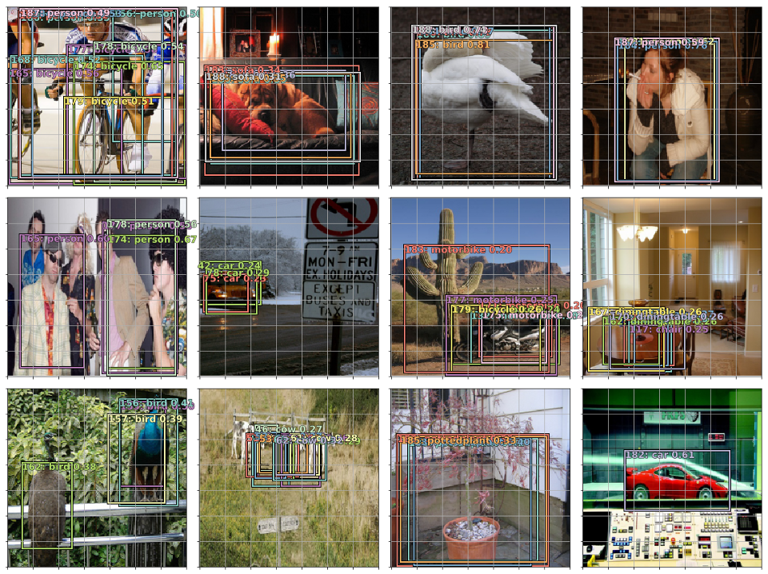

 
### Object detection

#### Object localization

In this lecture we'll continue with object detection, the last thing we explored was predecting bounding boxes of the biggest objects in the image, now we'll do an object localization task, doing both a localization and a classification task of the bigget object in the image.

We first start by adding some data augmentation, mainly a random rotation, a random lignting shift, a random flip and a random dihedral, and the same transformation needs to be applied to the bounding box coordianates or will otherwise has a box missalignement.

```python
tfm_y = TfmType.COORD
augs = [RandomFlip(tfm_y=tfm_y),
        RandomRotate(3, p=0.5, tfm_y=tfm_y),
        RandomLighting(0.05,0.05, tfm_y=tfm_y)]

tfms = tfms_from_model(f_model, sz, crop_type=CropType.NO, 
                 tfm_y=tfm_y, aug_tfms=augs)
```

Here we do maximum of 3 degree rotation to avoid this problem. It also only rotates half of the time (p=0.5).

Now to do object detection, we need a custom head for our resnet architecture, and this time with one outputs having C + 4 number of elements, C outputs for classification with an output equals the number of classes, and a regression branch with four outputs, for the dataset, we concatenate the two dataset we saved earlier in the form of pandas dataframe, one with only the coordinates and one with the classes.

**Architecture:** Fot the architecture, we’ll use an extra linear layer this time, plus some dropout, to help us train a more flexible model. so we add some linear layer with dropout, going from 512 x 7 x 7 -> 256 -> C + 4.

```
head_reg4 = nn.Sequential(
    Flatten(),
    nn.ReLU(),
    nn.Dropout(0.5),
    nn.Linear(25088,256),
    nn.ReLU(),
    nn.BatchNorm1d(256),
    nn.Dropout(0.5),
    nn.Linear(256,4+len(cats)),
)
```

**Loss Function:** The loss function needs to look at these 4 + len(cats) activations and decide if they are good, whether these numbers accurately reflect the position and class of the largest object in the image. We know how to do this. For the first 4 activations, we will use L1Loss just like we did before (L1-Loss is like a Mean Squared Error, instead of sum of squared errors, it uses sum of absolute values). For rest of the activations, we can use cross entropy loss.

```python
def detn_loss(input, target):
    bb_t,c_t = target
    bb_i, c_i = input[:, :4], input[:, 4:]
    bb_i = F.sigmoid(bb_i)*224
    return F.l1_loss(bb_i, bb_t) + F.cross_entropy(c_i, c_t)*20

def detn_acc(input, target):
    _,c_t = target
    c_i = input[:, 4:]
    return accuracy(c_i, c_t)
```

We multiply the classfication loss with 20 so that both the losses will have similar ranges, and for the predicted coordinates, we have a sigmoid as output for regression, so we have outputs in the range of [0, 1], and knowing that the size of the image is 224 x 224, we multiply it by 224 to have the same range too.

And then we find the learning rate, fit the custom head, unfreeze (last two layer ad then the whole model) and use differential learning rates to get better resutls.

```python
lr=1e-2
learn.fit(lr, 1, cycle_len=3, use_clr=(32,5))
learn.freeze_to(-2)
lrs = np.array([lr/100, lr/10, lr])
learn.fit(lrs/5, 1, cycle_len=5, use_clr=(32,10))
learn.unfreeze()
learn.fit(lrs/10, 1, cycle_len=10, use_clr=(32,10))
```

And we end up with the same results (81% accuracy for classification) nad a loss of 18.55 for the regression, which are similar to the two networks that did each task separately. This is not surprising because ResNet was designed to do classification so we wouldn’t expect to be able to improve things in such a simple way. It certainly wasn’t designed to do bounding box regression. It was explicitly actually designed in such a way to not care about geometry, it takes the last 7 by 7 grid of activations and averages them all together throwing away all the information about where everything came from. Interestingly, when we do classification and bounding box at the same time, the L1 seems a little bit better than when we just did bounding box regression, this might be beacuse the classification information backpropagated through the network helps also with the regression in an unexpected way.

### Multi label classification

The objective now is to go from detecting one object, the biggest one, to detecting all of the  objects present in the image, what we call multi label classification.

First we'll start by detecting all the classes prsent in the image, for this we start by constructing a new data frame, this time containing all the classes in a given image.

```python
mc = [set([cats[p[1]] for p in trn_anno[o]]) for o in trn_ids]
mcs = [' '.join(str(p) for p in o) for o in mc]

df = pd.DataFrame({'fn': [trn_fns[o] for o in trn_ids],
                   'clas': mcs}, columns=['fn','clas'])
df.to_csv(MC_CSV, index=False)
```

And the created dataset has fields like `1 000017.jpg person horse` and `2 000023.jpg bicycle person`.

And this time, the model used is similar to the one used for image classification, but with a different loss funcition, using sigmoid loss function instead of a softmax, we then apply the same approach as usual, starting by finding a learning rate, and fitting the model using cyclic learning rate.

### SSD and YOLO

Now we'll tackle the problem of detecting all the objects in a given image, there is generally two approaches to do this, SSD (single shot detection) or YOLO (you only look once), before comparing the two approches, first we need to define the output of our network, let's say we divide our input image into 4x4 blocks, and the objective is to predict the class of the object in each block, and their coordinates, and of course one of the possible outputs is background, so for a 4x4 blocks, the number of ouputs needs to be 16 x (C + 4), and C is the number of classes, for SSD, the last layer is contructed using a convolutionnal layer, going from 7x7x512 to 4x4x(4+C) using a 3x3 convolution with stride 2, and for YOLO, we can simply use a fully convolutionnal layer to go from 7x7x512 to a flattened 4x4x(4+C), this is illustrated in the figure bellow ([source](https://medium.com/@hiromi_suenaga/deep-learning-2-part-2-lesson-9-5f0cf9e4bb5b))

<p align="center">  </p>

The latest version of YOLO (Yolo v3) is doing the same thing as SSD.

In SSD, by using a convolution from 7x7 to 4x4, each one cell of the last layer that is responsible of predicting the object class and coordinnates of the correct region in the input image, given that each cell of 4x4 has an receptive field the correspond to the correct region in the input image.

#### The architecture

So we first start by applying some convolutions 3x3 convolutions with stride one and some padding, followed by another conv 3x3 but this time with a stride of two, and now we'll end up with an output of 4x4x512 (StdConv), after this we'll need to add two branches, one to predict the probabilities for each class for each box (C+1 channels, so C+1 for each one of the 4x4 boxes), and another is to predict 4 coordinates for each box. At the end, we flatten out the convolution because the loss function expects flattened out tensor.

```python
class StdConv(nn.Module):
    def __init__(self, nin, nout, stride=2, drop=0.1):
        super().__init__()
        self.conv = nn.Conv2d(nin, nout, 3, stride=stride, padding=1)
        self.bn = nn.BatchNorm2d(nout)
        self.drop = nn.Dropout(drop)

    def forward(self, x):
        return self.drop(self.bn(F.relu(self.conv(x))))

def flatten_conv(x,k):
    bs,nf,gx,gy = x.size()
    x = x.permute(0,2,3,1).contiguous()
    return x.view(bs, -1, nf//k)

class OutConv(nn.Module):
    def __init__(self, k, nin, bias):
        super().__init__()
        self.k = k
        self.oconv1 = nn.Conv2d(nin, (len(id2cat)+1)*k, 3, padding=1)
        self.oconv2 = nn.Conv2d(nin, 4*k, 3, padding=1)
        self.oconv1.bias.data.zero_().add_(bias)

    def forward(self, x):
        return [flatten_conv(self.oconv1(x), self.k),
                flatten_conv(self.oconv2(x), self.k)]

class SSD_Head(nn.Module):
    def __init__(self, k, bias):
        super().__init__()
        self.drop = nn.Dropout(0.25)
        self.sconv0 = StdConv(512,256, stride=1)
        self.sconv2 = StdConv(256,256)
        self.out = OutConv(k, 256, bias)

    def forward(self, x):
        x = self.drop(F.relu(x))
        x = self.sconv0(x)
        x = self.sconv2(x)
        return self.out(x)

head_reg4 = SSD_Head(k, -3.)
```

In this case, for each cell in the image (4x4), we have only one anchor per cell, so k=1 in this first and simple case.

#### Matching problem

First, we need to begin by assigning to each cell one of the boxes in the training data, the one that is centered in a given cell for example, and for the rest we need to predict background, So the loss function needs to take each of the objects in the image and match them to one of these grid cells, and compare them to the prediction made by the model.

<p align="center">  </p>

Each of these square boxes, different papers call them different things: anchor boxes, prior boxes, or default boxes.

What we are going to do for this loss function is we are going to go through a matching problem where we are going to take every one of these 16 boxes and see which one of these three ground truth objects has the highest amount of overlap with a given cell. To do this, we have to have some way of measuring amount of overlap and a standard function for this is called Jaccard index (IoU).

So first, we begin by calculating the jacard index for each ground truth object with all the cells in the image (4x4 cells), now in the example above we have three ground truth boxes, with 16 cells, so we have a matrix of size 3x16, each element in the jacard index of each ground truth object with each cell, and then we can see the cell with the height overlap for each ground truth (dim = 1) or the max overlap for each cell (dim = 0).

```bash
# JACARD VALUES
Columns 0 to 7
0.0000  0.0000  0.0000  0.0000  0.0000  0.0000  0.0000  0.0000    0.0000  0.0000  0.0000  0.0000 0.0000  0.0000  0.0000  0.0000    0.0000  0.0000  0.0000  0.0000  0.0000  0.0000  0.0000  0.0000

Columns 8 to 15
0.0000  0.0091 0.0922  0.0000  0.0000  0.0315  0.3985  0.0000  0.0356  0.0549 0.0103  0.0000  0.2598  0.4538  0.0653  0.0000  0.0000  0.0000 0.0000  0.1897  0.0000  0.0000  0.0000  0.0000 

# MAX DIM 1
0.3985 0.4538 0.1897
14  13  11

# MAX DIM 0
0.0000   0.0000   0.0000   0.0000   0.0000   0.0000   0.0000   0.0000   0.0356   0.0549   0.0922 0.1897   0.2598   0.4538   0.3985   0.0000
0   0   0   0   0   0   0   0   1   1   0   2   1   1   0   0
```

Now we use these values, the max overlap (the three cells with the max jacard values) gets assigned the objects in questions, and for the rest, each cell gets assigned the object with which it has an overlap greater than 0.5, the rest is labeled background.

```bash
# ASSIGNEMENT
['bg',  'bg',  'bg',  'bg',  'bg',  'bg',  'bg',  'bg',  'bg',  'bg',  'bg',  'sofa',  'bg',  'diningtable',  'chair',  'bg']
```

After the matching stage, we can use an L1 loss between the coordinates ground truth objects, and the coordinates predicted for each one of cell that are mached with these groung truth objects, and we do the same for the second outputs that are used for classification, but this time using cross entropy.

In the end, for each image, we'll endup with 16 predicted boxes, the majority of which will be ground truth.

#### How do we interpret the outputs ?

The way we interpret the activation is defined as:

```python
def actn_to_bb(actn, anchors):
    actn_bbs = torch.tanh(actn)
    actn_centers = (actn_bbs[:,:2]/2 * grid_sizes) + anchors[:,:2]
    actn_hw = (actn_bbs[:,2:]/2+1) * anchors[:,2:]
    return hw2corners(actn_centers, actn_hw)
```

We grab the outputs, we stick them through tanh which forces it to be within [-1,1] range and multiply them by the grid size for each cell. We then grab the actual position of the anchor boxes, and we will move them around according to the value of the outputs divided by two (actn_bbs[:,:2]/2). In other words, each predicted bounding box can be moved by up to 50% of a grid size from where its default position is. So it can be up to twice as big or half as big as its default size. So what our network predicts, are only relative translations from the center of each grid cell and the height and width (the height and with are betwenn 0 and 1, so we add 1, and multiply by the default size of the cell), and in the output stage, we then adjust the outputs taking into consideration the center of each cell and the relative translations/height - width.

#### Classification loss: binary cross entropy loss instead of cross entropy

Binary cross entropy is what we normally use for multi-label classification. Like in the planet satellite competition, each satellite image could have multiple things. If it has multiple things in it, we cannot use softmax because softmax really encourages just one thing to have the high number. In our case, each anchor box can only have one object associated with it, so it is not for that reason that we are avoiding softmax. But due to that fact that we can an anchor box with nothing associated with it. There are two ways to handle this idea of “background”; one would be to say background is just a class, so let’s use softmax and just treat background as one of the classes that the softmax could predict. A lot of people have done it this way. But that is a really hard thing to ask neural network to do it is basically asking whether this grid cell does not have any of the 20 objects that I am interested with Jaccard overlap of more than 0.5. It is a really hard to thing to put into a single computation. On the other hand, what if we just asked for each class; “is it a motorbike?” “is it a bus?”, “ is it a person?” etc and if all the answer is no, consider that background. That is the way we do it here. It is not that we can have multiple true labels, but we can have zero [source](https://medium.com/@hiromi_suenaga/deep-learning-2-part-2-lesson-9-5f0cf9e4bb5b).

```python
class BCE_Loss(nn.Module):
    def __init__(self, num_classes):
        super().__init__()
        self.num_classes = num_classes

    def forward(self, pred, targ):
        t = one_hot_embedding(targ, self.num_classes+1)
        t = V(t[:,:-1].contiguous())#.cpu()
        x = pred[:,:-1]
        w = self.get_weight(x,t)
        return F.binary_cross_entropy_with_logits(x, t, w, 
                            size_average=False)/self.num_classes

    def get_weight(self,x,t): return None
```

In forward First we take the one hot embedding of the target (at this stage, we do have the idea of background), then we remove the background column (the last one) which results in a vector either of all zeros or one one, and finally we use binary cross-entropy predictions.

And then, after introducing the loss, we can start training, first by finding the correct learning rate using a strangled learning rates, with different learning rates for each 1/3 of the layers, and after finding the correct learning rate, we can then train our model.

```python
lr = 3e-3
lrs = np.array([lr/100,lr/10,lr])

learn.lr_find(lrs/1000,1.)
learn.sched.plot(1)

learn.fit(lr, 1, cycle_len=5, use_clr=(20,10))
learn.fit(lr, 1, cycle_len=5, use_clr=(20,10))
```

#### Results

<p align="center">  </p>

As we can see, for each cell (16 ones), we predicted bounding boxes, with a center in each given cell, and the maximum height and width are two times the dimensions of a given cell, and the majority of these cell are of type background.

In practice, we want to remove the background and also add some threshold for probabilities, but it is on the right track. The potted plant image, the result is not surprising as all of our anchor boxes were small (4x4 grid). To go from here to something that is going to be more accurate, all we are going to do is to create way more anchor boxes.

### Adding more anchors

Until now, we've divided our input image into 4x4 cells, and for each cell the model predicts the class of the object in it, and four coordinates, x and y are beteween -1 and 1, that are then added to the center of each cell to get the position of the center of the bounding box, and the a W and H of the bounding boxes, and are between 0 and 1, that we multiply by the width of each cell, and the we get the correct coordinates for the bounding boxes.

But the problem, is that out model is very limited in predicting the correct coordinates based only on the features, which is quite hard, so the solution is to define some anchors, that aleady have a given size the position in the image, and the model then predicts only a correction to these pre-existing anchors, like a translation and scaling.

So, this time, let's say, we have 16 positions in the image (the centers of the old 4x4 cells), and in each one, what we can do is define 9 anchors per position, each anchors has a different ratios (3 ratios: 1:1, 0.5:1, 1:0.5) and different size (3 different sizes: 0.75, 1., 1.3), and we end up with `16 * 9 = 144` anchors or even more, in the implementation bellow we have `21*9 = 189` anchors, depending of the number of position we choose, and the number of ratios / sizes in each one:

<p align="center">  </p>

And this is done as follows:

```python
anc_grids = [4, 2, 1] # Number of Grid positions (4 + 2 + 1)
anc_zooms = [0.75, 1., 1.3] # The different sizes
anc_ratios = [(1., 1.), (1., 0.5), (0.5, 1.)] # The different Ratios

# We create the 9 possible combinations of sizes and ratios
anchor_scales = [(anz*i,anz*j) for anz in anc_zooms for (i,j) in anc_ratios]
k = len(anchor_scales)
anc_offsets = [1/(o*2) for o in anc_grids]

# We're going to choose the positions, we want 4 /2 / 1 equally spaced positions
# for the 4 position, they'll be at [0.125, 0.375, 0.625, 0.875], for 2 : [0.25, 0.75] and 
# one in the center, and so for each position of x, we have 7 of y, total of 4*4 + 2*2 +1*1 = 21
anc_x = np.concatenate([np.repeat(np.linspace(ao, 1-ao, ag), ag) for ao,ag in zip(anc_offsets,anc_grids)])
anc_y = np.concatenate([np.tile(np.linspace(ao, 1-ao, ag), ag) for ao,ag in zip(anc_offsets,anc_grids)])

anc_ctrs = np.repeat(np.stack([anc_x,anc_y], axis=1), k, axis=0)

anc_sizes = np.concatenate([np.array([[o/ag,p/ag] for i in range(ag*ag) 
                for o,p in anchor_scales]) for ag in anc_grids])
grid_sizes = V(np.concatenate([np.array([ 1/ag  for i in range(ag*ag)
                for o,p in anchor_scales]) for ag in anc_grids]), requires_grad=False).unsqueeze(1)

anchors = V(np.concatenate([anc_ctrs, anc_sizes], axis=1), requires_grad=False).float()
anchor_cnr = hw2corners(anchors[:,:2], anchors[:,2:])
```

### Model

In this case, we need to have a slight modification to our model, in the output of the previous model, we have 16 grids, each one of a given cell, but this time, we'll need 4x4 outputs for the anchors with positions [0.125, 0.375, 0.625, 0.875], and the same for 2x2 and 1x1, and for each one grid of these activation, the depth need to be equal to : `number of anchors x (Classes + 4)`, because in each position we have 9 anchors, and for each anchors we need to predict the 4 coordinnates (or their corrections), and the probabilities of each one of the C classes.

This is done by taking the 7x7x512, and constructing three outputs, one of size 4x4x(A x (C + 4)) using a conv with stride two, and a 2x2 and 1x1 output using another 2 convolutions with strides of two:

```python
drop=0.4
class SSD_MultiHead(nn.Module):
    def __init__(self, k, bias):
        super().__init__()
        self.drop = nn.Dropout(drop)
        self.sconv0 = StdConv(512,256, stride=1, drop=drop)
        self.sconv1 = StdConv(256,256, drop=drop) # Stride 2
        self.sconv2 = StdConv(256,256, drop=drop) # Stride 2
        self.sconv3 = StdConv(256,256, drop=drop) # Stride 2
        self.out1 = OutConv(k, 256, bias)
        self.out2 = OutConv(k, 256, bias)
        self.out3 = OutConv(k, 256, bias)

    def forward(self, x):
        x = self.drop(F.relu(x))
        x = self.sconv0(x)
        x = self.sconv1(x) # 4x4 
        o1c,o1l = self.out1(x)
        x = self.sconv2(x) # 2x2
        o2c,o2l = self.out2(x)
        x = self.sconv3(x) # 1x1
        o3c,o3l = self.out3(x)
        return [torch.cat([o1c,o2c,o3c], dim=1),
                torch.cat([o1l,o2l,o3l], dim=1)]
```

And as per usual, we find the learning rate, and train the model, and this time we obtain better resutls:

<p align="center">  </p>

### Focal Loss:

One problem with a big number of anchors, is the majority of them will belong to the background, and so the loss of the background will overwhelem the losses of the few anchors that do not belong to the backgound, and this will push the model to predict a background unless it is very confident that it is in fact an object of other type, if not, it won't take any chance.

With the focal loss, if the predictions are quite confident (say > 0.6), which is the case for the background instances, then the resulting loss for these anchors will be weighted with `(1-porbability)^(a hyperparam)`, so it will we weighted down and not have a mitigating effect over the other and more informative losses.

<p align="center">  </p>

And this is done as follows:
$$\mathrm { FL } \left( p _ { \mathrm { t } } \right) = - \alpha _ { \mathrm { t } } \left( 1 - p _ { \mathrm { t } } \right) ^ { \gamma } \log \left( p _ { \mathrm { t } } \right)$$

We have an ordinaty negative log likelihood loss, but we add a weight $\left( 1 - p _ { \mathrm { t } } \right) ^ { \gamma }$ that reduces the loss if the probabilites are close 1 (the model is confident in the predictions), and another weight alpha, that is a normal weight to reduce the inequalities in the number of examples in each class.

And the focal loss is implemened as follows:

```python
class FocalLoss(BCE_Loss):
    def get_weight(self,x,t):
        alpha,gamma = 0.25,2.
        p = x.sigmoid()
        pt = p*t + (1-p)*(1-t)
        w = alpha*t + (1-alpha)*(1-t)
        return w * (1-pt).pow(gamma)
```

And after training with this loss, we a better resutls, and the model is capable of detecting objects that were not detected using the traditionnal binary cross entropy.

<p align="center">  </p>

### Non Maximum Suppression

And now the last step, is to reduce the number of detected object to only one for a given object in the image, this is done using Non Maximum Suppression, we go through the predicted objects, take the object with the heighes confidence score, and then supress all the other predicted object of the same class, that have an IoU > 0.5 with the one with the heighest score. this way we can end up with only one box of each ground truth object.
