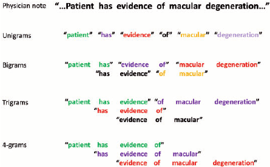
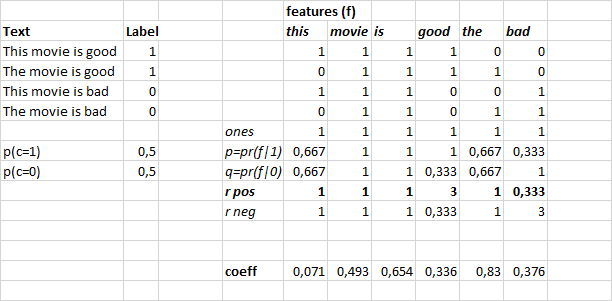

<!-- vscode-markdown-toc -->
* 1. [Trigram with NB features](#TrigramwithNBfeatures)
* 2. [Adding NB feature](#AddingNBfeature)
* 3. [Embeddings](#Embeddings)

<!-- vscode-markdown-toc-config
	numbering=true
	autoSave=true
	/vscode-markdown-toc-config -->
<!-- /vscode-markdown-toc -->

# Lecture 11 - Embeddings

Our next model is a version of logistic regression with Naive Bayes features described [here](https://www.aclweb.org/anthology/P12-2018). For every document we compute binarized features as described in the last lecture, but this time we use bigrams and trigrams too. Each feature is a log-count ratio. A logistic regression model is then trained to predict the sentiment.

##  1. <a name='TrigramwithNBfeatures'></a>Trigram with NB features

<p align="center">  </p>

We create our term matrix the exact same way as before, using tokenized words, but before this time we also add bigrams and trigrams, and we limit the count to 800,000, because if not, we'll end up with a much higher count.

```python
veczr =  CountVectorizer(ngram_range=(1,3), tokenizer=tokenize, max_features=800000)
trn_term_doc = veczr.fit_transform(trn)
val_term_doc = veczr.transform(val)
```

And this time around the size of our matrix is 25000 x 800000, with the vocabulary is not just single words but also couples and triplets : `['by vast', 'by vengeance', 'by vengeance .', 'by vera', 'by vera miles']`.

##  2. <a name='AddingNBfeature'></a>Adding NB feature

The claims in the original paper:

* Naive Bayes (NB) and Support Vector Machine (SVM) are widely used as baselines in text-related tasks but their performance varies significantly across variants, features and datasets.
* Word bigrams are useful for sentiment analysis, but not so much for topical text classification tasks
* NB does better than SVM for short snippet sentiment tasks, while SVM outperforms NB for longer documents
* A SVM variant using NB log-count ratios as feature values consistently performs well across tasks and datasets

NBSVM is an algorithm, originally designed for binary text/sentiment classification, which combines the Multinomial Naive Bayes (MNB) classifier with the Support Vector Machine (SVM). It does so through the element-wise multiplication of standard feature vectors by the positive class/negative class ratios of MNB log-counts. Such vectors are then used as inputs for the SVM classifier.

In our case we'll use logistic instead of SVM, and this time instead of use the binarized features as inputs : x @ W + b, we use the ratio-matrix (R_pos = p(f|C0)/p(f|C1) and R_neg=1/R_pos), and then use the logistic regression on the new inputs : (x.r) @ W + b, and this, together with the trigrams and bigrams give us the state of the art results.

```python
x_nb = x.multiply(r)
m = LogisticRegression(dual=True, C=0.1)
m.fit(x_nb, y)

val_x_nb = val_x.multiply(r)
preds = m.predict(val_x_nb)
(preds.T==val_y).mean()
```

<p align="center">  </p>

After multiplying the term document matrix with r, everywhere a zero appears in the term document matrix, a zero appears in the multiplied version. And every time a one appears in the term document matrix, the equivalent value of r appears on the bottom. So we haven’t really changed much. We’ve just kind of changed the ones into something else i.e. r’s from that feature. So what we are now going to do is we’re going to use this our independent variables, instead, in our logistic regression.

So in other words, this (xnb @ w1) is equal to x*r·w1 . So we could just change the weights to be r·w1 and get the same number. So this ought to mean that the change that we made to the independent variable should not have made any difference because we can calculate exactly the same thing without making that change. So there’s the question. Why did it make a difference? It is due to regularization, with regularization we want the weigths to go to zero, but after multiplying the inputs with the ratios which can be viewd as priors, we dictate our weights to only be very bing/very small in case we have great confidence it'll improve the results (loss is quite big), but in general, we don't want to diverge very much from the prior wich are naive bayes ratios.

##  3. <a name='Embeddings'></a>Embeddings

In categorical variable, we transformed them into one hot vector and then fead them to our model, but the vectors are sparce and orthogonal to each other, so no similarity between the enteries, and also the dimensionnality equals the size of the vocabulary, making it quite big, so a better approach is to lean new vector representations for entery in a much lower and semantically richer space, this is done using a simple linear layer, where the weights are the new vectors we'd like to learn, the this matrix is of size (vocab_size x embs_size). We can implement the same model in PyTorch:

```python
class DotProdNB(nn.Module):
    def __init__(self, nf, ny, w_adj=0.4, r_adj=10):
        super().__init__()
        self.w_adj, self.r_adj = w_adj, r_adj
        self.w = nn.Embedding(nf+1, 1, padding_idx=0)
        self.w.weight.data.uniform_(-0.1,0.1)
        self.r = nn.Embedding(nf+1, ny)

    def forward(self, feat_idx, feat_cnt, sz):
        w = self.w(feat_idx)
        r = self.r(feat_idx)
        x = ((w+self.w_adj)*r/self.r_adj).sum(1)
        return F.softmax(x)
```

In pytorch, instead of using a very large matrix (25000 x 800000) of binary values, and then multiply it by the weights / ratios; we can only store the none negative values of the matrice (a sparce matrix) as indices, and use a look-up table, which takes these indices and gives and ouputs the weights for w and the ratios for r, and this lookup table in pytorch in `nn.Embedding`. In general,  `nn.Embedding` is a lookup table where the key is the word index and the value is the corresponding word vector. However, before using it we should specify the size of the lookup table, and initialize the word vectors ourselves. Here is an exmaple:

```python
# vocab_size is the number of words in the train, val and test set
# vector_size is the dimension of the word vectors we are using
embed = nn.Embedding(vocab_size, vector_size)

# intialize the word vectors, pretrained_weights is a
# numpy array of size (vocab_size, vector_size) and
# pretrained_weights[i] retrieves the word vector of
# i-th word in the vocabulary
embed.weight.data.copy_(torch.fromnumpy(pretrained_weights))

# Then turn the word index into actual word vector
vocab = {"some": 0, "words": 1}
word_indexes = [vocab[w] for w in ["some", "words"]]
word_vectors = embed(word_indexes)
```

He we're not only multiplying by r, but also adding w_adj, this is to further help the model have weights starting from say 0.4, By doing this, even after regularization, every feature is getting some form of minimum weight, Not necessarily because it could end up choosing a coefficient of -0.4 for a feature and that would say “we know what, even though Naive Bayes says it’s the r should be whatever for this feature. I think we should totally ignore it”.
