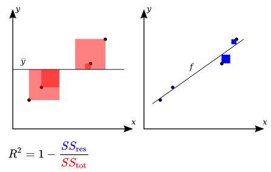
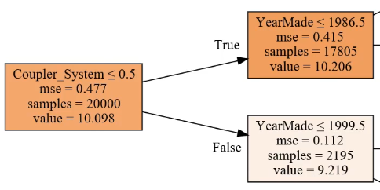

___
# LECTURE 2: Deep dive into Random Forest

### R2 Score

$$R ^ { 2 } \equiv 1 - \frac { S S _ { \mathrm { res } } } { S S _ { \mathrm { tot } } }$$

* The total sum of squares (proportional to the variance of the data): $S S _ { \mathrm { res } } = \sum _ { i } \left( y _ { i } - f _ { i } \right) ^ { 2 } = \sum _ { i } e _ { i } ^ { 2 }$
* The sum of squares of residuals, also called the residual sum of squares: $S S _ { \mathrm { tot } } = \sum _ { i } \left( y _ { i } - \overline { y } \right) ^ { 2 }$

<p align="center">  </p>

We compare the models error to the error made by the most non-stupid model we can use (always predicting the average), so the range of R2 is [1, -inf], one is the perfect score, and when your R² is negative, it means your model is worse than predicting the mean.

So in a nutshell, R² is the ratio between how good your model is (RMSE)vs. how good is the naïve mean model (RMSE).

R² is not necessarily what you are actually trying to optimize, but it is a number you can use for every model and you can start to get a feel of what .8 looks like or what .9 looks like. Something you may find interesting is to create synthetic 2D datasets with different amounts of random noise, and see what they look like on a scatterplot and their R² to get a feel of how close they are to the actual value.

### Validation set for the Kaggle data
If your dataset has a time piece in it (as is in Blue Book competition), you would likely want to predict future prices/values/etc. What Kaggle did was to give us data representing a particular date range in the training set, and then the test set presented a future set of dates that wasn’t represented in the training set. So we need to create a validation set (for hyper-parameter tuning without over fitted to avoid to the training data) that has the same properties:

```python
def split_vals(a,n): return a[:n].copy(), a[n:].copy()

n_valid = 12000  # same as Kaggle's test set size
n_trn = len(df)-n_valid
raw_train, raw_valid = split_vals(df_raw, n_trn)
X_train, X_valid = split_vals(df, n_trn)
y_train, y_valid = split_vals(y, n_trn)
```

But there is always the possibility of eventually overfitting on the validation set and when you try it on the test set or submit it to Kaggle, it turns out not to be very good. This happens in Kaggle competitions all the time and they actually have a fourth dataset which is called the private leader board set. Every time you submit to Kaggle, you actually only get feedback on how well it does on the public leader board set and you do not know which rows they are. At the end of the competition, you get judged on a different dataset entirely called the private leader board set.

#### Building a single tree
TO unserstand Random Forest, let's begin by taking a look into trees, for that we'll use `n_estimators=1` to create a forest with just one tree and`max_depth=3` to make it a small tree
```python
m = RandomForestRegressor(n_estimators=1, max_depth=3,
                          bootstrap=False, n_jobs=-1)
m.fit(X_train, y_train)
print_score(m)
```

<p align="center">  </p>

By how to we find the best splits to build the tree:

* We need to pick a variable and the value to split on such that the two groups are as different to each other as possible and and have simlilar elements internally.
* How to find the best variable, and the best values to split on for that variable, we can go through all the variables and all the possible values of the selected varaibles, we do a split and calculate the weighted average of the two resulting groups = MSE1 * samples/samples1 + MSE2 * samples/samples2, and then choose variables/value with the least erros (note: the MSE of the root node, is naive model, aka predicitng the average).

Right now, our decision tree has R² of 0.4. Let’s make it better by removing max_depth=3. By doing so, the training R² becomes 1 (as expected since each leaf node contains exactly one element) and validation R² is 0.73 — which is better than the shallow tree but not as good as we would like.


**Side Note: Using Entropy to pick the nodes**
* A chosen attribute A, with K distinct values, divides the training set E into subsets E1 , ... , EK. 
* The Expected Entropy (EH) remaining after trying attribute A (with branches  i=1,2,..., K), given that $H(p) = -\sum p \log(p)$ is
$$E H ( A ) = \sum _ { i = 1 } ^ { K } \frac { \left(  p _ { i }  + n _ { i } \right) } { p + n } H \left( \frac { p _ { i } } { p _ { i } + n _ { i } } , \frac { n _ { i } } { p _ { i } + n _ { i } } \right)$$
* Information gain (I) or  reduction in entropy  for this attribute is (entropy before the split - entropy after it)
$$I ( A ) = H \left( \frac { p } { p + n } , \frac { n } { p + n } \right) - E H ( A )$$
* Choose the attribute with the largest I


*Let’s make our decision tree better*, To make these trees better, we will create a forest. To create a forest, we will use a statistical technique called **bagging**.

**Bagging** is an interesting idea which is what if we created five different models each of which was only somewhat predictive but the models gave predictions that were not correlated with each other. That would mean that the five models would have profound different insights into the relationships in the data. If you took the average of those five models, you are effectively bringing in the insights from each of them. So this idea of averaging models is a technique for Ensembling.

What if we created a whole a lot of trees, big, deep, massively overfit trees but each one, let’s say, we only pick a random 1/10 of the data and we do that a hundred times (different random sample every time). They are overfitting terribly but since they are all using different random samples, they all overfit in different ways on different things. In other words, they all have errors but the errors are random / not correlated. The average of random errors is zero. If we take the average of these trees each of which have been trained on a different random subset, the error will average out to zero and what is left is the true relationshi, and that’s the random forest.

The key insight here is to construct multiple models which are better than nothing and where the errors are, as much as possible, not correlated with each other.

And it turns out, the more uncorrelated the trees, the better the results, now even with random samples, when we built a large number of trees, the trees will be somehow correlated, so we can always try to add more randomization to the process of creating the trees, say like choosing the variables to split on radomly and not all the variables. Like `ExtraTreeClassifier ` in skitlearn

**Code example:**
```python
preds = np.stack([t.predict(X_valid) for t in m.estimators_]) preds[:,0], np.mean(preds[:,0]), y_valid[0]

(array([ 9.21034,  8.9872 ,  8.9872 ,  8.9872 ,  8.9872 ,  9.21034,  8.92266,  9.21034,  9.21034,  8.9872 ]),
9.0700003890739005,  
9.1049798563183568)
```

Each tree is stored in an attribute called `estimators_` . For each tree, we will call predict with our validation set. `np.stack` concatenates them together on a new axis, so the resulting `preds` has the shape of (10, 12000) (10 trees, 12000 validation set). The mean of 10 predictions for the first data is 9.07, and the actual value is 9.10. As you can see, none of the individual prediction is close to 9.10, but the mean ends up pretty good.

<p align="center">  </p>

Here is a plot of R² values given first i trees. As we add more trees, R² improves. But it seems as though it has flattened out.

#### Out-of-bag (OOB) score

```python
m = RandomForestRegressor(n_estimators=40, n_jobs=-1, oob_score=True)
```

Sometimes your dataset will be small and you will not want to pull out a validation set because doing so means you now do not have enough data to build a good model. However, random forests have a very clever trick called out-of-bag (OOB) error which can handle this.

What we could do is to recognize that in our first tree, some of the rows did not get used for training. so we could do is to pass those unused rows through the first tree and treat it as a validation set. For the second tree, we could pass through the rows that were not used for the second tree, and so on. Effectively, we would have a different validation set for each tree. To calculate our prediction, we would average all the trees where that row is not used for training. If you have hundreds of trees, it is very likely that all of the rows are going to appear many times in these out-of-bag samples. You can then calculate RMSE, R², etc on these out-of-bag predictions.

#### Subsampling

Earlier, we took 30,000 rows and created all the models which used a different subset of that 30,000 rows to speed things up. Why not take a totally different subset of 30,000 each time? In other words, let’s leave the entire 389,125 records as is, and if we want to make things faster, pick a different subset of 30,000 each time. So rather than bootstrapping the entire set of rows, just randomly sample a subset of the data.

```python
def set_rf_samples(n):
    """ Changes Scikit learn's random forests to give each tree a random sample of n random rows.
    """
    forest._generate_sample_indices = (lambda rs, n_samples:
        forest.check_random_state(rs).randint(0, n_samples, n))
```

This will take the same amount of time to run as before, but every tree has an access to the entire dataset. After using 40 estimators, we get the R² score of 0.876.

**TIP:** Most people run all of their models on all of the data all of the time using their best possible parameters which is just pointless. If you are trying to find out which feature is important and how they are related to each other, having that 4th decimal place of accuracy is not going to change any of your insights at all. Do most of your models on a large enough sample size that your accuracy is reasonable (within a reasonable distance of the best accuracy you can get) and taking a small number of seconds to train so that you can interactively do your analysis.

**A quick summary** [Link](https://stackoverflow.com/questions/18541923/what-is-out-of-bag-error-in-random-forests)
Suppose our training data set is represented by T and suppose data set has M features (or attributes or variables).

    T = {(X1,y1), (X2,y2), ... (Xn, yn)}

and

    Xi is input vector {xi1, xi2, ... xiM}
    yi is the label (or output or class).

Random Forests algorithm is a classifier based on primarily two methods:
- Bagging
- Random subspace method.

Suppose we decide to have S number of trees in our forest then we first create S datasets of "same size as original" created from random resampling of data in T with-replacement (n times for each dataset). This will result in `{T1, T2, ... TS}` datasets. Each of these is called a bootstrap dataset. Due to "with-replacement" every dataset Ti can have duplicate data records and Ti can be missing several data records from original datasets. This is called *Bootstrapping*. And Bagging is the process of taking bootstraps & then aggregating the models learned on each *bootstrap*.

Now, RF creates `S` trees and uses m (sqrt(M) or ln(M+1)) random subfeatures out of M possible features to create any tree. This is called *Random subspace method*.

So for each Ti bootstrap dataset we create a tree `Ki`. If we want to classify some input data `D = {x1, x2, ..., xM}`, we pass it through each tree and produce S outputs (one for each tree) which can be denoted by `Y = {y1, y2, ..., ys}`. Final prediction is a majority vote on this set (or the avearge).

*Out-of-bag error:* After creating the classifiers (`S` trees). To evaluate our model, for each `(Xi,yi)` in the original training set T, we select all `Tk` which does not include the said exampke `(Xi,yi)`. This subset is a set of boostrap datasets which does not contain a particular record from the original dataset. This set is called out-of-bag examples. There are n such subsets (one for each data record in original dataset T). OOB classifier is the aggregation of votes only over `Tk` such that it does not contain `(Xi,yi)`.

Out-of-bag estimate for the generalization error is the error rate of the out-of-bag classifier on the training set (compare it with known yi's).

#### Overfitting

One way to reduce over-fitting is to grow our trees less deeply. We do this by specifying (with `min_samples_leaf`) that we require some minimum number of rows in every leaf node. This has two benefits:

- There are less decision rules for each leaf node; simpler models should generalize better
- The predictions are made by averaging more rows in the leaf node, resulting in less volatility

For each tree, rather than just taking one point, we are taking the average of at least three points that we would expect the each tree to generalize better. But each tree is going to be slightly less powerful on its own. The numbers that work well are 1, 3, 5, 10, 25, but it is relative to your overall dataset size.

```python
m = RandomForestRegressor(n_estimators=40, min_samples_leaf=3, n_jobs=-1, oob_score=True)
m.fit(X_train, y_train)
```

Another is to pick a random number of columns using `max_feature`, The idea is that the less correlated your trees are with each other, the better. Imagine you had one column that was so much better than all of the other columns of being predictive that every single tree you built always started with that column. But there might be some interaction of variables where that interaction is more important than the individual column. So if every tree always splits on the same thing the first time, you will not get much variation in those trees. For example, `max_feature = 0.5`, we only use half of the variables to find the best splits.

```python
m = RandomForestRegressor(n_estimators=40, min_samples_leaf=3, max_features=0.5, n_jobs=-1, oob_score=True)
m.fit(X_train, y_train)
```