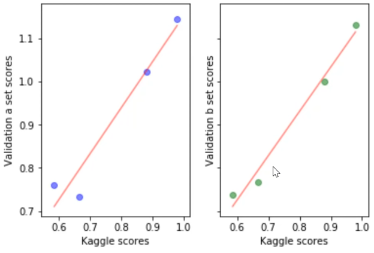
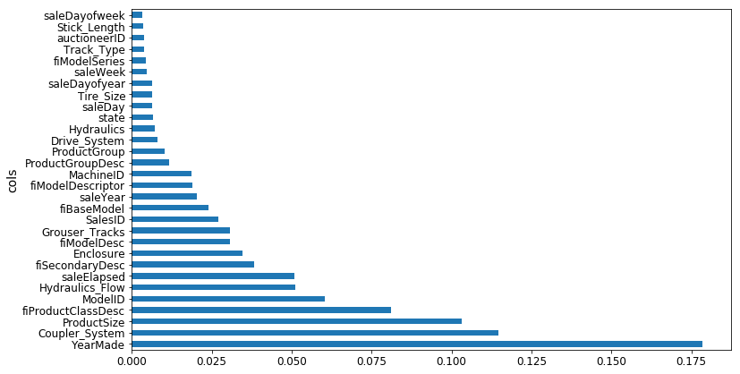

# Lecture 3 - Performance, Validation and Model Interpretation

<!-- vscode-markdown-toc -->
- [Lecture 3 - Performance, Validation and Model Interpretation](#Lecture-3---Performance-Validation-and-Model-Interpretation)
  - [1. <a name='Importanceofgoodvalidationset'></a>Importance of good validation set](#1-a-nameImportanceofgoodvalidationsetaImportance-of-good-validation-set)
  - [2. <a name='Interpretingmachinelearningmodels'></a>Interpreting machine learning models](#2-a-nameInterpretingmachinelearningmodelsaInterpreting-machine-learning-models)
  - [3. <a name='Confidenceinthepredictions'></a>Confidence in the predictions](#3-a-nameConfidenceinthepredictionsaConfidence-in-the-predictions)
  - [4. <a name='Featureimportance'></a>Feature importance](#4-a-nameFeatureimportanceaFeature-importance)

<!-- vscode-markdown-toc-config
	numbering=true
	autoSave=true
	/vscode-markdown-toc-config -->
<!-- /vscode-markdown-toc -->


##  1. <a name='Importanceofgoodvalidationset'></a>Importance of good validation set

If we do not have a good validation set, it is hard, if not impossible, to create a good model. If we are trying to predict next month’s sales and we build models. If we have no way of knowing whether the models we have built are good at predicting sales a month ahead of time, then we have no way of knowing whether it is actually going to be any good when we put the model in production. we need a validation set that we know is reliable at telling us whether the model is likely to work well when we put it in production or use it on the test set.

Normally we should not use the test set for anything other than using it right at the end of the competition or right at the end of the project to find out how we did. But there is one thing we can use the test set for in addition, that is to **calibrate** the validation set.

<p align="center">  </p>

In Kaggle for example, we can have four different models and submit each of the four models to Kaggle to find out their scores. X-axis is the Kaggle scores, and y-axis is the score on a particular validation set, above we have to validation sets, one plot for each, If the validation set is good, then the relationship between the leaderboard score (i.e. the test set score) should lie in a straight line (perfectly correlated). Ideally, it will lie on the y = x line, then we can find out which val set is the best. In this case, The val set on the right looks like it is going to predict the Kaggle leaderboard score well. That is really cool because we can go away and try a hundred different types of models, feature engineering, weighting, tweaks, hyper parameters, whatever else, see how they do on the validation set, and not have to submit to Kaggle. So we will get a lot more iterations, a lot more feedback. This is not just true for Kaggle but every machine learning project, but in general, if the validation set is not showing nice fit line, we need to reconstruct it.

##  2. <a name='Interpretingmachinelearningmodels'></a>Interpreting machine learning models

For model interpretation, there is no need to use the full dataset because we do not need a massively accurate random forest, we just need one which indicates the nature of relationships involved. So we just need to make sure the sample size is large enough that if we call the same interpretation commands multiple times, we do not get different results back each time. In practice, 50,000 is a good choice.

```python
set_rf_samples(50000)
m = RandomForestRegressor(n_estimators=40, min_samples_leaf=3, max_features=0.5, n_jobs=-1, oob_score=True)
m.fit(X_train, y_train)
```

##  3. <a name='Confidenceinthepredictions'></a>Confidence in the predictions

We already know how to get the prediction. We take the average value in each leaf node in each tree after running a particular row through each tree. Normally, we do not just want a prediction, we also want to know how confident we are of that prediction. We would be less confident of a prediction if we have not seen many examples of rows like this one. In that case, we would not expect any of the trees to have a path through, which is designed to help us predict that row. So conceptually, we would expect then that as we pass this unusual row through different trees, it is going to end up in very different places. In other words, rather than just taking the mean of the predictions of the trees and saying that is our prediction, what if we took the standard deviation of the predictions of the trees. If the standard deviation is high, that means each tree is giving us a very different estimate of this row’s prediction. If this was a really common kind of row, the trees would have learned to make good predictions for it because it has seen a lot of similar rows to split based on them. So the standard deviation of the predictions across the trees gives us at least relative understanding of how confident we are of this prediction.

```python
preds = np.stack([t.predict(X_valid) for t in m.estimators_])
np.mean(preds[:,0]), np.std(preds[:,0])
```

One problem with the code above, is that we execute run each tree squentially on the validation set, and we end up using only one CPU for all the trees (n_estimators=40), it'll be better to run them in parallel and utilize the multi-core system we have. To do this we can utilize the Python class `ProcessPoolExecutor` that uses a pool of processes to execute calls asynchronously.

```python
def parallel_trees(m, fn, n_jobs=8):
        return list(ProcessPoolExecutor(n_jobs).map(fn, m.estimators_))

def get_preds(t):
    return t.predict(X_valid)

preds = np.stack(parallel_trees(m, get_preds))
np.mean(preds[:,0]), np.std(preds[:,0])
```

For example let's select one of the variables, `ProductSize`, and count the number of examples in each category for this given variables, and find out the mean of the predictions and the std of the predictions in each one of these categories.

```python
raw_valid.ProductSize.value_counts().plot.barh()
flds = ['ProductSize', 'SalePrice', 'pred', 'pred_std']
summ = x[flds].groupby(flds[0]).mean()
```

<p align="center">  </p>

And it is clear, the less examples we have, the larger the standard deviation is.

##  4. <a name='Featureimportance'></a>Feature importance

We measure the importance of a feature by calculating the increase in the model’s prediction error after permuting the feature. A feature is “important” if shuffling its values increases the model error, because in this case the model relied on this feature for the predictions. A feature is “unimportant” if shuffling its values leaves the model error unchanged, because in this case the model ignored the feature for the prediction. The permutation feature importance measurement was introduced by Breiman (2001) for random forests. Based on this idea, Fisher, Rudin, and Dominici (2018) proposed a model-agnostic version of the feature importance and called it model reliance. They also introduced more advanced ideas about feature importance, for example a (model-specific) version that takes into account that many prediction models may predict the data well. Their paper is worth reading.

The permutation feature importance algorithm based on Fisher, Rudin, and Dominici (2018):

Input: Trained model f, feature matrix X, target vector y, error measure L(y,f).
- Estimate the original model error e_orig = L(y, f(X)) (e.g. mean squared error)
- For each feature j = 1,…,p do:
    - Generate feature matrix Xperm by permuting feature xj in the data X. This breaks the association between feature xj and true outcome y.
    - Estimate error e_perm = L(Y,f(X_perm)) based on the predictions of the permuted data.
    - Calculate permutation feature importance FI_j= e_perm/e_orig. Alternatively, the difference can be used: FI_j = e_perm - e_orig.
- Sort features by descending FI.

In our case, this is done using the already available output in the trained random forest `m`.

```python
def rf_feat_importance(m, df):
    return pd.DataFrame({'cols':df.columns, 'imp':m.feature_importances_}
                       ).sort_values('imp', ascending=False)

def plot_fi(fi):
    return fi.plot('cols', 'imp', 'barh', figsize=(12,7), legend=False)

plot_fi(fi[:30])
```

And by displying the bar plot for 30 most important features in our model we get:

<p align="center">  </p>

We can also delete all the other columns / features, and only maintain the ten most important ones, and retrain our model to see if the predicition score might stay the same.

```python
m = RandomForestRegressor(n_estimators=40, min_samples_leaf=3, max_features=0.5, n_jobs=-1, oob_score=True)
m.fit(X_train, y_train)
print_score(m)
```
```
    rmse train             rmse val            rmse train              R2 val               oob_score
[0.20685390156773095, 0.24454842802383558, 0.91015213846294174, 0.89319840835270514, 0.8942078920004991]
```

And the score are very similar, they are even slightly better (0.893 > 0.889), maybe beacuse the trees now can find better cuts and are able to avoid usuing redundant variables along the way.
