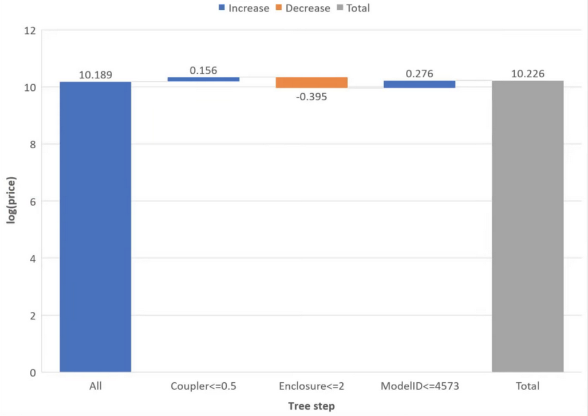
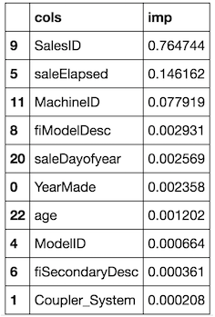

# LECTURE 5

#### Model overfitting

We should always split our dataset into, train / validation / test sets, and for random forest, we can even have 4 ways to check how our models is doing using OOB scores in addition to Train / Val / Test. Now what if we have a temporal data, and when we contruct our model on the dataset, it'll be used in production on a more recent set of examples, which might have some caracterestic not present on our dataset, now if we construct a test and validation sets radomly, the performances of our model will certainly not going to be replicated on the real world cases. One way to avoid this is by having a validation set containing examples more recent than the train set, and the test test will contain examples which are more recent than the ones on the validation set. This way we might be able to approximate how well our model will do on the real data, and we can always use the OOB score to get a measurements for a random sample of the data and see if our model is overfitting in the satistical sense.

#### Cross-validation
Cross-validation is a resampling procedure used to evaluate machine learning models on a limited data sample.
The general procedure is as follows:

1. Shuffle the dataset randomly.
2. Split the dataset into k groups
3. For each unique group:
    1. Take the group as a hold out or test data set
    2. Take the remaining groups as a training data set
    3. Fit a model on the training set and evaluate it on the test set
    4. Retain the evaluation score and discard the model
4. Summarize the model evaluation scores (average over all the hold out validation set).

The possible problems with cross-validation are:

* Time consumption: Training k models can take a lot of time and a lot of recources.
* For some kind of problems, like temporal data, doing a random shuffling will gives validation sets that are not represetative of the real world situation.

### Tree interpreter [Link](http://blog.datadive.net/interpreting-random-forests/)

When considering a decision tree, it is intuitively clear that for each decision that a tree (or a forest) makes there is a path (or paths) from the root of the tree to the leaf, consisting of a series of decisions, guarded by a particular feature, each of which contribute to the final predictions.
A decision tree with M leaves divides the feature space into M regions Rm, 1 ≤ m ≤ M. In the classical definition, the prediction function of a tree is then defined as $f ( x ) = \sum _ { m = 1 } ^ { M } c _ { m } I \left( x , R _ { m } \right)$ where M is the number of leaves in the tree (i.e. regions in the feature space), Rm is a region in the feature space (corresponding to leaf m), cm is a constants corresponding to region m and finally I is the indicator function (returning 1 if x ∈ Rm, 0 otherwise). The value of cm is determined in the training phase of the tree, which in case of regression trees corresponds to the mean of the response variables of samples that belong to region Rm (or ratio(s) in case of a classification tree). The definition is concise and captures the meaning of tree: the decision function returns the value at the correct leaf of the tree. But it ignores the “operational” side of the decision tree, namely the path through the decision nodes and the information that is available there.

Since each decision is guarded by a feature, and the decision either adds or subtracts from the value given in the parent node, the prediction can be defined as the sum of the feature contributions + the “bias” (i.e. the mean given by the topmost region that covers the entire training set).
Without writing out the full derivation, the prediction function can be written down as $f ( x ) = c _ { f u l } + \sum _ { k = 1 } ^ { K } \operatorname { contrib } ( x , k )$ where K is the number of features, cfull is the value at the root of the node and *contrib(x,k)* is the contribution from the k-th feature in the feature vector x. This is superficially similar to linear regression (f(x)=a+bx). For linear regression the coefficients b are fixed, with a single constant for every feature that determines the contribution. For the decision tree, the contribution of each feature is not a single predetermined value, but depends on the rest of the feature vector which determines the decision path that traverses the tree and thus the guards/contributions that are passed along the way.

To do this king of interpretation:

```python
from treeinterpreter import treeinterpreter as ti

df_train, df_valid = split_vals(df_raw[df_keep.columns], n_trn)
row = X_valid.values[None,0]
prediction, bias, contributions = ti.predict(m, row)
idxs = np.argsort(contributions[0])
[o for o in zip(df_keep.columns[idxs], df_valid.iloc[0][idxs], contributions[0][idxs])]
```

And now we can see how much each given values of a given variable / feature contributed to the final prediction: ('age', 11, -0.12507089451852943), so if the age of the vehicule is high, the pice goes down, and ('YearMade', 1999, 0.071829996446492878), increase the prices over the mean, which probably mean the a lot of cars were made prior to 1999.

Another way to show the contributions made is to usew aterfall charts:

<p align="center">  </p>

### Extrapolation

One problem with random forests is extrapolation, given a new example not seen before it is hard for random forests to find a good prediction, and given an other model, say linear regression, we can extrapolate even if the range is outside the range of the training data, one possible way to solve this problem, is to remove the features that are very dependent on the strong temporal components that are irrelevent when taken out of context, thus they make no valuable contribution when used on new data.

So in this case, to find these componenets, we can start by finding the difference between our validation set and our training set. If we understand the difference between our validation set and our training set, then we can find the predictors which have a strong temporal component and therefore they may be irrelevant by the time we get to the future time period. So we can create a RF to predict for a given example “is it in the validation set” (is_valid). So we add a new column, zeros for the examples in train set and ones for the examples in the validation set, and we run our model to find the most relevent features.

```python
df_ext = df_keep.copy()
df_ext['is_valid'] = 1
df_ext.is_valid[:n_trn] = 0
x, y, nas = proc_df(df_ext, 'is_valid')

m = RandomForestClassifier(n_estimators=40, min_samples_leaf=3, max_features=0.5, n_jobs=-1, oob_score=True)
m.fit(x, y)
fi = rf_feat_importance(m, x)
```

And the results are:

<p align="center">  </p>

Now we can remove the most relevent features from the dataframe, and retrain our random forest, and we end up with a very good results.
