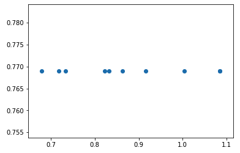

<!-- vscode-markdown-toc -->
- [Lecture 6 - Data Products](#Lecture-6---Data-Products)
  - [1. <a name='DrivetrainApproachLinkhttps:www.oreilly.comideasdrivetrain-approach-data-products'></a>Drivetrain Approach Link](#1-a-nameDrivetrainApproachLinkhttpswwworeillycomideasdrivetrain-approach-data-productsaDrivetrain-Approach-Link)
  - [2. <a name='ReviewofRandomforestinterpretation'></a>Review of Random forest interpretation](#2-a-nameReviewofRandomforestinterpretationaReview-of-Random-forest-interpretation)
  - [3. <a name='Counter Example: Extrapolation'></a>Counter Example: Extrapolation](#3-a-nameCounter-Example-ExtrapolationaCounter-Example-Extrapolation)

<!-- vscode-markdown-toc-config
	numbering=true
	autoSave=true
	/vscode-markdown-toc-config -->
<!-- /vscode-markdown-toc -->

# Lecture 6 - Data Products

##  1. <a name='DrivetrainApproachLinkhttps:www.oreilly.comideasdrivetrain-approach-data-products'></a>Drivetrain Approach [Link](https://www.oreilly.com/ideas/drivetrain-approach-data-products)

##  2. <a name='ReviewofRandomforestinterpretation'></a>Review of Random forest interpretation

* Confidence based on tree variance: The variance of the predictions of the trees. Normally the prediction is just the average, this is variance of the trees. We generally take just one row/observation and find out how confident we are about that (i.e. how much variance there are in the trees) or we can do the same for for different groups.
* Feature importance: After we are done building a random forest model, we take each column and randomly shuffle it. And we run a prediction and check the score. The feature importantce for a given variables we shuffled, is the difference between RMSE of the original score and the score obtained after shuffling.
* Partial dependence: For a given column, we replace all the values with a given values, say for YearMade, we replace all the values with 1960, and we predict the price, this is done for every row and every values we're interested in, we then take the average of all the plots.
* Tree interpreter: Like feature importance, but feature importance is for complete random forest model, and this tree interpreter is for feature importance for particular observation. So let’s say it’a about hospital readmission. If a patient A is going to be readmitted to a hospital, which feature for that particular patient is going to impact and how can we change that. It is calculated starting from the prediction of mean then seeing how each feature is changing the behavior of that particular patient.

##  3. <a name='Counter Example: Extrapolation'></a>Counter Example: Extrapolation

We're going to see an example where random forests fail miserably when predicting a time series, and we need to do extrapolation to make it work, we start by creating a synthetic dataset:

```python
import numpy as np
x = np.linespace(0, 1) # per default, we can 50 samples
y = x + np.random.uniform()
```

<p align="center">  </p>

Now before we create a training and a validation set and fit a random forest model, given that skitlearn RF accepts only a matrix as inputs for x, we must transform x created by `np.linespace` from one vector (rank one : len(x.shape)) into a matrix / tensor of 2 dimension, we can use numpy reshape function, or use python :

* `x = x[:,None]` which is equivalent to `x[None]`, here we add a new first dimension, so x will be one row,
* `x = x[...,None]` to add a new dimension as the last one, here x will be one column.

After this we can split the synthetic dataset into train / va:

```python
x_trn, x_val = x[:40], x[40:]
y_trn, y_val = y[:40], y[40:]
m = RandomForestRegressor().fit(x, y)
```

And then we fit the model, and use it to predict new values, that are unseen before, and that necessate a prediction greater than all the values in the training set.

```python
plt.scatter(y_val, m.predict(x_val))
```

<p align="center">  </p>

And we see that the predictions are very different in comparision to the actuals, beacuse the tree directly predits, given the inputs, the maximum y values it have seen in the training set, one possible solution is to use gradient boosting trees. What a GBM does is, it creates a little tree, and runs everything through that first little tree, then it calculates the residuals and the next little tree just predicts the residuals. So it would be kind of like detrending it, GBM still can’t extrapolate to the future but at least they can deal with time-dependent data more conveniently.