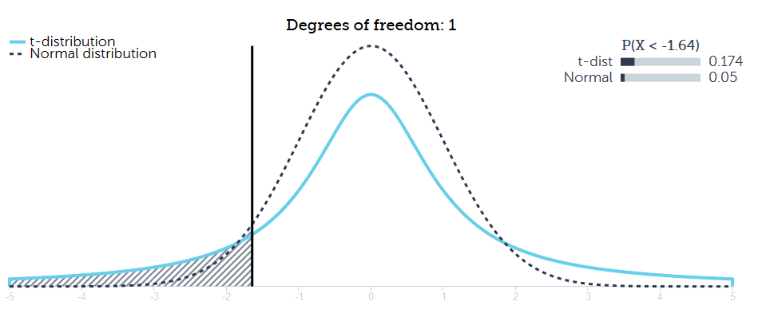

# Lesson 7 - Random Forest from Scratch

### t-distribution

The t distribution (aka, Student’s t-distribution) is a probability distribution that is used to estimate population parameters when the sample size is small and/or when the population variance is unknown.
According to the central limit theorem, the sampling distribution of a statistic (like a sample mean) will follow a normal distribution, as long as the sample size is sufficiently large. Therefore, when we know the standard deviation of the population, we can compute a z-score, and use the normal distribution to evaluate probabilities with the sample mean.

But sample sizes are sometimes small, and often we do not know the standard deviation of the population. When either of these problems occur, statisticians rely on the distribution of the t statistic (also known as the t score), whose values are given by: t = [ x - μ ] / [ s / sqrt( n ) ]

So the t-distribution approaches the normal distribution as the sample size increase, and that the difference is negligible even for moderately large sample sizes (> 30). However, for small samples the difference is important. The t-distribution is used when the population variance is unknown. Simply put, estimating the variance from the sample leads to greater uncertainty and a more spread out distribution, as can be seen by the t-distributions heavier tails.

  

### Standard error
The standard error (SE) of a statistic (usually an estimate of a parameter) is the standard deviation of its sampling distribution[1] or an estimate of that standard deviation. If the parameter or the statistic is the mean, it is called the standard error of the mean (SEM).

### Size of the validation set

How big does out validation set need to be? first we need to answer the question how precisely do I need to know the accuracy of the algorithm. For example, given a dogs vs. cats image classifier, and the model we're looking at had about a 99.4, 99.5% accuracy on the validation set. And a validation set size was 2000. So the number of incorrect is something around (1 - accuracy) * n.

So we were getting about 12 wrong. And the number of cats we had is a half so the number of wrong cats is about 6. Then we run a new model and we find instead that the accuracy has gone to 99.2%. Then Does 99.4 vs. 99.2 matter? If it wasn’t about cats and dogs, probably not, but it was about finding fraud, then the difference between a .6% error rate and .8% error rate is like 25% of the cost of fraud so that can be huge.

