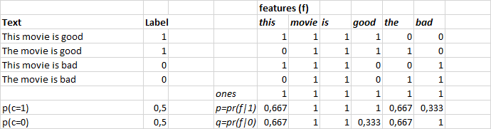

# LECTURE 9/10

### Iterators & Streaming

Its a object that we call next on. We can pull different pieces, ordered or randomized that can be pulled for mini-batches.

<p align="center">  </p>

Pytorch is designed to handle this concept too, of predicting a stream of data (or the next item). fastai is also designed around this concept of iterators. DataLoader is created with the same concept, but with multiprocessing, which is multi threaded applications.


### Regularization

Add new terms to the loss function. If we add L1 and L2 norms of the weights to the loss functions, it incentives the coefficients to be zlose to zero. See the extra term below.

$$ loss =\frac{1}{n} \sum{(wX-y)^2} + \alpha \sum{w^2} $$

How to implement?

* Change the loss function
* Change the training loop to add the derivative adjustment.

In the begining of the training we might see that the error in the training set is smaller with regularization than without, this might be due to the fact that the function we're optimizing is easier and smoother and can less iterations to reduce the error, but in the end with regularization the training error is larger because now we don't have any overfitting, and in the error in the validation set becomes smaller.

## NLP

In this simple approach, we'll first discard the order of the words, and only use their frequency in the corpus, this is done using term document matrix, which count the number of appearances of each word (feature) in the document, so the size of this matrix is # Document x # Number of unique words, the unique words are obtained by tokenizing all the words in the corpus (*this "movie" isn't good*. *becomes this " movie " is n't good .*).

We first need to create the training and validation set using the text files provided in the IMDB sentiment analysis dataset. We have two folder one for training examples, and one for validation/test, in each one we have neg and pos examples, so for train examples, we go through the negatives add them to train_text and append zeros (idx) for all of them, same of pos but with label 1.

```python
def texts_labels_from_folders(path, folders = ['neg','pos']):
    texts, labels = [], []
    for idx, label in enumerate(folders):
        for fname in glob(os.path.join(path, label, '*.*')):
            texts.append(open(fname, 'r').read())
            labels.append(idx)

trn,trn_y = texts_labels_from_folders(f'{PATH}train',names)
val,val_y = texts_labels_from_folders(f'{PATH}test',names)
```

After that, we convert thecollection of text documents to a matrix of token counts using `sklearn.feature_extraction.text.CountVectorizer`:

```python
veczr = CountVectorizer(tokenizer=tokenize)
trn_term_doc = veczr.fit_transform(trn)
val_term_doc = veczr.transform(val)
```

`fit_transform(trn)` finds the vocabulary in the training set. It also transforms the training set into a term-document matrix. Since we have to apply the *same transformation* to your validation set, the second line uses just the method `transform(val)`. `trn_term_doc` and `val_term_doc` are sparse matrices. `trn_term_doc[i]` represents training document i and it contains a count of words for each document for each word in the vocabulary.

Term Document Matrix:

* columns - vocab or words
* rows - different documents
* cells - count of occurance

We'll obtain 25000x75132 sparse matrix, so 25000 documents and 75132 tokenized words on training set, given that this a sparce matrix and only a small amount of elements are non zeros, it is stored as ((1, 100) -> 2), to reduce the memory requirements.

Sentiment Approach: bays rule

<p align="center">  </p>

The probability that a document is from class 1 given that the document is from class 0. We will use a conditional probability to calculate the ratio as follows below

$$ \frac{P(C_1 | d)}{P(C_0 | d)} = \frac {P(d|C_1)P(C_1)}{P(d)} = \frac {P(d)}{P(d|C_0)P(C_0)}$$
$$ \frac{P(C_1 | d)}{P(C_0 | d)} = \frac {P(d|C_1)P(C_1)}{P(d|C_0)P(C_0)}$$

And the **log-count ratio** r for each word f:

$$r = \log \frac{\text{ratio of feature\ f in positive documents}}{\text{ratio of feature\ f in negative documents}}$$

How do we calculate?

* We calculate p(C=0) and p(C=1) using the number of positive and negative example in the dataset, in this case we have 12500/12500 so P = 0.5 for both classes.
* Now we need to calculate P(d|C1) and P(d|C0), given that each document contains a set of features, and with the assumption the features are independent, we only need to find P(f|C1) and P(f|C0) and multiply them:
    * P(f|C0) = (number of appearances of the features in the positives + 1) / (number of in the positives in the set + 1), we add one beacause we want to avoid having 0 probability, beacuse there is always a small possibility that a word will be in a given document.
    * And then we multiply them together if the feature is a given doc : with P(dj|C1) = P(fi|C1) x term_doc(dj, fi).
* We multiply a number of probablities together, so to avoid numerical instability we use the log ratio:
  
$$ log r = log \frac {P(d|C_1)}{P(d|C_0)} + log \frac {P(C_1)}{P(C_0)}$$

```python
def pr(y_i):
    p = x[y==y_i].sum(0)
    return (p+1) / ((y==y_i).sum()+1)
x=trn_term_doc
y=trn_y

r = np.log(pr(1)/pr(0))
b = np.log((y==1).mean() / (y==0).mean())

pre_preds = val_term_doc @ r.T + b
preds = pre_preds.T>0
(preds==val_y).mean()
```

To get better result, we can binarize the document matrix (instead of having frequencies of each word, we're only going to have 0/1, if the word exists in a give document of not)

```python
x=trn_term_doc.sign()
r = np.log(pr(1)/pr(0))

pre_preds = val_term_doc.sign() @ r.T + b
preds = pre_preds.T>0
(preds==val_y).mean()
```
And thus we get better results : 81 to 83

If we look at the equation of naive bayes, we see that it is the same as for logistic regression, the only difference is that in LR regression we use the data to obtain to optimize the parameters, and this can gives us better results:

```python
m = LogisticRegression(C=0.1, dual=True)
m.fit(trn_term_doc.sign(), y)
preds = m.predict(val_term_doc.sign())
(preds==val_y).mean()
```
And we get better results (88%)