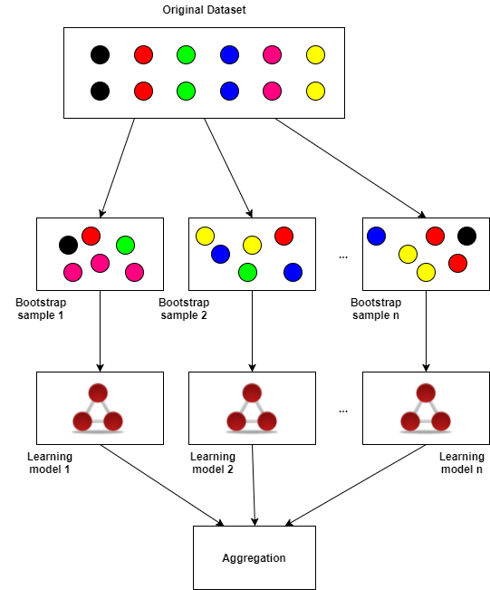
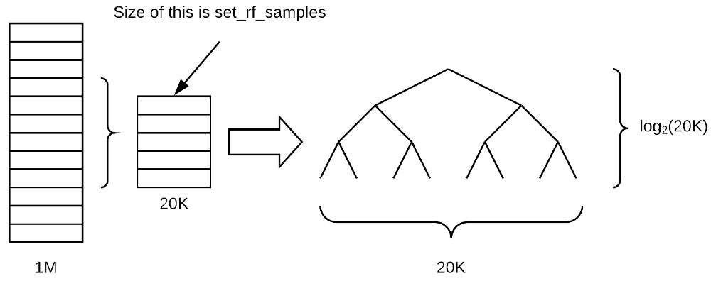
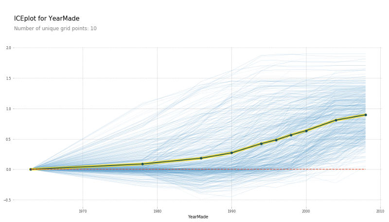
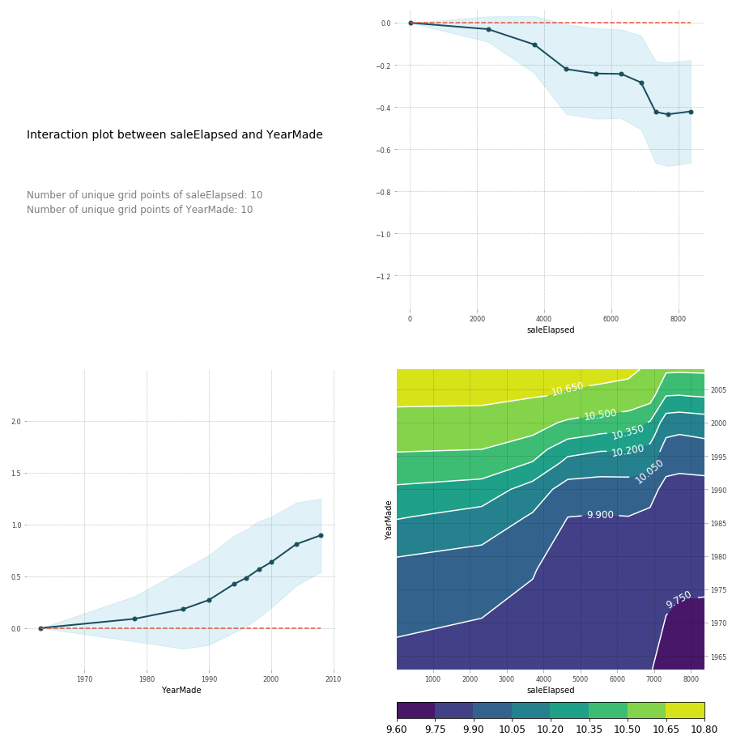

## Some notes about Google Colab

- To install some packages, we can use either `pip` or `apt`:
```python
!pip install -q matplotlib-venn
from matplotlib_venn import venn2
venn2(subsets = (3, 2, 1))
```
```shell
!apt update && apt install -y libfluidsynth1
```
Installing FastAi in Google Colab (example only) [Link](https://gist.githubusercontent.com/gilrosenthal/58e9b4f9d562d000d07d7cf0e5dbd840/raw/343a29f22692011088fe428b0f800c77ccad3951/Fast.ai%2520install%2520script)
For Machine learn course, we need to install the version 0.7 of fastAi, forum response [Link](https://forums.fast.ai/t/importerror-cannot-import-name-as-tensor/25295/3)

To delete some packages, we can do the same thing
```shell
!pip uninstall `fastai`
```

- To add some data to google colab, first we upload it to the Files (we can view the Files angle in the left angle, by clicking a small grey arrow)
After adding the files, we can then import it into the notebook:
````python
# Loadd the Drive helper and mount
from google.colab import drive
# This will prompt for authorization
drive.mount('/content/name_of_the_folder')
# The files will be present in the "/cotent/name_of_the_folder/My Drive"
§ls "/content/name_of_the_folder/ My Drive"
````

* To download the data using Kaggle API, after installing it and exporting the API Keys to the terminal, we download it directly:
````shell
!mkdir -p ~/.kaggle
!cp kaggle.json ~/.kaggle/
kaggle competitions download -c bluebook-for-bulldozers
````


## Jupyter tricks

- In data sience (unlike software engineering), prototyping is very important, and jupyter notebook helps a lot, for example, given a function `display`:

    1. type `display` in a cell and press shift+enter — it will tell you where it came from `<function IPython.core.display.display>`
    2. type `?display` in a cell and press shift+enter — it will show you the documentation
    3. type `??display` in a cell and press shift+enter — it will show you the source code. This is particularly useful for fastai library because most of the functions are easy to read and no longer than 5 lines long.

- `shift + tab` in Jupyter Notebook will bring up the inspection of the parameters of a function, if we hit `shift + tab` twice it'll tell us even more about the function parameters (part of the docs)
- If we put %time, it will tell us how much times it took to execute the line in question.
- If we  run a line of code and it takes quite a long time, we can put %prun in front. `%prun m.fit(x, y)`. This will run a profiler and tells us which lines of code took the most time, and maybe try to change our preprocessing to help speed things up.

## Python tricks

1- `getattr` looks inside of an object and finds an attribute with that name, for example to modify the date (datetime format in Pandas), we use it to add more colums in the dataframe depending on the name (Year, Week, Mont, Is_quarter_end...), these data attribues are present in field_name.dt (Pandas splits out different methods inside attributes that are specific to what they are. So date time objects will be in `dt`).

2- PEP 8 - Style Guide for Python Code [PEP 8](https://www.python.org/dev/peps/pep-0008/).

3- Reading Data: In case we using quite bit csv files (millions of columns), to be able to load them into the RAM by limiting the amount of space that it takes up when you read in, we create a dictionary for each column name to the data type of that column. It is up to you to figure out the data types by running or less or head on the dataset.
```python
types = {'id': 'int64',
        'item_nbr': 'int32',
        'store_nbr': 'int8',
        'unit_sales': 'float32',
        'onpromotion': 'object'}

%%time
df_all = pd.read_csv(f'{PATH}train.csv', parse_dates=['date'], dtype=types, infer_datetime_format=True)
```

But generally it is betten to use only a subset of the data to explore it, and not loading all at one go, one possible way to do so is to use the UNIX command `shuf`, wz can get a random sample of data at the command prompt and then we can just read that. This also is a good way to find out what data types to use,we read in a random sample and let Pandas figure it out for us. ```shuf -n 5 -o output.csv train.csv```

___
# LECTURE 1


#### Data

Now for the data, we'll use Kaggle data, and there is a trick to download it using cURL from the terminal, by capturing the GET resquest using the inspect element / Network of Firefox browser:

* Press `ctrl + shift + i` to open web developer tool. Go to Network tab, click on Download button, and cancel out of the dialog box. It shows network connections that were initiated. You then right-click on it and select Copy as cURL. Paste the command and add `-o bulldozer.zip` at the end (possibly remove `— — 2.0` in the cURL command), or use the Kaggle API

**What about a curse of dimensionality?** the more dimension of the data / features we have, it creates a space that is more and more empty, the more dimensions you have, the more all of the points sit on the edge of that space. If you just have a single dimension where things are random, then they are spread out all over. Where else, if it is a square then the probability that they are in the middle means that they cannot be on the edge of either dimension so it is a little less likely that they are not on the edge. Each dimension you add, it becomes multiplicatively less likely that the point is not on the edge of at least one dimension, so in high dimensions, everything sits on the edge. What that means in theory is that the distance between points is much less meaningful. But this turns out not to be the case for number of reasons, like they still do have different distances away from each other. Just because they are on the edge, they still vary on how far away they are from each other and so this point is more similar at this point than it is to that point.

**No free lunch theorem?** There is a claim that there is no type of model that works well for any kind of dataset. In the mathematical sense, any random dataset by definition is random, so there is not going to be some way of looking at every possible random dataset that is in someway more useful than any other approach. In real world, we look at data which is not random. Mathematically we would say it sits on some lower dimensional manifold. It was created by some kind of causal structure.

The dataset contains a mix of continuous and categorical variables.

* continuous — numbers where the meaning is numeric such as price.
* categorical — either numbers where the meaning is not continuous like zip code or string such as “large”, “medium”, “small”

One of the most interesting types of features are dates, you can fo a lot of feature engineering based on them: It really depends on what you are doing. If you are predicting soda sales in San Fransisco, you would probably want to know if there was a San Francisco Giants ball game that day. What is in a date is one of the most important piece of feature engineering you can do and no machine learning algorithm can tell you whether the Giants were playing that day and that it was important. So this is where you need to do feature engineering.

So before feed the data to the random forest, we must first process the dates and also convert all the strings, which are inefficient, and doesn't provide the numeric coding required for a random forest. Therefore we call must to convert strings to pandas categories.

For example:
Firsst, change any columns of strings in a panda's dataframe to a column of catagorical values.
```python
for n,c in df.items():
    if is_string_dtype(c): df[n] = c.astype('category').cat.as_ordered()
```
and pandas automatically creates a list of catecories (in `df.column.cat.categories`, and their decimal codes in `df.column.cat.codes`)

One additionnal pre-processing step, is processing missig values (NULL), so for each column, if there is NULL values (`pd.isnull(col).sum` > 0), we create a new column with the same name and null added in the end, and the NULL calues have 1, and the other are zeros (`pd.isnull(col)`), now for the original column, we replace the NULL values by the median of the column `df[name] = col.fillna(col.median())`. This is only done for numerical columns, pandas automaticlly handels categorical data (converted strings in our case), but the NULL in this case equals -1, so we add one to all the columns (`if not is_numerical_dtype(col)`)

**Feather format**: Reading CSV took about 10 seconds, and processing took another 10 seconds, so if we do not want to wait again, it is a good idea to save them. Here we will save it in a feather format. What this is going to do is to save it to disk in exactly the same basic format that it is in RAM. This is by far the fastest way to save something, and also to read it back. Feather format is becoming standard in not only Pandas but in Java, Apache Spark, etc.

#### Skitlearn

Everything in scikit-learn has the same form, to be used for random forest (either a regressor for predicting continuous variables `RandomForestRegressor `, or a classifier for predicting categorifcal variables `RandomForestClassifier `)

```python
m = RandomForestRegressor(n_jobs=-1)
m.fit(df_raw.drop('SalePrice', axis=1), df_raw.SalePrice)
```

* Create an instance of an object for the machine learning model, 
* Call `fit` by passing in the independent variables, giving the columns / features, and the variable to predict.

___
# LECTURE 2: Deep dive into Random Forest

### R2 Score

$$R ^ { 2 } \equiv 1 - \frac { S S _ { \mathrm { res } } } { S S _ { \mathrm { tot } } }$$

* The total sum of squares (proportional to the variance of the data): $S S _ { \mathrm { res } } = \sum _ { i } \left( y _ { i } - f _ { i } \right) ^ { 2 } = \sum _ { i } e _ { i } ^ { 2 }$
* The sum of squares of residuals, also called the residual sum of squares: $S S _ { \mathrm { tot } } = \sum _ { i } \left( y _ { i } - \overline { y } \right) ^ { 2 }$

<p align="center">  </p>

We compare the models error to the error made by the most non-stupid model we can use (always predicting the average), so the range of R2 is [1, -inf], one is the perfect score, and when your R² is negative, it means your model is worse than predicting the mean.

So in a nutshell, R² is the ratio between how good your model is (RMSE)vs. how good is the naïve mean model (RMSE).

R² is not necessarily what you are actually trying to optimize, but it is a number you can use for every model and you can start to get a feel of what .8 looks like or what .9 looks like. Something you may find interesting is to create synthetic 2D datasets with different amounts of random noise, and see what they look like on a scatterplot and their R² to get a feel of how close they are to the actual value.

### Validation set for the Kaggle data
If your dataset has a time piece in it (as is in Blue Book competition), you would likely want to predict future prices/values/etc. What Kaggle did was to give us data representing a particular date range in the training set, and then the test set presented a future set of dates that wasn’t represented in the training set. So we need to create a validation set (for hyper-parameter tuning without over fitted to avoid to the training data) that has the same properties:

```python
def split_vals(a,n): return a[:n].copy(), a[n:].copy()

n_valid = 12000  # same as Kaggle's test set size
n_trn = len(df)-n_valid
raw_train, raw_valid = split_vals(df_raw, n_trn)
X_train, X_valid = split_vals(df, n_trn)
y_train, y_valid = split_vals(y, n_trn)
```

But there is always the possibility of eventually overfitting on the validation set and when you try it on the test set or submit it to Kaggle, it turns out not to be very good. This happens in Kaggle competitions all the time and they actually have a fourth dataset which is called the private leader board set. Every time you submit to Kaggle, you actually only get feedback on how well it does on the public leader board set and you do not know which rows they are. At the end of the competition, you get judged on a different dataset entirely called the private leader board set.

#### Building a single tree
TO unserstand Random Forest, let's begin by taking a look into trees, for that we'll use `n_estimators=1` to create a forest with just one tree and`max_depth=3` to make it a small tree
```python
m = RandomForestRegressor(n_estimators=1, max_depth=3,
                          bootstrap=False, n_jobs=-1)
m.fit(X_train, y_train)
print_score(m)
```

<p align="center">  </p>

By how to we find the best splits to build the tree:

* We need to pick a variable and the value to split on such that the two groups are as different to each other as possible and and have simlilar elements internally.
* How to find the best variable, and the best values to split on for that variable, we can go through all the variables and all the possible values of the selected varaibles, we do a split and calculate the weighted average of the two resulting groups = MSE1 * samples/samples1 + MSE2 * samples/samples2, and then choose variables/value with the least erros (note: the MSE of the root node, is naive model, aka predicitng the average).

Right now, our decision tree has R² of 0.4. Let’s make it better by removing max_depth=3. By doing so, the training R² becomes 1 (as expected since each leaf node contains exactly one element) and validation R² is 0.73 — which is better than the shallow tree but not as good as we would like.


**Side Note: Using Entropy to pick the nodes**
* A chosen attribute A, with K distinct values, divides the training set E into subsets E1 , ... , EK. 
* The Expected Entropy (EH) remaining after trying attribute A (with branches  i=1,2,..., K), given that $H(p) = -\sum p \log(p)$ is
$$E H ( A ) = \sum _ { i = 1 } ^ { K } \frac { \left(  p _ { i }  + n _ { i } \right) } { p + n } H \left( \frac { p _ { i } } { p _ { i } + n _ { i } } , \frac { n _ { i } } { p _ { i } + n _ { i } } \right)$$
* Information gain (I) or  reduction in entropy  for this attribute is (entropy before the split - entropy after it)
$$I ( A ) = H \left( \frac { p } { p + n } , \frac { n } { p + n } \right) - E H ( A )$$
* Choose the attribute with the largest I


*Let’s make our decision tree better*, To make these trees better, we will create a forest. To create a forest, we will use a statistical technique called **bagging**.

**Bagging** is an interesting idea which is what if we created five different models each of which was only somewhat predictive but the models gave predictions that were not correlated with each other. That would mean that the five models would have profound different insights into the relationships in the data. If you took the average of those five models, you are effectively bringing in the insights from each of them. So this idea of averaging models is a technique for Ensembling.

What if we created a whole a lot of trees, big, deep, massively overfit trees but each one, let’s say, we only pick a random 1/10 of the data and we do that a hundred times (different random sample every time). They are overfitting terribly but since they are all using different random samples, they all overfit in different ways on different things. In other words, they all have errors but the errors are random / not correlated. The average of random errors is zero. If we take the average of these trees each of which have been trained on a different random subset, the error will average out to zero and what is left is the true relationshi, and that’s the random forest.

The key insight here is to construct multiple models which are better than nothing and where the errors are, as much as possible, not correlated with each other.

And it turns out, the more uncorrelated the trees, the better the results, now even with random samples, when we built a large number of trees, the trees will be somehow correlated, so we can always try to add more randomization to the process of creating the trees, say like choosing the variables to split on radomly and not all the variables. Like `ExtraTreeClassifier ` in skitlearn

**Code example:**
```python
preds = np.stack([t.predict(X_valid) for t in m.estimators_]) preds[:,0], np.mean(preds[:,0]), y_valid[0]

(array([ 9.21034,  8.9872 ,  8.9872 ,  8.9872 ,  8.9872 ,  9.21034,  8.92266,  9.21034,  9.21034,  8.9872 ]),
9.0700003890739005,  
9.1049798563183568)
```

Each tree is stored in an attribute called `estimators_` . For each tree, we will call predict with our validation set. `np.stack` concatenates them together on a new axis, so the resulting `preds` has the shape of (10, 12000) (10 trees, 12000 validation set). The mean of 10 predictions for the first data is 9.07, and the actual value is 9.10. As you can see, none of the individual prediction is close to 9.10, but the mean ends up pretty good.

<p align="center">  </p>

Here is a plot of R² values given first i trees. As we add more trees, R² improves. But it seems as though it has flattened out.

#### Out-of-bag (OOB) score

```python
m = RandomForestRegressor(n_estimators=40, n_jobs=-1, oob_score=True)
```

Sometimes your dataset will be small and you will not want to pull out a validation set because doing so means you now do not have enough data to build a good model. However, random forests have a very clever trick called out-of-bag (OOB) error which can handle this.

What we could do is to recognize that in our first tree, some of the rows did not get used for training. so we could do is to pass those unused rows through the first tree and treat it as a validation set. For the second tree, we could pass through the rows that were not used for the second tree, and so on. Effectively, we would have a different validation set for each tree. To calculate our prediction, we would average all the trees where that row is not used for training. If you have hundreds of trees, it is very likely that all of the rows are going to appear many times in these out-of-bag samples. You can then calculate RMSE, R², etc on these out-of-bag predictions.

#### Subsampling

Earlier, we took 30,000 rows and created all the models which used a different subset of that 30,000 rows to speed things up. Why not take a totally different subset of 30,000 each time? In other words, let’s leave the entire 389,125 records as is, and if we want to make things faster, pick a different subset of 30,000 each time. So rather than bootstrapping the entire set of rows, just randomly sample a subset of the data.

```python
def set_rf_samples(n):
    """ Changes Scikit learn's random forests to give each tree a random sample of n random rows.
    """
    forest._generate_sample_indices = (lambda rs, n_samples:
        forest.check_random_state(rs).randint(0, n_samples, n))
```

This will take the same amount of time to run as before, but every tree has an access to the entire dataset. After using 40 estimators, we get the R² score of 0.876.

**TIP:** Most people run all of their models on all of the data all of the time using their best possible parameters which is just pointless. If you are trying to find out which feature is important and how they are related to each other, having that 4th decimal place of accuracy is not going to change any of your insights at all. Do most of your models on a large enough sample size that your accuracy is reasonable (within a reasonable distance of the best accuracy you can get) and taking a small number of seconds to train so that you can interactively do your analysis.

**A quick summary** [Link](https://stackoverflow.com/questions/18541923/what-is-out-of-bag-error-in-random-forests)
Suppose our training data set is represented by T and suppose data set has M features (or attributes or variables).

    T = {(X1,y1), (X2,y2), ... (Xn, yn)}

and

    Xi is input vector {xi1, xi2, ... xiM}
    yi is the label (or output or class).

Random Forests algorithm is a classifier based on primarily two methods:
- Bagging
- Random subspace method.

Suppose we decide to have S number of trees in our forest then we first create S datasets of "same size as original" created from random resampling of data in T with-replacement (n times for each dataset). This will result in `{T1, T2, ... TS}` datasets. Each of these is called a bootstrap dataset. Due to "with-replacement" every dataset Ti can have duplicate data records and Ti can be missing several data records from original datasets. This is called *Bootstrapping*. And Bagging is the process of taking bootstraps & then aggregating the models learned on each *bootstrap*.

Now, RF creates `S` trees and uses m (sqrt(M) or ln(M+1)) random subfeatures out of M possible features to create any tree. This is called *Random subspace method*.

So for each Ti bootstrap dataset we create a tree `Ki`. If we want to classify some input data `D = {x1, x2, ..., xM}`, we pass it through each tree and produce S outputs (one for each tree) which can be denoted by `Y = {y1, y2, ..., ys}`. Final prediction is a majority vote on this set (or the avearge).

*Out-of-bag error:* After creating the classifiers (`S` trees). To evaluate our model, for each `(Xi,yi)` in the original training set T, we select all `Tk` which does not include the said exampke `(Xi,yi)`. This subset is a set of boostrap datasets which does not contain a particular record from the original dataset. This set is called out-of-bag examples. There are n such subsets (one for each data record in original dataset T). OOB classifier is the aggregation of votes only over `Tk` such that it does not contain `(Xi,yi)`.

Out-of-bag estimate for the generalization error is the error rate of the out-of-bag classifier on the training set (compare it with known yi's).

#### Overfitting

One way to reduce over-fitting is to grow our trees less deeply. We do this by specifying (with `min_samples_leaf`) that we require some minimum number of rows in every leaf node. This has two benefits:

- There are less decision rules for each leaf node; simpler models should generalize better
- The predictions are made by averaging more rows in the leaf node, resulting in less volatility

For each tree, rather than just taking one point, we are taking the average of at least three points that we would expect the each tree to generalize better. But each tree is going to be slightly less powerful on its own. The numbers that work well are 1, 3, 5, 10, 25, but it is relative to your overall dataset size.

```python
m = RandomForestRegressor(n_estimators=40, min_samples_leaf=3, n_jobs=-1, oob_score=True)
m.fit(X_train, y_train)
```

Another is to pick a random number of columns using `max_feature`, The idea is that the less correlated your trees are with each other, the better. Imagine you had one column that was so much better than all of the other columns of being predictive that every single tree you built always started with that column. But there might be some interaction of variables where that interaction is more important than the individual column. So if every tree always splits on the same thing the first time, you will not get much variation in those trees. For example, `max_feature = 0.5`, we only use half of the variables to find the best splits.

```python
m = RandomForestRegressor(n_estimators=40, min_samples_leaf=3, max_features=0.5, n_jobs=-1, oob_score=True)
m.fit(X_train, y_train)
```

___
# Lecture 3

#### Importance of good validation set**

If you do not have a good validation set, it is hard, if not impossible, to create a good model. If you are trying to predict next month’s sales and you build models. If you have no way of knowing whether the models you have built are good at predicting sales a month ahead of time, then you have no way of knowing whether it is actually going to be any good when you put your model in production. You need a validation set that you know is reliable at telling you whether or not your model is likely to work well when you put it in production or use it on the test set.

Normally you should not use your test set for anything other than using it right at the end of the competition or right at the end of the project to find out how you did. But there is one thing you can use the test set for in addition, that is to **calibrate** the validation set.

<p align="center">  </p>

In Kaggle per example, we can have four different models and submitted each of the four models to Kaggle to find out their scores. X-axis is the Kaggle scores, and y-axis is the score on a particular validation set, above we have to validation sets, one plot for each, If the validation set is good, then the relationship between the leaderboards score (i.e. the test set score) should lie in a straight line (perfectly correlated). Ideally, it will lie on the y = x line, then we can find out which model is the best. In this case, The model on the right looks like it is going to predict the Kaggle leaderboard score well. That is really cool because we can go away and try a hundred different types of models, feature engineering, weighting, tweaks, hyper parameters, whatever else, see how they do on the validation set, and not have to submit to Kaggle. So we will get a lot more iterations, a lot more feedback. This is not just true for Kaggle but every machine learning project, in general, if the validation set is not showing nice fit line, we need think carefully

### Interpreting machine learning models

For model interpretation, there is no need to use the full dataset because we do not need a massively accurate random forest, we just need one which indicates the nature of relationships involved. So we just need to make sure the sample size is large enough that if we call the same interpretation commands multiple times, we do not get different results back each time. In practice, 50,000 is a good choice.

```python
set_rf_samples(50000)
m = RandomForestRegressor(n_estimators=40, min_samples_leaf=3, max_features=0.5, n_jobs=-1, oob_score=True)
m.fit(X_train, y_train)
```

#### Confidence in the predictions

We already know how to get the prediction. We take the average value in each leaf node in each tree after running a particular row through each tree. Normally, we do not just want a prediction, we also want to know how confident we are of that prediction. We would be less confident of a prediction if we have not seen many examples of rows like this one. In that case, we would not expect any of the trees to have a path through, which is designed to help us predict that row. So conceptually, you would expect then that as you pass this unusual row through different trees, it is going to end up in very different places. In other words, rather than just taking the mean of the predictions of the trees and saying that is our prediction, what if we took the standard deviation of the predictions of the trees. If the standard deviation is high, that means each tree is giving us a very different estimate of this row’s prediction. If this was a really common kind of row, the trees would have learned to make good predictions for it because it has seen a lot of similar rows to split based on them. So the standard deviation of the predictions across the trees gives us at least relative understanding of how confident we are of this prediction.

```python
preds = np.stack([t.predict(X_valid) for t in m.estimators_])
np.mean(preds[:,0]), np.std(preds[:,0])
```

One problem with the code above, is that we execute run each tree squentially on the validation set, and we end up using only one CPU for all the trees (n_estimators=40), it'll be better to run them in parallel and utilize the multi core system we have. To do this we can utilize the Python calss `ProcessPoolExecutor` that uses a pool of processes to execute calls asynchronously.

```python
def parallel_trees(m, fn, n_jobs=8):
        return list(ProcessPoolExecutor(n_jobs).map(fn, m.estimators_))

def get_preds(t):
    return t.predict(X_valid)

preds = np.stack(parallel_trees(m, get_preds))
np.mean(preds[:,0]), np.std(preds[:,0])
```

For example let's select one of the variables, `ProductSize`, and count the number of examples in each category for this given variables, and find out the mean of the predictions and the std of the predictions in each one of these categories.

```python
raw_valid.ProductSize.value_counts().plot.barh()
flds = ['ProductSize', 'SalePrice', 'pred', 'pred_std']
summ = x[flds].groupby(flds[0]).mean()
```

<p align="center">  </p>

And it is clear, the less examples we have, the larger the standard deviation is.

### Feature importance

We measure the importance of a feature by calculating the increase in the model’s prediction error after permuting the feature. A feature is “important” if shuffling its values increases the model error, because in this case the model relied on the feature for the prediction. A feature is “unimportant” if shuffling its values leaves the model error unchanged, because in this case the model ignored the feature for the prediction. The permutation feature importance measurement was introduced by Breiman (2001)34 for random forests. Based on this idea, Fisher, Rudin, and Dominici (2018)35 proposed a model-agnostic version of the feature importance and called it model reliance. They also introduced more advanced ideas about feature importance, for example a (model-specific) version that takes into account that many prediction models may predict the data well. Their paper is worth reading.

The permutation feature importance algorithm based on Fisher, Rudin, and Dominici (2018):

Input: Trained model f, feature matrix X, target vector y, error measure L(y,f).
- Estimate the original model error e_orig = L(y, f(X)) (e.g. mean squared error)
- For each feature j = 1,…,p do:
    - Generate feature matrix Xperm by permuting feature xj in the data X. This breaks the association between feature xj and true outcome y.
    - Estimate error e_perm = L(Y,f(X_perm)) based on the predictions of the permuted data.
    - Calculate permutation feature importance FI_j= e_perm/e_orig. Alternatively, the difference can be used: FI_j = e_perm - e_orig.
- Sort features by descending FI.

In our case, this is done using the already avaible output in the trained random forest `m`.

```python
def rf_feat_importance(m, df):
    return pd.DataFrame({'cols':df.columns, 'imp':m.feature_importances_}
                       ).sort_values('imp', ascending=False)

def plot_fi(fi):
    return fi.plot('cols', 'imp', 'barh', figsize=(12,7), legend=False)

plot_fi(fi[:30])
```

And by displying the bar plot fot 30 most important features in our model we get:

<p align="center">  </p>

We can also delete all the other columns / features, and obly preserve the ten most important ones, and retrain our model to see if the predicition score might stay the same.

```python
m = RandomForestRegressor(n_estimators=40, min_samples_leaf=3, max_features=0.5, n_jobs=-1, oob_score=True)
m.fit(X_train, y_train)
print_score(m)
```
```
    rmse train             rmse val            rmse train              R2 val               oob_score
[0.20685390156773095, 0.24454842802383558, 0.91015213846294174, 0.89319840835270514, 0.8942078920004991]
```

And the score are very similar, they are even slightly better (0.893 > 0.889), maybe beacuse the trees now can find better cuts and are able to avoid usuing redundant variables along the way.

___

LECTURE 4

#### Hyper parameters of interest in Random Forests

**1- `set_rf_samples`**

<p align="center">  </p>

Determines how many rows are in each tree. So before we start a new tree, we either bootstrap a sample (i.e. sampling with replacement from the whole dataset) or we pull out a subsample of a smaller number of rows and then we build a tree from there.

Step 1 is we have our whole big dataset, we grab a few rows at random from it, and we turn them into a smaller dataset. From that, we build a tree.

<p align="center">  </p>

Assuming that the tree remains balanced as we grow it, and assuming we are growing it until every leaf is of size one, the tree will be log2(20K) layers deep. Same thing for the number of leaf nodes, we'll have 20K leaf nodes, one for each examples. We have a linear relationship between the number of leaf nodes and the size of the sample. So when you decrease the sample size, there are less final decisions that can be made. Therefore, the tree is going to be less rich in terms of what it can predict because it is making less different individual decisions and it also is making less binary choices to get to those decisions.

Setting RF samples lower is going to mean that you overfit less, but it also means that we are going to have a less accurate individual tree model. We are trying to do two things when we build a model with bagging. One is that each individual tree/estimator is as accurate as possible (so each model is a strong predictive model). But then across the estimators, the correlation between them must be as low as possible so that when we average them out together, we end up with something that generalizes. By decreasing the `set_rf_samples`, we are actually decreasing the power of the estimator and increasing the correlation

**2- `min_samples_leaf`**

Before, we assumed that `min_samples_leaf=1`, if it is set to 2, the new depth of the tree is log2(20K/2) = log2(20K) - 1. Each time we double the `min_samples_leaf` , we are removing one layer from the tree, and halving the number of leaf nodes (i.e. 10k). The result of increasing `min_samples_leaf` is that now each of our leaf nodes contains more than one example, so we are going to get a more stable average that we are calculating in each tree. We have a little less depth (i.e. we have less decisions to make) and we have a smaller number of leaf nodes. So again, we would expect the result of that node would be that each estimator would be less predictive, but the estimators would be also less correlated. So this might help us avoid overfitting.

**3- `max_features `**

At each split, it will randomly sample columns (as opposed to `set_rf_samples` where we pick a subset of rows for each tree). With `max_features=0.5`, at each split, we’d pick a different subset of the features, here we pick half of them. The reason we do that is because we want the trees to be as rich as possible. Particularly, if we were only doing a small number of trees (e.g. 10 trees) and we picked the same column set all the way through the tree, we are not really getting much variety in what kind of things it can find. So this way, at least in theory, seems to be something which is going to give us a better set of trees by picking a different random subset of features at every decision point.

### Model Interpretation

#### One hot encoding

For categorical variables represented as codes (number in the range of the cardinality of the variables / number of categoreis), it might take a number of splits for the tree to get the important category, say the category we're interested in is situated in position 4, and we hae 6 categories, so we'll need to split to set the desired one, and this increases and the computation needed and the complexity of the tree. One solution is to replace the one column of categories with the a number of columns depending on the cardinality of the features, say for 6 categories we'll have 6 one hot encoding column to replace it, this might help the tree, but most importantly, we can use to find the important features that were hidden prior to this.

In code this is done using the function `proc_df`, which automatically replaces all the column with a cardinality less than `max_n_cat` with one hot columns.

```python
df_trn2, y_trn, nas = proc_df(df_raw, 'SalePrice', max_n_cat=7)
X_train, X_valid = split_vals(df_trn2, n_trn)
```

Interestingly, it turns out that before, it said that enclosure was somewhat important. When we do it as one hot encoded, it actually says `Enclosure_EROPS w AC` is the most important thing. So for at least the purpose of interpreting the model, we should always try one hot encoding quite a few of your variables. We can try making that number as high as you can so that it doesn’t take forever to compute and the feature importance doesn’t include really tiny levels that aren’t interesting.

<p align="center">  </p>

#### Removing redundant variables

We’ve already seen how variables which are basically measuring the same thing can confuse our variable importance. They can also make our random forest slightly less good because it requires more computation to do the same thing and there’re more columns to check. So we are going to do some more work to try and remove redundant features using “dendrogram”. And it is kind of hierarchical clustering.

**Side notes:**

- Correlation coefficients are used in statistics to measure how strong a relationship is between two variables. There are several types of correlation coefficient.Population correlation coefficient: $r_ { x y } = \frac { \sigma _ { x y } } { \sigma _ { x } \sigma _ { y } }$
- Rank correlation, is the correlation between the ranks of tha variables, and not their values.
- Spearman’s  correlation  coefficient  is a  statistical  measure  of  the  strength  of  a  monotonic relationship between paired data. In a sample it is denoted by rs and is by  design constrained between -1 and 1. And  its  interpretation  is  similar  to  that  of  Pearsons,  e.g. the closer  is  to  the  stronger  the  monotonic  relationship.  Correlation  is  an  effect  size  and  so  we  can  verbally  describe  the  strength  of  the  correlation  using  the  following  guide  for  the  absolute value of :

After applying the hierarchical clustering to the data frame, and drawing the following dendogram:

<p align="center">  </p>

We see that a number of variables are strongly correlated, For example `saleYear` and `saleElapsed` are measuring basically the same thing (at least in terms of rank) which is not surprising because saleElapsed is the number of days since the first day in my dataset so obviously these two are nearly entirely correlated.

One thing we can do to assure that these variables are very similar, is to remove one of them and see if the models performances stayed the same or not.

```python
def get_oob(df):
    m = RandomForestRegressor(n_estimators=30, min_samples_leaf=5, 
           max_features=0.6, n_jobs=-1, oob_score=True)
    x, _ = split_vals(df, n_trn)
    m.fit(x, y_train)
    return m.oob_score_

for c in ('saleYear', 'saleElapsed', 'fiModelDesc', 'fiBaseModel', 
          'Grouser_Tracks', 'Coupler_System'):
    print(c, get_oob(df_keep.drop(c, axis=1)))
```

And we see that the results (saleYear 0.889037446375 saleElapsed 0.886210803445 ...) are very similar to the baseline (0.889).

#### Partial dependence

After ploting the values of `YearMade`, we see that a lot of them were made in year 1000, which means that they were made before a certain year and we didn't track them, so we can just grab things that are more recent, let's say, they were made before 1930, and use `ggplot`, which was originally was an R package (GG stands for the Grammar of Graphics). The grammar of graphics is this very powerful way of thinking about how to produce charts in a very flexible way. We use it to plot a realationship between to features, which will other wise give a very dense scatter plot.

```python
ggplot(x_all, aes('YearMade', 'SalePrice'))+stat_smooth(se=True, method='loess')
```

We using only 500 points from the data frame, and ploting `YearMade` against `SalePrice`. aes stands for “aesthetic”, and we add standard error (se=True) to show the confidence interval of this smoother. and the dark line is the resulst of using `loess`, which is a locally weighted regression.

We see a dipe in price, which might be missliding, and we could come to the conclusion that the bulldozers made in the period 1990 - 1997 are not good, and should not be sold, but their might be other factors in play, like a recession. One alternative is to replace the column `YearMade` with a given year, say starting from 1960 up to 2000, and for each time, we predict the prices using our trained Random Forest for each point in our data frame (in this examples 500), so we'll end up with 500 predictions for each Year (the ones in Blue), and by taking their average we can see that indeed the average price goes up when the `YearMade` increases, this is done using `pdp` - partial dependence plot.

```python
def plot_pdp(feat, clusters=None, feat_name=None):
    feat_name = feat_name or feat
    p = pdp.pdp_isolate(m, x, feat)
    return pdp.pdp_plot(p, feat_name, plot_lines=True,
                        cluster=clusters is not None,
                        n_cluster_centers=clusters)

plot_pdp('YearMade')
```
<p align="center">  </p>

This partial dependence plot is something which is using a random forest to get us a more clear interpretation of what’s going on in our data. The steps were:

* First of all look at the future importance to tell us which things do we think we care about.
* Then to use the partial dependence plot to tell us what’s going on on average.

We can also use `pdp` to find the price based on two variables (say `YearMade` and `saleElapsed`), or we can also cluster the 500 prediction (blue lines) to obtain the most import ones.

<p align="center">  </p>

___

# LECTURE 5

#### Model overfitting

We should always split our dataset into, train / validation / test sets, and for random forest, we can even have 4 ways to check how our models is doing using OOB scores in addition to Train / Val / Test. Now what if we have a temporal data, and when we contruct our model on the dataset, it'll be used in production on a more recent set of examples, which might have some caracterestic not present on our dataset, now if we construct a test and validation sets radomly, the performances of our model will certainly not going to be replicated on the real world cases. One way to avoid this is by having a validation set containing examples more recent than the train set, and the test test will contain examples which are more recent than the ones on the validation set. This way we might be able to approximate how well our model will do on the real data, and we can always use the OOB score to get a measurements for a random sample of the data and see if our model is overfitting in the satistical sense.

#### Cross-validation
Cross-validation is a resampling procedure used to evaluate machine learning models on a limited data sample.
The general procedure is as follows:

1. Shuffle the dataset randomly.
2. Split the dataset into k groups
3. For each unique group:
    1. Take the group as a hold out or test data set
    2. Take the remaining groups as a training data set
    3. Fit a model on the training set and evaluate it on the test set
    4. Retain the evaluation score and discard the model
4. Summarize the model evaluation scores (average over all the hold out validation set).

The possible problems with cross-validation are:

* Time consumption: Training k models can take a lot of time and a lot of recources.
* For some kind of problems, like temporal data, doing a random shuffling will gives validation sets that are not represetative of the real world situation.

### Tree interpreter [Link](http://blog.datadive.net/interpreting-random-forests/)

When considering a decision tree, it is intuitively clear that for each decision that a tree (or a forest) makes there is a path (or paths) from the root of the tree to the leaf, consisting of a series of decisions, guarded by a particular feature, each of which contribute to the final predictions.
A decision tree with M leaves divides the feature space into M regions Rm, 1 ≤ m ≤ M. In the classical definition, the prediction function of a tree is then defined as $f ( x ) = \sum _ { m = 1 } ^ { M } c _ { m } I \left( x , R _ { m } \right)$ where M is the number of leaves in the tree (i.e. regions in the feature space), Rm is a region in the feature space (corresponding to leaf m), cm is a constants corresponding to region m and finally I is the indicator function (returning 1 if x ∈ Rm, 0 otherwise). The value of cm is determined in the training phase of the tree, which in case of regression trees corresponds to the mean of the response variables of samples that belong to region Rm (or ratio(s) in case of a classification tree). The definition is concise and captures the meaning of tree: the decision function returns the value at the correct leaf of the tree. But it ignores the “operational” side of the decision tree, namely the path through the decision nodes and the information that is available there.

Since each decision is guarded by a feature, and the decision either adds or subtracts from the value given in the parent node, the prediction can be defined as the sum of the feature contributions + the “bias” (i.e. the mean given by the topmost region that covers the entire training set).
Without writing out the full derivation, the prediction function can be written down as $f ( x ) = c _ { f u l } + \sum _ { k = 1 } ^ { K } \operatorname { contrib } ( x , k )$ where K is the number of features, cfull is the value at the root of the node and *contrib(x,k)* is the contribution from the k-th feature in the feature vector x. This is superficially similar to linear regression (f(x)=a+bx). For linear regression the coefficients b are fixed, with a single constant for every feature that determines the contribution. For the decision tree, the contribution of each feature is not a single predetermined value, but depends on the rest of the feature vector which determines the decision path that traverses the tree and thus the guards/contributions that are passed along the way.

To do this king of interpretation:

```python
from treeinterpreter import treeinterpreter as ti

df_train, df_valid = split_vals(df_raw[df_keep.columns], n_trn)
row = X_valid.values[None,0]
prediction, bias, contributions = ti.predict(m, row)
idxs = np.argsort(contributions[0])
[o for o in zip(df_keep.columns[idxs], df_valid.iloc[0][idxs], contributions[0][idxs])]
```

And now we can see how much each given values of a given variable / feature contributed to the final prediction: ('age', 11, -0.12507089451852943), so if the age of the vehicule is high, the pice goes down, and ('YearMade', 1999, 0.071829996446492878), increase the prices over the mean, which probably mean the a lot of cars were made prior to 1999.

Another way to show the contributions made is to usew aterfall charts:

<p align="center">  </p>

### Extrapolation

One problem with random forests is extrapolation, given a new example not seen before it is hard for random forests to find a good prediction, and given an other model, say linear regression, we can extrapolate even if the range is outside the range of the training data, one possible way to solve this problem, is to remove the features that are very dependent on the strong temporal components that are irrelevent when taken out of context, thus they make no valuable contribution when used on new data.

So in this case, to find these componenets, we can start by finding the difference between our validation set and our training set. If we understand the difference between our validation set and our training set, then we can find the predictors which have a strong temporal component and therefore they may be irrelevant by the time we get to the future time period. So we can create a RF to predict for a given example “is it in the validation set” (is_valid). So we add a new column, zeros for the examples in train set and ones for the examples in the validation set, and we run our model to find the most relevent features.

```python
df_ext = df_keep.copy()
df_ext['is_valid'] = 1
df_ext.is_valid[:n_trn] = 0
x, y, nas = proc_df(df_ext, 'is_valid')

m = RandomForestClassifier(n_estimators=40, min_samples_leaf=3, max_features=0.5, n_jobs=-1, oob_score=True)
m.fit(x, y)
fi = rf_feat_importance(m, x)
```

And the results are:

<p align="center">  </p>

Now we can remove the most relevent features from the dataframe, and retrain our random forest, and we end up with a very good results.

___
# LECTURE 6

### Drivetrain Approach [Link](https://www.oreilly.com/ideas/drivetrain-approach-data-products)

#### Review of Random forest interpretation

* Confidence based on tree variance: The variance of the predictions of the trees. Normally the prediction is just the average, this is variance of the trees. We generally take just one row/observation and find out how confident we are about that (i.e. how much variance there are in the trees) or we can do the same for for different groups.
* Feature importance: After we are done building a random forest model, we take each column and randomly shuffle it. And we run a prediction and check the score. The feature importantce for a given variables we shuffled, is the difference between RMSE of the original score and the score obtained after shuffling.
* Partial dependence: For a given column, we replace all the values with a given values, say for YearMade, we replace all the values with 1960, and we predict the price, this is done for every row and every values we're interested in, we then take the average of all the plots.
* Tree interpreter: Like feature importance, but feature importance is for complete random forest model, and this tree interpreter is for feature importance for particular observation. So let’s say it’a about hospital readmission. If a patient A is going to be readmitted to a hospital, which feature for that particular patient is going to impact and how can we change that. It is calculated starting from the prediction of mean then seeing how each feature is changing the behavior of that particular patient.

#### Extrapolation

We're going to see an example where random forests fail miserably when predicting a time series, and we need to do extrapolation to make it work, we start by creating a synthetic dataset:

```python
import numpy as np
x = np.linespace(0, 1) # per default, we can 50 samples
y = x + np.random.uniform()
```

<p align="center">  </p>

Now before we create a training and a validation set and fit a random forest model, given that skitlearn RF accepts only a matrix as inputs for x, we must transform x created by `np.linespace` from one vector (rank one : len(x.shape)) into a matrix / tensor of 2 dimension, we can use numpy reshape function, or use python :

* `x = x[:,None]` which is equivalent to `x[None]`, here we add a new first dimension, so x will be one row,
* `x = x[...,None]` to add a new dimension as the last one, here x will be one column.

After this we can split the synthetic dataset into train / va:

```python
x_trn, x_val = x[:40], x[40:]
y_trn, y_val = y[:40], y[40:]
m = RandomForestRegressor().fit(x, y)
```

And then we fit the model, and use it to predict new values, that are unseen before, and that necessate a prediction greater than all the values in the training set.

```python
plt.scatter(y_val, m.predict(x_val))
```

<p align="center">  </p>

And we see that the predictions are very different in comparision to the actuals, beacuse the tree directly predits, given the inputs, the maximum y values it have seen in the training set, one possible solution is to use gradient boosting trees. What a GBM does is, it creates a little tree, and runs everything through that first little tree, then it calculates the residuals and the next little tree just predicts the residuals. So it would be kind of like detrending it, GBM still can’t extrapolate to the future but at least they can deal with time-dependent data more conveniently.