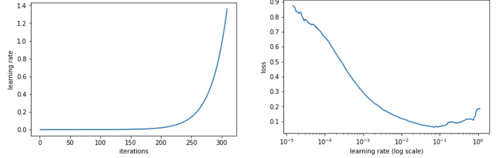
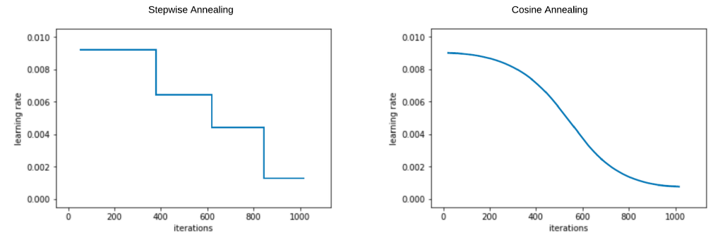
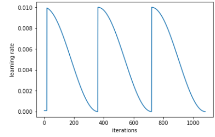
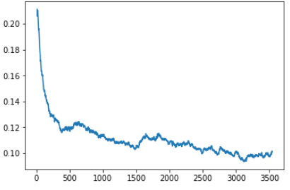
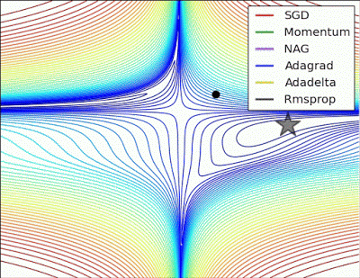
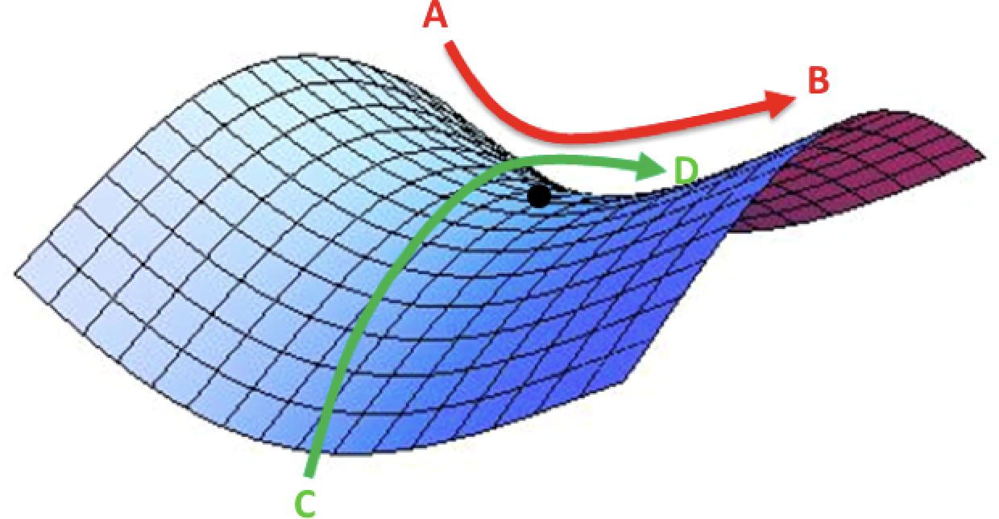
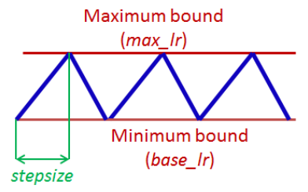

<!-- vscode-markdown-toc -->
- [Lecture 2: CNNs](#Lecture-2-CNNs)
  - [1. Finding an optimal learning rate](#1-a-nameFindinganoptimallearningrateaFinding-an-optimal-learning-rate)
  - [2. learning rate annealing](#2-a-namelearningrateannealingalearning-rate-annealing)
  - [3. stochastic gradient descent with restarts (SGDR)](#3-a-namestochasticgradientdescentwithrestartsSGDRastochastic-gradient-descent-with-restarts-SGDR)
  - [4. Learning rate and fine tuning (differential learning rate annealing)](#4-a-nameLearningrateandfinetuningdifferentiallearningrateannealingaLearning-rate-and-fine-tuning-differential-learning-rate-annealing)
  - [5. Cycling Learning Rate](#5-a-nameCyclingLearningRateaCycling-Learning-Rate)
    - [5.1. One LR for all parameters](#51-a-nameOneLRforallparametersaOne-LR-for-all-parameters)
    - [5.2. Adaptive LR for each parameter](#52-a-nameAdaptiveLRforeachparameteraAdaptive-LR-for-each-parameter)
    - [5.3. Cycling Learning Rate](#53-a-nameCyclingLearningRate-1aCycling-Learning-Rate)
    - [5.4. Why it works ?](#54-a-nameWhyitworksaWhy-it-works)
    - [5.5. Epoch, iterations, cycles and stepsize](#55-a-nameEpochiterationscyclesandstepsizeaEpoch-iterations-cycles-and-stepsize)
  - [6. How to terain a state of the art classifier :](#6-a-nameHowtoterainastateoftheartclassifieraHow-to-terain-a-state-of-the-art-classifier)
  - [7. References:](#7-a-nameReferencesaReferences)

<!-- vscode-markdown-toc-config
	numbering=true
	autoSave=true
	/vscode-markdown-toc-config -->
<!-- /vscode-markdown-toc -->
# Lecture 2: CNNs

##  1. Finding an optimal learning rate

How do we select the “right” learning rate to start training our model? This question is a he heavily debated one in deep learning and fast.ai offers a solution based on a paper from Leslie Smith - Cyclical Learning Rates for training Neural Networks.

  

The idea of the paper is quite simple:

* start with a small learning rate and calculate the loss;
* gradually start increasing the learning rate and each time, calculate the loss;
* once the loss starts to shoot up again, it is time to stop;
* we select the highest learning rate we can find, where the loss is still crearly improving (steepest decrease of the loss).

  

In the figure above, we see that when we increase the learning rate beyond a certain treshold, the loss goes up, this is when we stop our training and choose the lr that gave us the steepest decrease of the loss.

##  2. learning rate annealing

In training deep networks, it is usually helpful to anneal the learning rate over time. Good intuition to have in mind is that with a high learning rate, the system contains too much kinetic energy and the parameter vector bounces around chaotically, unable to settle down into deeper, but narrow parts of the loss function. Knowing when to decay the learning rate can be tricky: Decay it slowly and we'll be wasting computation taking too much time to converge with little improvement for a long time. Decay it too aggressively and the system will cool too quickly, unable to reach the best position it can. There are three common types of implementing the learning rate decay:

* **Step decay:** Reduce the learning rate by some factor every few epochs. Typical values might be reducing the learning rate by a half every 5 epochs, or by 0.1 every 20 epochs. These numbers depend heavily on the type of problem and the model. One heuristic we see in practice is to watch the validation error while training with a fixed learning rate, and reduce the learning rate by a constant (e.g. 0.5) whenever the validation error stops improving.
* **Exponential decay**. has the mathematical form , where α0, k are hyperparameters and t is the iteration number (or the epochs).
* **1/t decay** has the mathematical form  where apha0 and k are hyperparameters and t is the iteration number.

  

In practice, we find that the step decay is slightly preferable because the hyperparameters it involves (the fraction of decay and the step timings in units of epochs) are more interpretable than the hyperparameter k. Lastly, if we can afford the computational budget, err on the side of slower decay and train for a longer time.

##  3. stochastic gradient descent with restarts (SGDR)

With lr annealing, we may find ourselves in a part of the weight space that isn’t very resilient, that is, small changes to the weights may result in big changes to the loss. We want to encourage our model to find parts of the weight space that are both accurate and stable. Therefore, from time to time we increase the learning rate (this is the ‘restarts’ in ‘SGDR’), which will force the model to jump to a different part of the weight space if the current area is “spiky”.

Here’s a picture of how that might look if we reset the learning rates 3 times (in this paper they call it a “cyclic LR schedule”):

  

From the paper [Snapshot Ensembles](https://arxiv.org/abs/1704.00109)

If we plot the learning rate while using “cyclic LR schedule” we get (the value used in the starting point is the one obtained using learning rate finder:

  

The number of epochs between resetting the learning rate is set by cycle length, and the number of times this happens is referred to as the number of cycles. so for epochs=3 and cycle_len=1, we'll do three epochs, one with each cycle.

We can also vary the length of each cycle, where we start with small cycles and the cycle length get multiplied each time.

  

In the figure above, we do three cycles, the original length of the cycle is one epoch, and given that we multiply each time the length by two, we'll get 1 + 2 + 4 = 7 epochs in the end.

Intuitively speaking, if the cycle length is too short, it starts going down to find a good spot, then pops out, and goes down trying to find a good spot and pops out, and never actually get to find a good spot. Earlier on, we want it to do that because it is trying to find a spot that is smoother, but later on, we want it to do more exploring. That is why cycle_mult=2 seems to be a good approach.

##  4. Learning rate and fine tuning (differential learning rate annealing)

When using a pretrained model, we can freeze the weights of all the previous layers but the last one, so we only combine the learned features that the model is capable of outputing and use them to classify our inputs.

Now if we want to fine tune the earlier layers to be more specific to our dataset, and only detect the fetures that will actualy help us, we can use diffent learning rates for each layers.

In other words, for cat/dogs dataset, the previous layers have *already* been trained to recognize imagenet photos (whereas our final layers where randomly initialized), so we want to be careful of not destroying the carefully tuned weights that are already there.

Generally speaking, the earlier layers have more general-purpose features. Therefore we would expect them to need less fine-tuning for new datasets. For this reason we will use different learning rates for different layers: the first few layers will be at say 1e-4, the middle layers at 1e-3, and our FC layers we'll leave at 1e-2, which is the same learning rate we got with the learning rate finder `lr=np.array([1e-4,1e-3,1e-2])`.

And we can see that this kind of approach help us find better local minimas with smaller losses.

  

##  5. Cycling Learning Rate

###  5.1. One LR for all parameters

Typically seen in SGD, a single LR is set at the beginning of the training, and an LR decay strategy is set (step, exponential etc.). This single LR is used to update all parameters. It is gradually decayed with each epoch with the assumption that with time, we reach near to the desired minima, upon which we need to slow down the updates so as not to overshoot it.

  
)

There are many challenges to this approach:

* Choosing an initial LR can be difficult to set in advance (as depicted in above figure).
* Setting an LR schedule (LR update mechanism to decay it over time) is also difficult to be set in advance. They do not adapt to dynamics in data.
* The same LR gets applied to all parameters which might be learning at different rates.
* It is very hard to get out of a saddle point.

###  5.2. Adaptive LR for each parameter
Improved optimizers like AdaGrad, AdaDelta, RMSprop and Adam alleviate much of the above challenges by adapting learning rates for each parameters being trained. With Adadelta, we do not even need to set a default learning rate, as it has been eliminated from the update rule.

  
)

###  5.3. Cycling Learning Rate

CLR was proposed by Leslie Smith in 2015. It is an approach to LR adjustments where the value is cycled between a lower bound and upper bound. By nature, it is seen as a competitor to the adaptive LR approaches and hence used mostly with SGD. But it is possible to use it along with the improved optimizers (mentioned above) with per parameter updates.

CLR is computationally cheaper than the optimizers mentioned above. As the paper says:
*Adaptive learning rates are fundamentally different from CLR policies, and CLR can be combined with adaptive learning rates, as shown in Section 4.1. In addition, CLR policies are computationally simpler than adaptive learning rates. CLR is likely most similar to the SGDR method that appeared recently.*

###  5.4. Why it works ?
As far as intuition goes, conventional wisdom says we have to keep decreasing the LR as training progresses so that we converge with time.

However, counterintuitively it might be useful to periodically vary the LR between a lower and higher threshold. The reasoning is that the periodic higher learning rates within the training help the model come out of any local minimas or saddle points if it ever enters into one, given that the difficulty in minimizing the loss arises from saddle points rather than poor local minima. If the saddle point happens to be an elaborate plateau, lower learning rates can never generate enough gradient to come out of it (or will take enormous time). That’s where periodic higher learning rates help with more rapid traversal of the surface.

  
)

A second benefit is that the optimal LR appropriate for the error surface of the model will in all probability lie between the lower and higher bounds as discussed above. Hence we do get to use the best LR when amortized over time.

###  5.5. Epoch, iterations, cycles and stepsize

An epoch is one run of the training algorithm across the entire training set. If we set a batch size of 100, we get 500 batches in 1 epoch or 500 iterations. The iteration count is accumulated over epochs, so that in epoch 2, we get iterations 501 to 1000 for the same batch of 500, and so one.

With that in mind, a cycle is defined as that many iterations where we want our learning rate to go from a base learning rate to a max learning rate, and back. And a stepsize is half of a cycle. Note that a cycle, in this case, need not fall on the boundary of an epoch, though in practice it does.

  
)

In the above diagram, we set a base lr and max lr for the algorithm, demarcated by the red lines. The blue line suggests the way learning rate is modified (in a triangular fashion), with the x-axis being the iterations. A complete up and down of the blue line is one cycle. And stepsize is half of that.

* Deriving the optimal base lr and max lr: An optimal lower and upper bound of the learning rate can be found by letting the model run for a few epochs, letting the learning rate increase linearly and monitoring the accuracy. We run a complete step by setting stepsize equal to num_iterations (This will make the LR increase linearly and stop as num_iterations is reached). We also set base lr to a minimum value and max lr to a maximum value that we deem fit.
* Deriving the optimal cycle length (or stepsize): The paper suggests, after experimentation, that the stepsize be set to 2-10 times the number of iterations in an epoch. In the previous example, since we had 500 iterations per epoch, setting stepsize from 1000 to 5000 would do. The paper found not much difference in setting stepsize to 2 times num of iterations in an epoch than 8 times so.

##  6. How to terain a state of the art classifier :

1. Use data augmentation and pretrained models
2. Use Cyclical Learning Rates to find highest learning rate where loss is still clearly improving
3. Train last layer from precomputed activations for 1-2 epochs
4. Train last layer with data augmentation for 2-3 epochs with stochastic gradient descent with restarts
5. Unfreeze all layers
6. Set earlier layers to 3x-10x lower learning rate than next higher layer
7. Use Cyclical Learning Rates again
8. Train full network with stochastic gradient descent with restarts with varying length until over-fitting

##  7. References:
* [FastAi lecture 2 notes](https://medium.com/@hiromi_suenaga/deep-learning-2-part-1-lesson-2-eeae2edd2be4)
* [The Cyclical Learning Rate technique](http://teleported.in/posts/cyclic-learning-rate/)