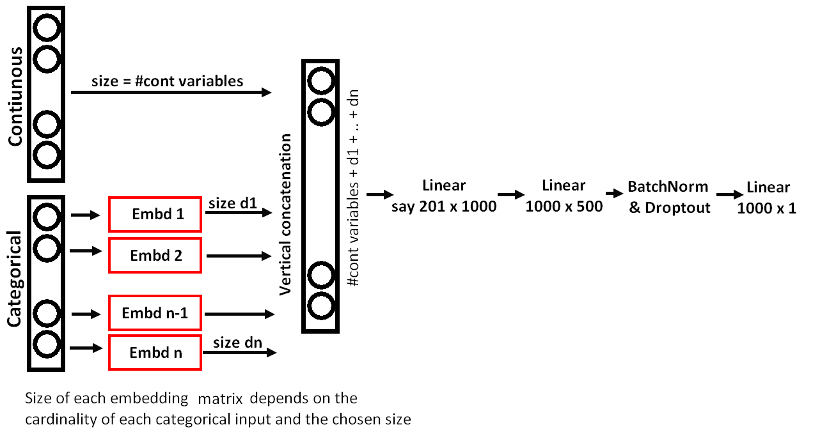
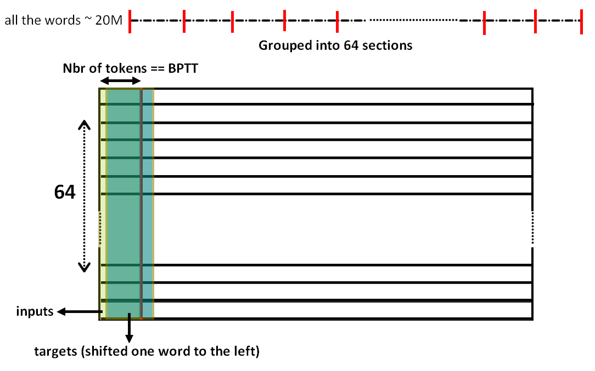
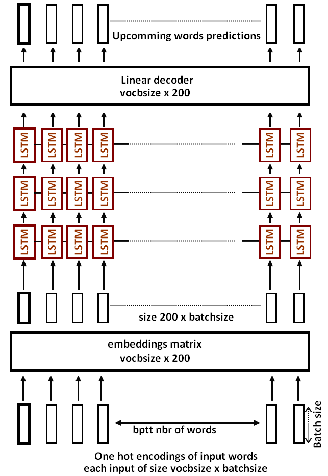
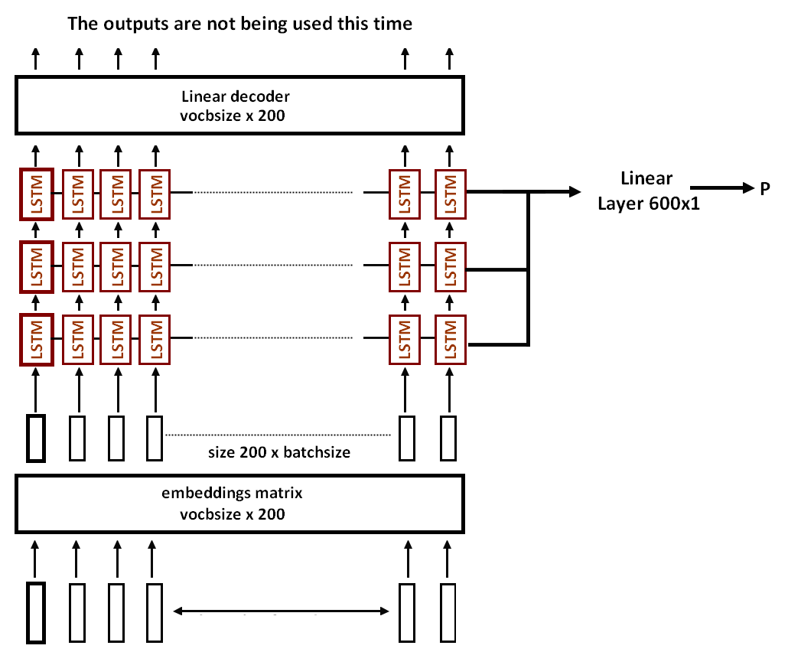

### Structured and Time Series Data

There are two types of columns:

* Categorical — It has a number of “levels” e.g. StoreType, Assortment.
* Continuous — It has a number where differences or ratios of that numbers have some kind of meanings e.g. `CompetitionDistance`.

Numbers like `Year` , `Month`, although we could treat them as continuous, we do not have to. If we decide to make `Year` a categorical variable, we are telling our neural net that for every different “level” of `Year` (2000, 2001, 2002), we can treat it totally differently; where-else if we say it is continuous, it has to come up with some kind of smooth function to fit them. So often things that actually are continuous but do not have many distinct levels (e.g. Year, DayOfWeek), it often works better to treat them as categorical.

Choosing categorical vs. continuous variable is a modeling decision we get to make. In summary, if it is categorical in the data, it has to be categorical. If it is continuous in the data, we get to pick whether to make it continuous or categorical in the model. Generally, floating point numbers are hard to make categorical as there are many levels (Cardinality).

#### Joining the data
In the competition, the winners used additionnal data like state names, google trends and weather, so first we need to joint this dataframes with different sizes, this is done using the `merge` method. The `suffixes` argument describes the naming convention for duplicate fields. We've elected to leave the duplicate field names on the left untouched, and append a "\_y" to those on the right.

`join_df` is a function for joining tables on specific fields. By default, we'll be doing a left outer join of `right` on the `left` argument using the given fields for each table.

```python
def join_df(left, right, left_on, right_on=None, suffix='_y'):
    if right_on is None: right_on = left_on
    return left.merge(right, how='left', left_on=left_on, right_on=right_on, 
                      suffixes=("", suffix))

weather = join_df(weather, state_names, "file", "StateName")
```

Here we join state_names to the right of weather, using the fields on the right of "StateName" in `state_names` and `weather`.

#### Preprocessing

* Turn all the continuous ones into 32bit floating point for pytorch.
* Pull out the dependent variable it into a separate variable, and deletes it from the original data frame. (the value to be predicted is deleted from `df`, and now we have a single column dataframe with the target value).
* Neural nets like to have the input data to all be somewhere around zero with a standard deviation of somewhere around 1. So we take our data, subtract the mean, and divide by the standard deviation to make that happen. It returns a special object which keeps track of what mean and standard deviation it used for that normalization so we can do the same to the test set later (mapper).
* Hnadling missing values — for categorical variable, it becomes ID: 0 and other categories become 1, 2, 3, and so on. For continuous variable, it replaces the missing value with the median and create a new boolean column that says whether it was missing or not.

Now we have a data frame which does not contain the dependent variable and where everything is a number. Now we're ready to deep learning.

#### The model, Embeddings and training:
As per usual, we will start by creating model data object which has a validation set, training set, and optional test set built into it. From that, we will get a learner, we will then optionally call lr_find, then call learn.fit and so forth.

The continus variables are directly fed in to the network, now for the categorical variables, instead of representing them as one hot vectors, we'll embedd into a lower space, using different emebedding matrices depending on the cardinality of the categories of each column, for example, the categories we have and their cardinality :

```python
[('Store', 1116),  ('DayOfWeek', 8),  ('Year', 4),  ('Month', 13),  ('Day', 32),  ('StateHoliday', 3),  ('CompetitionMonthsOpen', 26),  ('Promo2Weeks', 27),  ('StoreType', 5),  ('Assortment', 4),  ('PromoInterval', 4),  ('CompetitionOpenSinceYear', 24),  ('Promo2SinceYear', 9),  ('State', 13),  ('Week', 53),  ('Events', 22),  ('Promo_fw', 7),  ('Promo_bw', 7),  ('StateHoliday_fw', 4),  ('StateHoliday_bw', 4),  ('SchoolHoliday_fw', 9),  ('SchoolHoliday_bw', 9)]
```

Now depending on the cardinality of each one cat we'll chose an embedding size, with a max of 50:

```python
emb_szs = [(c, min(50, (c+1)//2)) for _,c in cat_sz]

[(1116, 50),  (8, 4),  (4, 2),  (13, 7),  (32, 16),  (3, 2),  (26, 13),  (27, 14),  (5, 3),  (4, 2),  (4, 2),  (24, 12),  (9, 5),  (13, 7),  (53, 27),  (22, 11),  (7, 4),  (7, 4),  (4, 2),  (4, 2),  (9, 5),  (9, 5)]
```

So now we have for each column a specific embedding matrice, we pass all the values of each column per their corresponding matrice, so our model we'll have nb_cat embeddings, each one with the specific size ((1116, 50) ... (9, 5)), so now, per example, all the categorical vars are transformed into vectors (50 ..... 5), the total size of all of them cancatenated is 185, now we add the numerical values of the continus variables which are 185, and the inputs of our model is a vector of size 201, and them we add linear layers (201x100 and then 1000x500), batch norm and dropout.

```python
MixedInputModel(
  (embs): ModuleList(
    (0): Embedding(1116, 50)
    (1): Embedding(8, 4)
    (2): Embedding(4, 2)
    (3): Embedding(13, 7)
    (4): Embedding(32, 16)
    (5): Embedding(3, 2)
    .....
    (17): Embedding(7, 4)
    (18): Embedding(4, 2)
    (19): Embedding(4, 2)
    (20): Embedding(9, 5)
    (21): Embedding(9, 5)
  )
  (lins): ModuleList(
    (0): Linear(in_features=201, out_features=1000, bias=True)
    (1): Linear(in_features=1000, out_features=500, bias=True)
  )
  (bns): ModuleList(
    (0): BatchNorm1d(1000, eps=1e-05, momentum=0.1, affine=True, track_running_stats=True)
    (1): BatchNorm1d(500, eps=1e-05, momentum=0.1, affine=True, track_running_stats=True)
  )
  (outp): Linear(in_features=500, out_features=1, bias=True)
  (emb_drop): Dropout(p=0.04)
  (drops): ModuleList(
    (0): Dropout(p=0.001)
    (1): Dropout(p=0.01)
  )
  (bn): BatchNorm1d(18, eps=1e-05, momentum=0.1, affine=True, track_running_stats=True))
```

<p align="center">  </p>

### NLP

#### spaCy
spaCy is a relatively new package for “Industrial strength NLP in Python”. It is designed with the applied data scientist in mind, meaning it does not weigh the user down with decisions over what esoteric algorithms to use for common tasks and it’s fast. Incredibly fast (it’s implemented in Cython). If we are familiar with the Python data science stack, spaCy is the numpy for NLP – it’s reasonably low-level, but very intuitive and performant.

spacy provides a one-stop-shop for tasks commonly used in any NLP project, including:

* Tokenisation.
* Lemmatisation.
* Part-of-speech tagging.
* Entity recognition.
* Dependency parsing.
* Sentence recognition.
* Word-to-vector transformations.
* Many convenience methods for cleaning and normalising text.

Examples:
 * **Lemmatisation** is the process of reducing a word to its base form, its mother word
 * **Tokenising** text is the process of splitting a piece of text into words, symbols, punctuation, spaces and other elements
 * **Part-of-speech tagging** is the process of assigning grammatical properties (e.g. noun, verb, adverb, adjective etc.) to words
 * **Entity recognition** is the process of classifying named entities found in a text into pre-defined categories, such as persons, places, organizations, dates, etc. 

```python
import spacy
nlp = spacy.load("en")
doc = nlp("The big grey dog ate all of the chocolate, but fortunately he wasn't sick!")

# Tokenization
[token.orth_ for token in doc]
''' OUT -> ['The', 'big', 'grey', 'dog', 'ate', 'all', 'of', 'the', 'chocolate', ',', 'but', 'fortunately', 'he', 'was', "n't", ' ', 'sick', '!']'''

# Lemmatization
doc = nlp(""practice practiced practicing" ")
[word.lemma_ for word in doc] 
''' OUT -> [['practice', 'practice', 'practice']]'''

# POS Tagging
doc = nlp("Conor's dog's toy was hidden under the man's sofa in the woman's house")
pos_tags = [(i, i.tag_) for i in doc2]
''' OUT -> [(Conor, 'NNP'), ('s, 'POS'), (dog, 'NN'), ('s, 'POS'), (toy, 'NN'), (was, 'VBD'), (hidden, 'VBN'), (under, 'IN'), (the, 'DT'), (man, 'NN'), ('s, 'POS'), (sofa, 'NN'), (in, 'IN'), (the, 'DT'), (woman, 'NN'), ('s, 'POS'), (house, 'NN')]'''

# Entity recognition
doc = nlp("Barack Obama is an American politician")
[(i, i.label_, i.label) for i in nlp_obama.ents]
''' OUT -> [(Barack Obama, 'PERSON', 346), (American, 'NORP', 347)]'''
```

### Data 

The [large movie view dataset](http://ai.stanford.edu/~amaas/data/sentiment/) contains a collection of 50,000 reviews from IMDB. The dataset contains an even number of positive and negative reviews. A negative review has a score ≤ 4 out of 10, and a positive review has a score ≥ 7 out of 10. Neutral reviews are not included in the dataset. The dataset is divided into training and test sets. The training set is the same 25,000 labeled reviews.

The **sentiment classification task** consists of predicting the polarity (positive or negative) of a given text. However, before we try to classify *sentiment*, we will simply try to create a *language model*; that is, a model that can predict the next word in a sentence. Because our model first needs to understand the structure of English, before we can expect it to recognize positive vs negative sentiment.

First we'll use a similar approach to the one used in image classification, pretrain a model to do one thing (predict the next word), and fine tune it to do something else (classify sentiment).

Unfortunately, given that there aren't any good pretrained language models available to download, we need to create our own. [Dataset](http://files.fast.ai/data/aclImdb.tgz) download link.

#### Preprocessing
Before we can analyze text, we must first tokenize it. This refers to the process of splitting a sentence into an array of words (or more generally, into an array of tokens).

We use Pytorch's `torchtext` library to preprocess our data. First, we create a torchtext field, which describes how to preprocess a piece of text, in this case, we tell torchtext to make everything lowercase, and tokenize it with `spacy` (or NLTK).

```python
TEXT = data.Field(lower=True, tokenize="spacy")
```

We can then save it using `dill`, given python's standard `Pickle` library can't handle this correctly

```python
dill.dump(TEXT, open(f'{PATH}models/TEXT.pkl','wb'))
```

**About** [Dill](https://pypi.org/project/dill/): dill extends python’s pickle module for serializing and de-serializing python objects to the majority of the built-in python types. Serialization is the process of converting an object to a byte stream, and the inverse of which is converting a byte stream back to on python object hierarchy.

We can also acces and constructed vocabulary, and also numericalize the words:

```python
# 'itos': 'int-to-string'
TEXT.vocab.itos[:12]
>>> ['<unk>', '<pad>', 'the', ',', '.', 'and', 'a', 'of', 'to', 'is', 'it', 'in']

TEXT.numericalize([md.trn_ds[0].text[:12]])
>>> Variable containing:    12    35   227   480    13    76    17     2  7319   769     3     2 [torch.cuda.LongTensor of size 12, 1 (GPU 0)]
```

Now, we need to construct our data into batches to feed it to the model, we choose batches of size 64, and a length of 70 (for back propagating through time), so each batch will contain ~ 70 words, it varies, beacuse pytorch adds some randomizing to the process, it vision we can shuffle the images but in NLP the order is important.

So first we start by taking our whole dataset, tolenize it (all the 50,000 texts, both POS and NEG), and then take all the words (~20M) and group them into 64 sections, and each time we take a window of 70 words for our tarining, and the labels are the same batch but shifted one word to the right, given that the objective is to predict the upcomming word (.

<p align="center">  </p>)


And if we see the size of the batches, and display the words by sampling one example of the data loader, we get:
```python
next(iter(md.trn_dl))[0].size()
# Batch sizes
torch.Size([71, 64])

next(iter(md.trn_dl))
# Input and target, the target is flattened for ease computation
(Variable containing:
     12    567      3  ...    2118      4   2399
     35      7     33  ...       6    148     55
    227    103    533  ...    4892     31     10
         ...            ⋱           ...         
     19   8879     33  ...      41     24    733
    552   8250     57  ...     219     57   1777
      5     19      2  ...    3099      8     48
 [torch.cuda.LongTensor of size 77,64 (GPU 0)], Variable containing:
     35
      7
     33
   ⋮   
     22
   3885
  21587
 [torch.cuda.LongTensor of size 4928 (GPU 0)])
```

### The model
We have a number of parameters to set.
```python
em_sz = 200  # size of each embedding vector
nh = 500     # number of hidden activations per layer
nl = 3       # number of layers
```

Researchers have found that large amounts of momentum (which we'll learn about later) don't work well with these kinds of RNN models, so we create a version of the Adam optimizer with less momentum than it's default of 0.9.
```python
opt_fn = partial(optim.Adam, betas=(0.7, 0.99))
```

fastai uses a variant of the state of the art [AWD LSTM Language Model](https://arxiv.org/abs/1708.02182) developed by Stephen Merity. A key feature of this model is that it provides excellent regularization through Dropout.

The model first contains an embedding matrix, that takes as inputs one hot encodings (the size of the vocabulary), and ouputs 200-encondings for each word, and then we pass the 200-vector throught three layers of LSTM (200x500 -> 500x500 -> 500x200) endings up with a new 200-vector encoding, which will hopfully be the coresponding to the next word, so we use a linear decoder to get the probability distribution over all the words in the vocabulary, and in between we use LockedDropout() proposed in [AWD LSTM](https://arxiv.org/abs/1708.02182).

```python
class LockedDropout(nn.Module):
    def __init__(self):
        super().__init__()
    def forward(self, x, dropout=0.5):
        if not self.training or not dropout:
            return x
        m = x.data.new(1, x.size(1), x.size(2)).bernoulli_(1 - dropout)
        mask = Variable(m, requires_grad=False) / (1 - dropout)
        mask = mask.expand_as(x)
        return mask * x
```

<p align="center">  </p>

```python
SequentialRNN(
  (0): RNN_Encoder(
    (encoder): Embedding(13458, 200, padding_idx=1)
    (encoder_with_dropout): EmbeddingDropout(
      (embed): Embedding(13458, 200, padding_idx=1)
    )
    (rnns): ModuleList(
      (0): WeightDrop(
        (module): LSTM(200, 500, dropout=0.05)
      )
      (1): WeightDrop(
        (module): LSTM(500, 500, dropout=0.05)
      )
      (2): WeightDrop(
        (module): LSTM(500, 200, dropout=0.05)
      )
    )
    (dropouti): LockedDropout()
    (dropouths): ModuleList(
      (0): LockedDropout()
      (1): LockedDropout()
      (2): LockedDropout()
    )
  )
  (1): LinearDecoder(
    (decoder): Linear(in_features=200, out_features=13458, bias=False)
    (dropout): LockedDropout()
  ))
```

#### Sentiment

Now we can use the pretrained language model above, and fine tune it for sentiment analysis, but first of all we need to modify the last layer of the model, instead of using an linear decoder for each ouput in the sequence, this time, the RNN will not be many to many, but many to one, so we'll only use the last output, so we can either only calculate the loss using the last output of the RNN, or add a linear layer that takes and last hidden layer and gives us P, P>0.5 if the input is POS and NEG otherwise. the last linear layer will take as input 600-vectors, given that the we have three layer and each one is of each hidden state is 200.

<p align="center">  </p>

And the model is:

```python
SequentialRNN(
  (0): MultiBatchRNN(
    (encoder): Embedding(13458, 200, padding_idx=1)
    (encoder_with_dropout): EmbeddingDropout(
      (embed): Embedding(13458, 200, padding_idx=1)
    )
    (rnns): ModuleList(
      (0): WeightDrop(
        (module): LSTM(200, 500, dropout=0.3)
      )
      (1): WeightDrop(
        (module): LSTM(500, 500, dropout=0.3)
      )
      (2): WeightDrop(
        (module): LSTM(500, 200, dropout=0.3)
      ))
    (dropouti): LockedDropout()
    (dropouths): ModuleList(
      (0): LockedDropout()
      (1): LockedDropout()
      (2): LockedDropout()
    ))
  (1): PoolingLinearClassifier(
    (layers): ModuleList(
      (0): LinearBlock(
        (lin): Linear(in_features=600, out_features=1, bias=True)
        (drop): Dropout(p=0.1)
        (bn): BatchNorm1d(600, eps=1e-05, momentum=0.1, affine=True, track_running_stats=True)
      ))))
```

And because we're fine-tuning a pretrained model, we'll use differential learning rates, and also increase the max gradient for clipping, to allow the SGDR to work better. So first we'll fine tune the last layer, and then unfreeze all the layer and use differential learning rates for fine tunning.

```python
m3.clip=25.
lrs=np.array([1e-4,1e-4,1e-4,1e-3,1e-2])

m3.freeze_to(-1)
m3.fit(lrs/2, 1, metrics=[accuracy])
m3.unfreeze()
m3.fit(lrs, 1, metrics=[accuracy], cycle_len=1)
```

Using this approcah, we end up with state of the art resutls in sentiment classification.

#### References:
* [FastAi lecture 3 notes](https://medium.com/@hiromi_suenaga/deep-learning-2-part-1-lesson-4-2048a26d58aa)
* [Spacy](https://towardsdatascience.com/a-short-introduction-to-nlp-in-python-with-spacy-d0aa819af3ad
)