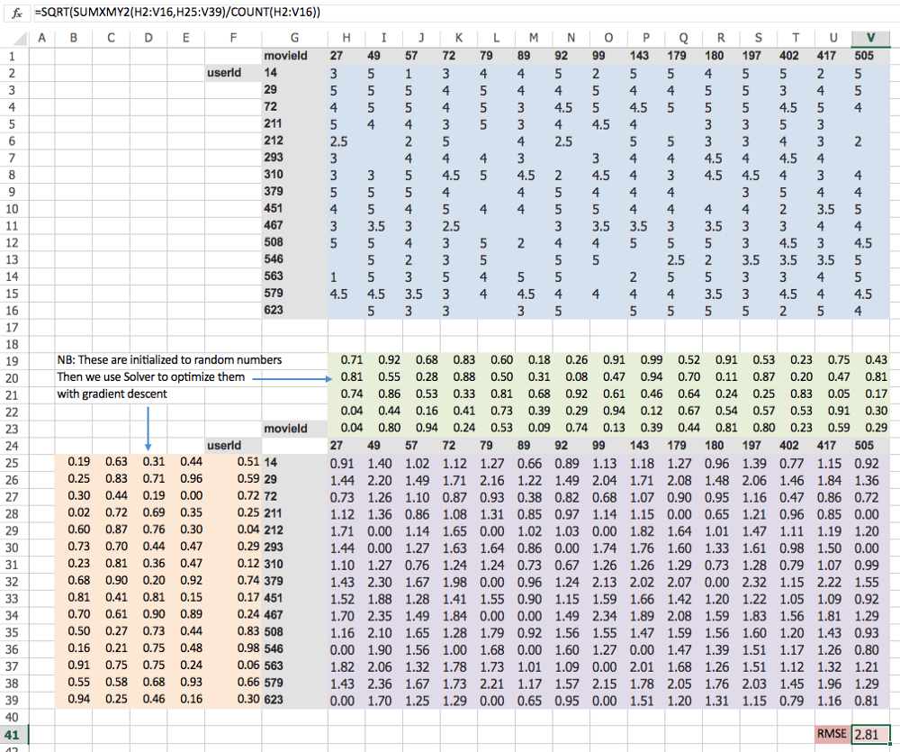
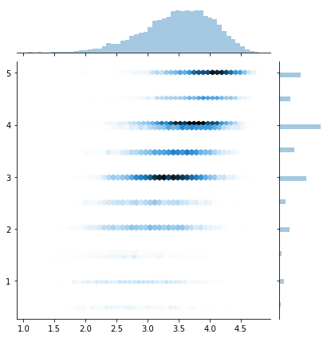
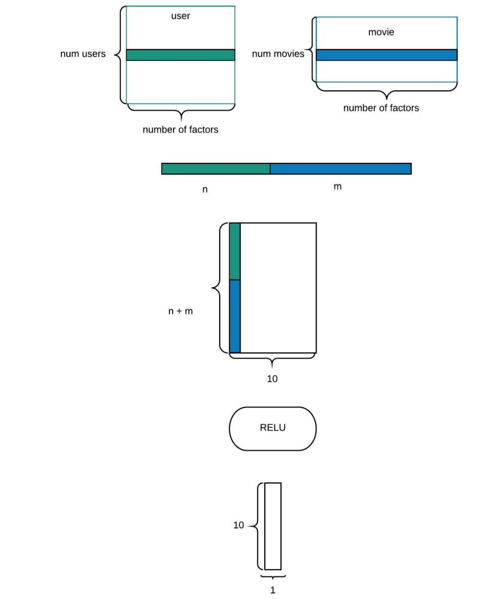

## Collaborative filtering

Collaborative filtering, also referred to as social filtering, filters information by using the recommendations of other people. It is based on the idea that people who agreed in their evaluation of certain items in the past are likely to agree again in the future. A person who wants to see a movie for example, might ask for recommendations from friends. The recommendations of some friends who have similar interests are trusted more than recommendations from others. This information is used in the decision on which movie to see.

Let’s look at collaborative filtering. We are going to look at Movielens dataset. The Movielens dataset is basically is a list of movie ratings by users.

```
!wget  http://files.grouplens.org/datasets/movielens/ml-latest-small.zip
```

In MovieLens dataset, we have a set of users and movies, in the user ratings, each row is one rating given by a user to a movie specified by its ID, and in movies dataframe, each movie is specified by its title and its genres.

```python
ratings = pd.read_csv(path+'ratings.csv')
ratings.head()
```

|  | userId        | movieId       | rating  | timestamp    |
|--|-------------- |:-------------:| -------:| ------------:|
|0 | 1             | 31            | 2.5     | 1260759144   |
|1 | 1             | 1029          | 3.0     | 1260759179   |
|2 | 1             | 1061          | 3.0     | 1260759182   |
|3 | 1             | 1129          | 2.0     | 1260759185   |
|4 | 1             | 1172          | 4.0     | 1260759205   |

```python
movies = pd.read_csv(path+'movies.csv')
movies.head()
```

|  | movieId       | title         | rating  |
|--|-------------- |:-------------:| -------:|
|0 | 1             | Toy Story (1995)                      | Adventure\|Animation\|Children\|Comedy\|Fantasy     |
|1 | 2             | Jumanji (1995)                        | Adventure\|Children\|Fantasy     |
|2 | 3             | Grumpier Old Men (1995)               | Adventure\|Children\|Fantasy     |
|3 | 4             | Waiting to Exhale (1995)              | Comedy\|Drama\|Romance     |
|4 | 5             | Father of the Bride Part II (1995)    | Comedy    |

### Simple example in excel

We'll create a simple example for colaborative filetring in excel, first we'll begin by using a matrix factorization / decomposition instead of building a neural net, we have a matrix containing all the users (rows) and all the movies (columns), and each element of the matrix is the rating given by a certain user to the corresponding movie, if a given user did not rate the movie the element is blank.

And the objective is to learn two embedding matrices, one for the users (each user will characterized by a vector of size 5, that will reflect the user's perferences), and one embedding matrix for the movies, in which each movie will be represented by a vecotr of size 5 to reflec the genre and type of movie, and the objective is to use these two matrices to construct the rating matrix for each user/movies by a simple matrix multiply, and using SGD to adjust the weights of the two embedding matrices to be closer to the ground truth, we'll be able to learn good representation for each user and each movie (we predict 0 for the missing values=).

<p align="center">  </p>

* Blue cells — the actual rating
* Purple cells — our predictions
* Red cell — our loss function i.e. Root Mean Squared Error (RMSE)
* Green cells — movie embeddings (randomly initialized)
* Orange cells — user embeddings (randomly initialized)

### Python version

It is quite possible that user ID’s are not contiguous which makes it hard to use them as an index of embedding matrix. So we will start by creating indices that starts from zero and are contiguous and replace `ratings.userId` column with the index by using Panda’s apply function with an anonymous function `lambda` and do the same for `ratings.movieId`.

```python
u_uniq = ratings.userId.unique() 
user2idx = {o:i for i,o in enumerate(u_uniq)} 
ratings.userId = ratings.userId.apply(lambda x: user2idx[x])  

m_uniq = ratings.movieId.unique() 
movie2idx = {o:i for i,o in enumerate(m_uniq)} 
ratings.movieId = ratings.movieId.apply(lambda x: movie2idx[x])  

n_users=int(ratings.userId.nunique()) n_movies=int(ratings.movieId.nunique())
```

And then we can create our model, by first creating two embedding matrices, each one with outputs of 50 (n_factors), so each movie/user will be represented by a 50 dimensionnal vector, and the we initialize the weights of the embeddings with uniform distribution with zero mean and 0.05 std (close to he initialization). And when we get a given movie / user pairs, we extract the correspondings vector representation for each one in the embedding matrices, and then calculate their dot products and sum it to obtain a possible rating given by the user for the movie.

```python
class EmbeddingDot(nn.Module):
    def __init__(self, n_users, n_movies):
        super().__init__()
        self.u = nn.Embedding(n_users, n_factors)
        self.m = nn.Embedding(n_movies, n_factors)
        self.u.weight.data.uniform_(0,0.05)
        self.m.weight.data.uniform_(0,0.05)

    def forward(self, cats, conts):
        users,movies = cats[:,0],cats[:,1]
        u,m = self.u(users),self.m(movies)
        return (u*m).sum(1)
```

And then we send our model to the GPU and choose an optimizer to train in.

```python
model = EmbeddingDot(n_users, n_movies).cuda()
opt = optim.SGD(model.parameters(), 1e-1, weight_decay=1e-5, momentum=0.9)
```

**Improving the model**, one possible way to improve the model is to add a bias, given that some movies have higher ratings than others, we can also specigy the rage of the outputs / ratings by using a sigmoid to have the output in the range of [0,1], and then and the min rating and multiply by the range of the ratings.

```python
min_rating, max_rating = ratings.rating.min(), ratings.rating.max()

def get_emb(ni,nf):
    e = nn.Embedding(ni, nf)
    e.weight.data.uniform_(-0.01,0.01)
    return e

class EmbeddingDotBias(nn.Module):
    def __init__(self, n_users, n_movies):
        super().__init__()
        (self.u, self.m, self.ub, self.mb) = [get_emb(*o) for o in [
            (n_users, n_factors), (n_movies, n_factors), (n_users,1), (n_movies,1)
        ]]

    def forward(self, cats, conts):
        users,movies = cats[:,0],cats[:,1]
        um = (self.u(users)* self.m(movies)).sum(1)
        res = um + self.ub(users).squeeze() + self.mb(movies).squeeze()
        res = F.sigmoid(res) * (max_rating-min_rating) + min_rating
        return res
```

and we can plot the predictions :

```python
preds = learn.predict()
y=learn.data.val_y[:,0]
sns.jointplot(preds, y, kind='hex', stat_func=None)
```

<p align="center">  </p>

### Neural Net Version

One possible way to also tackle the problem of coloborative filering is to use linear layers to treat both the movie and user representation to predict a given rating, first we create two embeding matrices for the users and movies just like before, the only difference this time, is that instead of multipying them together, for given user and movies, we extract their corresponding embeddings, and we concatenate them together to form a vector of size `n_factors*2`, and feed this vector to a dropout, and then two linear layers, each one followed by a non liearity and a dropout:

```python
class EmbeddingNet(nn.Module):
    def __init__(self, n_users, n_movies, nh=10, p1=0.5, p2=0.5):
        super().__init__()
        (self.u, self.m) = [get_emb(*o) for o in [
            (n_users, n_factors), (n_movies, n_factors)]]
        self.lin1 = nn.Linear(n_factors*2, nh)
        self.lin2 = nn.Linear(nh, 1)
        self.drop1 = nn.Dropout(p1)
        self.drop2 = nn.Dropout(p2)

    def forward(self, cats, conts):
        users,movies = cats[:,0],cats[:,1]
        x = self.drop1(torch.cat([self.u(users),self.m(movies)], dim=1))
        x = self.drop2(F.relu(self.lin1(x)))
        return F.sigmoid(self.lin2(x)) * (max_rating-min_rating+1) + min_rating-0.5
```

<p align="center">  </p>
