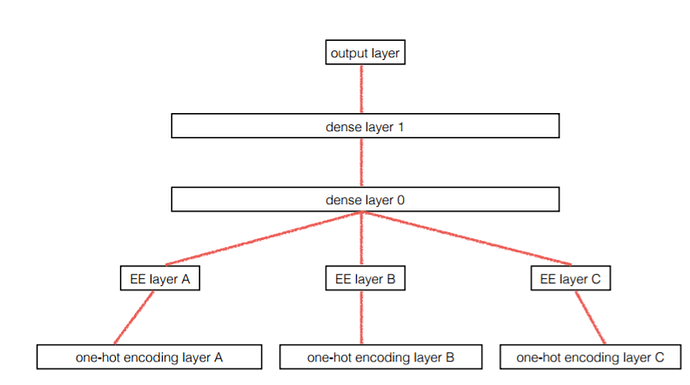

## Collaborative filtering

In the last lecture, we created a simple model for colloborative filtering, first by taking as inputs the one hot encodings of the 9066 movies (in reality only the indices are passed to the lookup table `nn.Embedding`) and the 671 users, and then using the two 50-dimensionnal embeddings to create the score matix, we also add a biad (using `nn.Embedding`) and a sigmoid x the range of the scores, the second approch is to use hidden layers, first the two embeddings are concatenated and then passed to two linear layers and outputing the score for a potential movie / user pair.

### Code snippets

Here is how the dataset for collaborative filtering is written in fastai:

```python
class CollabFilterDataset(Dataset):
    def __init__(self, path, user_col, item_col, ratings):
        self.ratings,self.path = ratings.values.astype(np.float32),path
        self.n = len(ratings)
        (self.users,self.user2idx,self.user_col,self.n_users) = self.proc_col(user_col)
        (self.items,self.item2idx,self.item_col,self.n_items) = self.proc_col(item_col)
        self.min_score,self.max_score = min(ratings),max(ratings)
        self.cols = [self.user_col,self.item_col,self.ratings]

    @classmethod
    def from_data_frame(cls, path, df, user_name, item_name, rating_name):
        return cls(path, df[user_name], df[item_name], df[rating_name])

    @classmethod
    def from_csv(cls, path, csv, user_name, item_name, rating_name):
        df = pd.read_csv(os.path.join(path,csv))
        return cls.from_data_frame(path, df, user_name, item_name, rating_name)

    def proc_col(self,col):
        uniq = col.unique()
        name2idx = {o:i for i,o in enumerate(uniq)}
        return (uniq, name2idx, np.array([name2idx[x] for x in col]), len(uniq))

    def __len__(self): return self.n
    def __getitem__(self, idx): return [o[idx] for o in self.cols]

    def get_data(self, val_idxs, bs):
        val, trn = zip(*split_by_idx(val_idxs, *self.cols))
        return ColumnarModelData(self.path, PassthruDataset(*trn), PassthruDataset(*val), bs)

    def get_model(self, n_factors):
        model = EmbeddingDotBias(n_factors, self.n_users, self.n_items, self.min_score, self.max_score)
        return CollabFilterModel(to_gpu(model))

    def get_learner(self, n_factors, val_idxs, bs, **kwargs):
        return CollabFilterLearner(self.get_data(val_idxs, bs), self.get_model(n_factors), **kwargs)
```

### A deeper look

#### Biases

first let's take a look into the biases and how to interpret them, the created model is as follows:

```python
EmbeddingDotBias (
  (u): Embedding(671, 50)
  (i): Embedding(9066, 50)
  (ub): Embedding(671, 1)
  (ib): Embedding(9066, 1)
)
```

So let's check the biases, we first get the model, and extract the biases for the top 3000 movies, and we sort them using only the biases (we pass to the python built in function `sorted`, the function to be called for each element)

```python
# ratings is the ratings dataframe, and cf is the dataset (code above)
ratings = pd.read_csv(path+'ratings.csv')
# count how many times each movie has been rated
g=ratings.groupby('movieId')['rating'].count()
topMovies=g.sort_values(ascending=False).index.values[:3000]
topMovieIdx = np.array([cf.item2idx[o] for o in topMovies])

m=learn.model
movie_bias = to_np(m.ib(topMovieIdx))
movie_ratings = [(b[0], movie_names[i]) for i,b in zip(topMovies,movie_bias)]
sorted(movie_ratings, key=lambda o: o[0])[:15]
# we could also use itemgetter
sorted(movie_ratings, key=itemgetter(0))[:15]
```

and the results are:
```
[(-0.049937896, 'Sin City (2005)'),
 (-0.049869832, 'Winnie the Pooh and the Blustery Day (1968)'),
 (-0.049756341, 'Bringing Down the House (2003)'),
 (-0.049732186, 'Maltese Falcon, The (1941)'),
 (-0.049730305, 'Fish Called Wanda, A (1988)'),
 (-0.049677063, 'Nell (1994)'),]
```

#### Embedding Interpretation
First we need to reduce the dimension of the embeddings from 50-dimensions to an interpretable amount of dimension (3 in this case), we can use some dimensionnality reduction technique, we choose PCA giving us the main axes with the highest variance of the embedding vectors along them.

```python
from sklearn.decomposition import PCA
pca = PCA(n_components=3)
movie_pca = pca.fit(movie_emb.T).components_
```

let's look at each dimension of the three dimension and try to interpret their meaning:

**1st dimension:** we call it easy watching vs. serious
```python
fac0 = movie_pca[0]
movie_comp = [(f, movie_names[i]) for f,i in zip(fac0, topMovies)]

sorted(movie_comp, key=itemgetter(0), reverse=True)[:10]
```
```
[(0.054308776, 'Bonfire of the Vanities (1990)'),
 (0.052916676, 'Ex Machina (2015)'),
 (0.052070759, 'Falling Down (1993)'),
 ...
 (0.048397031, 'Ella Enchanted (2004)')]
```

same for the other two dimensions (one seems to correlate with high production movies / CGI heavy and the thirs to the artistic and critically acclaimed ones)

#### Reusing the embeddings
As for rossman competition, where the winner used a very similar approach to win the competition, by having different embeddings for each categorical variables and then feeding them to a couple of linear layers.

<p align="center">  </p>

And they then extracted only the embeddings and reused them in other machine learning techniques, and they observe that the performances of other techniques (KNNs, Random forests and gradient bosted machines) increasing significantly.

The type of model used in this case called `MixedInputModel`, it is able to handle inputs consisting of both categorical and continuous variables, we give the model a list of the embedding sizes, the number of the continuous variables (will not be modified), the sized of the hidden layers and the output range. 

```python
def emb_init(x):
   x = x.weight.data
   sc = 2/(x.size(1)+1)
   x.uniform_(-sc,sc)

class MixedInputModel(nn.Module):
    def __init__(self, emb_szs, n_cont, emb_drop, out_sz, szs, drops,
                 y_range=None, use_bn=False):
        super().__init__()
        self.embs = nn.ModuleList([nn.Embedding(c, s) for c,s in emb_szs])
        for emb in self.embs: emb_init(emb)
        n_emb = sum(e.embedding_dim for e in self.embs)
        szs = [n_emb+n_cont] + szs
        self.lins = nn.ModuleList([
            nn.Linear(szs[i], szs[i+1]) for i in range(len(szs)-1)])
        self.bns = nn.ModuleList([
            nn.BatchNorm1d(sz) for sz in szs[1:]])
        for o in self.lins: kaiming_normal(o.weight.data)
        self.outp = nn.Linear(szs[-1], out_sz)
        kaiming_normal(self.outp.weight.data)

        self.emb_drop = nn.Dropout(emb_drop)
        self.drops = nn.ModuleList([nn.Dropout(drop) for drop in drops])
        self.bn = nn.BatchNorm1d(n_cont)
        self.use_bn,self.y_range = use_bn,y_range

    def forward(self, x_cat, x_cont):
        x = [e(x_cat[:,i]) for i,e in enumerate(self.embs)]
        x = torch.cat(x, 1)
        x2 = self.bn(x_cont)
        x = self.emb_drop(x)
        x = torch.cat([x, x2], 1)
        for l,d,b in zip(self.lins, self.drops, self.bns):
            x = F.relu(l(x))
            if self.use_bn: x = b(x)
            x = d(x)
        x = self.outp(x)
        if self.y_range:
            x = F.sigmoid(x)
            x = x*(self.y_range[1] - self.y_range[0])
            x = x+self.y_range[0]
        return x
```

So in the code above, we take all the categorical variables, passed them through the embeddings, concatenate all the embeddings and then also the continous variables, passed them through a set of liner layers, with batch norm and dropout in between, and then one final linear layer to get the correct number of ouputs.

## SGD

Let’s work on solving a simple case of Ax + b. If we can do this we can apply the technique to other problems as well.

We can generate some random data: generate x, and given a and b calculate ax + b with some random noise added:

```python
def lin(a,b,x): return a*x+b

def gen_fake_data(n, a, b):
    x = s = np.random.uniform(0,1,n) 
    y = lin(a,b,x) + 0.1 * np.random.normal(0,3,n)
    return x, y
```

We define the loss function: MSE

```python
def mse(y_hat, y): return ((y_hat - y) ** 2).mean()
def mse_loss(a, b, x, y): return mse(lin(a,b,x), y)
```

We can now generate some random data (pairs of x and y), and loop for a number of iterations, begining with a random intialization of a and b, and each step calculate the loss, computes the gradient of loss with respect to all Variables with `requires_grad=True`. after this call `a.grad` and `b.grad` will be Variables holding the gradient of the loss with respect to a and b respectively, so then we can update a and b using gradient descent (about the types: `a.data` and `b.data` are Tensors, `a.grad` and `b.grad` are Variables and a.grad.data and b.grad.data are Tensors).

```python
learning_rate = 1e-3
for t in range(10000):
    loss = mse_loss(a,b,x,y)
    if t % 1000 == 0: print(loss.data[0])

    loss.backward()
    a.data -= learning_rate * a.grad.data
    b.data -= learning_rate * b.grad.data

    a.grad.data.zero_()
    b.grad.data.zero_()
```

Ploting an animation of the updates (we need to install ffmpeg first):

```python
fig = plt.figure(dpi=100, figsize=(5, 4))
plt.scatter(x,y)
line, = plt.plot(x,lin(a_guess,b_guess,x))
plt.close()

def animate(i):
    line.set_ydata(lin(a_guess,b_guess,x))
    for i in range(30): upd()
    return line,

ani = animation.FuncAnimation(fig, animate, np.arange(0, 20), interval=100)
```

## Recurrent Neural Network

### RNNs as Linear layers

First, let's began with a simple example, predicting the 4th char given the first 3 characters, first we're going to load a text of nietzsche, get all the unique characters, and add a `NULL` or empty character to the vocabulary. We'll use a character based model, these models generally yield better performances, but are very expensive computationnly, so when choosing between word and character based models, we must take into consideration both the performances and costs, and sometimes we might use a combination of the two (pair byte encoding).

```python
text = open(f'{PATH}nietzsche.txt').read()
chars = sorted(list(set(text)))
vocab_size = len(chars)+1
chars.insert(0, "\0")
```

And then we creat a dictionnary to map every character to a unique ID to feed them to the recurrent net, and the inverse to convert the predictions into text, and using the created dicts, convert the whole text into IDs.

```python
char_indices = dict((c, i) for i, c in enumerate(chars))
indices_char = dict((i, c) for i, c in enumerate(chars))
idx = [char_indices[c] for c in text]
```

We create the inputs, at each time step we'll feed the first three character and predict the fourth, in the upcomming time step, we'll start from the position of the character we wanter to predict and the next to as inputs, and so on, so we'll be skiping by 3, and `c1_dat[n+1] == c4_dat[n]`, and we stack the python list to get numpy arrays:

```python
cs = 3
c1_dat = [idx[i]   for i in range(0, len(idx)-cs, cs)]
c2_dat = [idx[i+1] for i in range(0, len(idx)-cs, cs)]
c3_dat = [idx[i+2] for i in range(0, len(idx)-cs, cs)]
c4_dat = [idx[i+3] for i in range(0, len(idx)-cs, cs)]

x1 = np.stack(c1_dat)
x2 = np.stack(c2_dat)
x3 = np.stack(c3_dat)
y = np.stack(c4_dat)
```

#### The model
We'll have three hidden layers, each one gets a character and the activations of the previous layers (the first one gets a zero vector), and weights between the hidden layer are the same (orrange arrow), and the same for the weights between the hidden and output (blue arrow) and input the hidden (green arrow), so we take the IDs of each character, convert them from one hot encodings to embeddings, and feed them to the RNNs in order, and finally take the last represenatation to ouput a probability density over the vocabulary:

<p align="center">  </p>

```python
class Char3Model(nn.Module):
    def __init__(self, vocab_size, n_fac):
        super().__init__()

        self.e = nn.Embedding(vocab_size, n_fac)
        self.l_in = nn.Linear(n_fac, n_hidden)
        self.l_hidden = nn.Linear(n_hidden, n_hidden)
        self.l_out = nn.Linear(n_hidden, vocab_size)

def forward(self, c1, c2, c3):
        in1 = F.relu(self.l_in(self.e(c1)))
        in2 = F.relu(self.l_in(self.e(c2)))
        in3 = F.relu(self.l_in(self.e(c3)))

        h = torch.zeros(in1.size()).cuda()
        h = F.tanh(self.l_hidden(h+in1))
        h = F.tanh(self.l_hidden(h+in2))
        h = F.tanh(self.l_hidden(h+in3))

        return F.log_softmax(self.l_out(h))
```

After that we can creat an instance model, define an optimizer and then train it of our dataset, and see the performances by having it predict the fourth word:

```python
def get_next(inp):
    idxs = torch.from_numpy(np.array([char_indices[c] for c in inp]))
    p = m(*idxs)
    i = np.argmax(torch.numpy(p))
    return chars[i]

get_next('y. ') # 'T'
get_next('ppl') # 'e'
get_next(' th') # 'e'
get_next('and') # ' '
```

### Our first RNN:

<p align="center">  </p>

This time around, we have a similar model as we've seen previously, but we will use the first 8 characters to predict the 9th. Here is how we create inputs and output just like the last time, first we need to recreat out examples to feed to the network with a step of 8 using double list comprehension, so for the first time step we'll use 0–7 to predict 8, and the upcoming one 1–8 to predict 9 and so on ...

```python
cs = 8
c_in_dat = [[idx[i+j] for i in range(cs)] for j in range(len(idx)-cs)]
c_out_dat = [idx[j+cs] for j in range(len(idx)-cs)]

xs = np.stack(c_in_dat, axis=0)
y = np.stack(c_out_dat)
```

The model, the same as for 3 characters, but with a for loop to simplify the process:

```python
class CharLoopModel(nn.Module):
    def __init__(self, vocab_size, n_fac):
        super().__init__()
        self.e = nn.Embedding(vocab_size, n_fac)
        self.l_in = nn.Linear(n_fac, n_hidden)
        self.l_hidden = nn.Linear(n_hidden, n_hidden)
        self.l_out = nn.Linear(n_hidden, vocab_size)

    def forward(self, *cs):
        bs = cs[0].size(0)
        h = torch.zeros(bs, n_hidden).cuda()
        for c in cs:
            inp = F.relu(self.l_in(self.e(c)))
            h = F.tanh(self.l_hidden(h+inp))

        return F.log_softmax(self.l_out(h), dim=-1)
```

Adding vs. Contatenating: in the exmples we've seen until now, we've added the hidden state to the inputs, but generally it's better to concatenate them given that the input state and the hidden state are qualitatively different. Input is the encoding of a character, and h is an encoding of series of characters. So adding them together, we might lose information. now after concatenating them we need to change the sizes of the hidden to input to be size of input + hidden -> hidden:

```python
class CharLoopConcatModel(nn.Module):
    def __init__(self, vocab_size, n_fac):
        super().__init__()
        self.e = nn.Embedding(vocab_size, n_fac)
        self.l_in = nn.Linear(n_fac+n_hidden, n_hidden)
        self.l_hidden = nn.Linear(n_hidden, n_hidden)
        self.l_out = nn.Linear(n_hidden, vocab_size)

    def forward(self, *cs):
        bs = cs[0].size(0)
        h = V(torch.zeros(bs, n_hidden).cuda())
        for c in cs:
            inp = torch.cat((h, self.e(c)), 1)
            inp = F.relu(self.l_in(inp))
            h = F.tanh(self.l_hidden(inp))
        return F.log_softmax(self.l_out(h), dim=-1)
```

### RNN with PyTorch

Now, when implementing RNNs with torch, we'll directly get the for loop automatically and also the INP -> Hidden and H->H layers, and at each time step we'll get the hidden as output, and all we need to do is get the last hidden state and feed it to the output layer or get all the hidden states in case we have sequence to sequence types of predictions:

```python
class CharRnn(nn.Module):
    def __init__(self, vocab_size, n_fac):
        super().__init__()
        self.e = nn.Embedding(vocab_size, n_fac)
        self.rnn = nn.RNN(n_fac, n_hidden)
        self.l_out = nn.Linear(n_hidden, vocab_size)

    def forward(self, *cs):
        bs = cs[0].size(0)
        h = torch.zeros(1, bs, n_hidden)
        inp = self.e(torch.stack(cs))
        outp, h = self.rnn(inp, h)
        return F.log_softmax(self.l_out(outp[-1]), dim=-1)
```

We have in this example a batch of 512 (512 sequences of 8 character (0-7) and the target charcter in position 8), created using fastai library (`md = ColumnarModelData.from_arrays('.', [-1], np.stack([x1,x2,x3], axis=1), y, bs=512)`).

In PyTorch version, a hidden state is rank 3 tensor `h = torch.zeros(1, bs, n_hidden)` (in the previous version, it was rank 2 tensor). so the inputs are of shape  `(seq_len, batch, input_size)`, and `nn.RNN` gives as output all the hidden layers (in our case [8, 512, 256]) and the last hidden one ([1, 512, 256]).

#### Test the model

```python
def get_next_n(inp, n):
    res = inp
    for i in range(n):
        c = get_next(inp)
        res += c
        inp = inp[1:]+c
    return res

get_next_n('for thos', 40)
'for those the same the same the same the same th'
```

This time, we loop n times calling get_next each time, and each time we will replace our input by removing the first character and adding the character we just predicted.

### Multi-output

Now at each time step we'll predict the next character, and to also reduce the redundacies and the computations:

<p align="center">  </p>

We can make it more efficient by taking non-overlapping sets of character this time. Because we are doing multi-output, for an input char 0 to 7, the output would be the predictions for char 1 to 8. So this time the targets Y will be the same as X but shifted one character to the right. This will not make our model any more accurate, but we can train it more efficiently.

```python
class CharSeqRnn(nn.Module):
    def __init__(self, vocab_size, n_fac):
        super().__init__()
        self.e = nn.Embedding(vocab_size, n_fac)
        self.rnn = nn.RNN(n_fac, n_hidden)
        self.l_out = nn.Linear(n_hidden, vocab_size)

    def forward(self, *cs):
        bs = cs[0].size(0)
        h = torch.zeros(1, bs, n_hidden)
        inp = self.e(torch.stack(cs))
        outp, h = self.rnn(inp, h)
        return F.log_softmax(self.l_out(outp), dim=-1)
```

Notice that we are no longer doing outp[-1] since we want to keep all of them. But everything else is identical. One complexity[2:00:37] is that we want to use the negative log-likelihood loss function as before, but it expects two rank 2 tensors (two mini-batches of vectors). But here, we have rank 3 tensor:

* 8 characters (time steps)
* 84 probabilities
* 512 minibatch

And for this case we'll right our custom loss function, we first transpose the first two axes because the target are `batch x seq` and the outputs of the model are `seq x batch`, and then we  flatten the inputs and taget:

```python
def nll_loss_seq(inp, targ):
    sl,bs,nh = inp.size()
    targ = targ.transpose(0,1).contiguous().view(-1)
    return F.nll_loss(inp.view(-1,nh), targ)
```

Note : PyTorch does not generally actually shuffle the memory order when we do things like ‘transpose’, but instead it keeps some internal metadata to treat it as if it is transposed. When we transpose a matrix, PyTorch just updates the metadata . If we ever see an error that says `this tensor is not continuous` , add .contiguous() after it and error goes away.

#### Gradient Explosion

self.rnn(inp, h) is a loop applying the same matrix multiply again and again. If that matrix multiply tends to increase the activations each time, we are effectively doing that to the pothe of 8 — we call this a gradient explosion. We want to make sure the initial l_hidden will not cause our activations on average to increase or decrease. one solution is to initilize the RNN matrix hidden to hidden weights with an indentity matrix :

```python
m.rnn.weight_hh_l0.data.copy_(torch.eye(n_hidden))
```

This was introduced by Geoffrey Hinton in "A Simple Way to Initialize Recurrent Networks of Rectified Linear Units".

### References

* https://forums.fast.ai/t/deeplearning-lecnotes6/8641
* https://medium.com/@hiromi_suenaga/deep-learning-2-part-1-lesson-6-de70d626976c