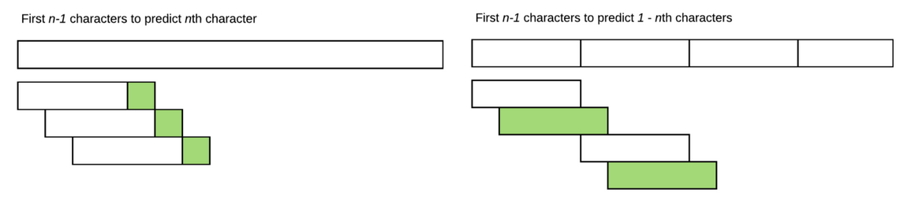

### Continuing With RNNs:

In the last lecture, the first approach we explored, we created a training set, with 8 character and the 9th one as the target, and the next example are the same as the previous, but only shifted one word to the left, so for each example, we are recalculating the states for 7/8 words that we've already seen in the last example, this is very inefficient.

So the solution is to take our corpus, and each time take sections with length 8 characters and the targets are the same but shifted one word to the left, this way we're seeing new examples each time and continuously predicting the next word. the figure (from [Deep Learning 2: Part 1 Lesson 7 by Hiromi Suenaga](https://medium.com/@hiromi_suenaga/deep-learning-2-part-1-lesson-7-1b9503aff0c)) explains the two approaches.

<p align="center">  </p>

#### Stateful RNN

In the last lecture, the way we implemented this, is that at each new section / example, we create a new hiddent state h0 (vector of zeros), and begin the predictions character by character, so for each 8 character, we'll endup needing to start over, and not reuse the computed hidden states, one possible way is to initilize the self.h in the constructor and do the calculation based on the earlier version in the forward method, but in this case, if we have thousands of character, the state of the later ones depend on the first hidden states, and so we need to packpropagate the error all the way to the start, at each time step, this is very computationnaly expensive, and the gradients are very likely to vanish or explode. so we limit the pack propagation to a fixed number of earlier states, the length is called BPTT (back-prop through time), this is implemented using `repackage_var` function:

```python
class CharSeqStatefulRnn(nn.Module):
    def __init__(self, vocab_size, n_fac, bs):
        self.vocab_size = vocab_size
        super().__init__()
        self.e = nn.Embedding(vocab_size, n_fac)
        self.rnn = nn.RNN(n_fac, n_hidden)
        self.l_out = nn.Linear(n_hidden, vocab_size)
        self.init_hidden(bs)

    def forward(self, cs):
        bs = cs[0].size(0)
        if self.h.size(1) != bs: self.init_hidden(bs)
        outp,h = self.rnn(self.e(cs), self.h)
        self.h = repackage_var(h)
        return F.log_softmax(self.l_out(outp), dim=-1).view(-1, self.vocab_size)

    def init_hidden(self, bs): self.h = V(torch.zeros(1, bs, n_hidden))

    def repackage_var(h):
      return Variable(h.data) if type(h) == Variable else tuple(repackage_var(v) for v in h)
```

In the code above, after finishing the calculation for a given sequence, length 8 characters in this case, we only keep the state / values of the hidden varaible, without its history (in case we have a multi layered RNN, we'll have many hidden states, for that we have the excpetion if h is not of type Varaible), in pytorch > 0.4, we only return h.data.

#### Mini batches

The idea, is that instead of passing only one sequence of length BPTT to our RNN to get the outputs per time step (== BPTT) and the last hidden state, we'dd like to pass BTTP x batch size to our RNN, this is can be done by taking all the dataset, and partition it into the number of batches we'd like, say 64, so we take all of the corpus and we divide it into 64 sections, and for each training iteration, we take a sequence of length BPTT (this sequence length might vary =/- 2 tokens to add some randomness to the process, given that in NLP we can shuffle the word) from each one of the 64 sections we created, we end up with 64 sequences of length BPTT, and given that each one was taken from a different section guarantees that we won't have any intersections, the targets are also the same sequences but shifted one token to the left.

<p align="center">  </p>

The total number of batches is vocab_size / (batch_size x BTTP).

Size of batches and BPTT: we must choose the correct values, to not get CUDA out of memory errors, and when BTTP is too high, we might also get INF loss or NAN due to the vanishing grandient.

#### Torch text

We can split our dataset into minibatches using torch text:

```python
TEXT = data.Field(lower=True, tokenize=list)
bs=64; bptt=8; n_fac=42; n_hidden=256

FILES = dict(train=TRN_PATH, validation=VAL_PATH, test=VAL_PATH)
md = LanguageModelData.from_text_files(PATH, TEXT, **FILES, bs=bs, bptt=bptt, min_freq=3)

len(md.trn_dl), md.nt, len(md.trn_ds), len(md.trn_ds[0].text)
(963, 56, 1, 493747)
```

In TorchText, we create Fields which is a description of how to go about pre-processing the text, so we lower case all the tokens, and to create the tokens we pass a tokenizer, in our case we want to transform all the words into characters, and this is simply done using `List` in python, and using the TEXT field we create our dataset, the targets generated and flattened into one dimensionnal arrays.

```python

class ConcatTextDataset(torchtext.data.Dataset):
    def __init__(self, path, text_field, newline_eos=True, encoding='utf-8', **kwargs):
        fields = [('text', text_field)]
        text = []
        if os.path.isdir(path): paths=glob(f'{path}/*.*')
        else: paths=[path]
        for p in paths:
            for line in open(p, encoding=encoding): text += text_field.preprocess(line)
            if newline_eos: text.append('<eos>')

        examples = [torchtext.data.Example.fromlist([text], fields)]
        super().__init__(examples, fields, **kwargs)

    @classmethod
    def splits(cls, train_df=None, val_df=None, test_df=None, keep_nones=False, **kwargs):
        res = (
            cls(train_df, **kwargs),
            cls(val_df, **kwargs),
            map_none(test_df, partial(cls, **kwargs)))  # not required
        return res if keep_nones else tuple(d for d in res if d is not None)

class LanguageModelData():
    def __init__(self, path, field, trn_ds, val_ds, test_ds, bs, bptt, backwards=False, **kwargs):
        self.bs = bs
        self.path = path
        self.trn_ds = trn_ds; self.val_ds = val_ds; self.test_ds = test_ds
        if not hasattr(field, 'vocab'): field.build_vocab(self.trn_ds, **kwargs)

        self.pad_idx = field.vocab.stoi[field.pad_token]
        self.nt = len(field.vocab)

        factory = lambda ds: LanguageModelLoader(ds, bs, bptt, backwards=backwards)
        self.trn_dl = factory(self.trn_ds)
        self.val_dl = factory(self.val_ds)
        self.test_dl = map_none(self.test_ds, factory)  # not required

   @classmethod
   def from_text_files(cls, path, field, train, validation, test=None, bs=64, bptt=70):
      trn_ds, val_ds, test_ds = ConcatTextDataset.splits(
         path, text_field=field, train=train, validation=validation, test=test)
      return cls(path, field, trn_ds, val_ds, test_ds, bs, bptt, **kwargs)
```

In fastai, this is implemented as above, first we create two spits by calling the constructor of `torchtext.data.Dataset`, the results are âsses to `from_text_files` that calls its constructor.

Once we run `LanguageModelData.from_text_files`, TEXT will contain an extra attribute called vocab. `TEXT.vocab.itos` list of unique items in the vocabulary, and `TEXT.vocab.stoi` is a reverse mapping from each item to number.

One last thing we need to correct, it is to check if we are in the last batch of the dataset of not, the last batch is very unlikely to contain and correct number of BPTT sequences, and when that't the case we need to re initialize our hidden states to start over, this is done each time in the last batch of each epoch, in the forward method we add `if self.h.size(1) != bs: self.init_hidden(bs)`

Sometimes, it is better to do a for loop explicitly and only use an RNN cell and not an RNN layer, this give us more options to control the implementation and add more regularization techniques like AWD LSTM:

```python
    def __init__(self, vocab_size, n_fac, bs):
        super().__init__()
        self.vocab_size = vocab_size
        self.e = nn.Embedding(vocab_size, n_fac)
        self.rnn = nn.RNNCell(n_fac, n_hidden)
        self.l_out = nn.Linear(n_hidden, vocab_size)
        self.init_hidden(bs)

    def forward(self, cs):
        bs = cs[0].size(0)
        if self.h.size(1) != bs: self.init_hidden(bs)
        outp = []
        o = self.h
        for c in cs:
            o = self.rnn(self.e(c), o)
            outp.append(o)
        outp = self.l_out(torch.stack(outp))
        self.h = repackage_var(o)
        return F.log_softmax(outp, dim=-1).view(-1, self.vocab_size)

    def init_hidden(self, bs): self.h = V(torch.zeros(1, bs, n_hidden))
```

#### GRU / LSTMs

In practice, we don't use vanilla RNN, but either LSTM (with two hidden variables this time H and C) or GRU, that control what we need to keep or forget for each time step depending on the current input and the hidden states, and then update the internal hidden state in the current time step depending on wheter we deleted some elements or not, the only thing we need to change is the type of layer we create, and if it is an LSTM add one more hidden state, and we can also add more layer with dropout between them:

```python
class CharSeqStatefulLSTM(nn.Module):
    def __init__(self, vocab_size, n_fac, bs, nl):
        super().__init__()
        self.vocab_size,self.nl = vocab_size,nl
        self.e = nn.Embedding(vocab_size, n_fac)
        self.rnn = nn.LSTM(n_fac, n_hidden, nl, dropout=0.5)
        self.l_out = nn.Linear(n_hidden, vocab_size)
        self.init_hidden(bs)

    def forward(self, cs):
        bs = cs[0].size(0)
        if self.h[0].size(1) != bs: self.init_hidden(bs)
        outp,h = self.rnn(self.e(cs), self.h)
        self.h = repackage_var(h)
        return F.log_softmax(self.l_out(outp), dim=-1).view(-1, self.vocab_size)

    def init_hidden(self, bs):
        self.h = (V(torch.zeros(self.nl, bs, n_hidden)),
                  V(torch.zeros(self.nl, bs, n_hidden)))
```

#### Testing :

```python
def get_next(inp):
    idxs = TEXT.numericalize(inp)
    p = m(VV(idxs.transpose(0,1)))
    r = torch.multinomial(p[-1].exp(), 1)
    return TEXT.vocab.itos[to_np(r)[0]]

def get_next_n(inp, n):
    res = inp
    for i in range(n):
        c = get_next(inp)
        res += c
        inp = inp[1:]+c
    return res

print(get_next_n('for thos', 400))
```

To test out trained model, we start by seeding a sequence of 8 character, and at each time we numericalize the characters, pass them through the model, and to add some variance to the output, we don't take the argmax this time, but we sample randomly given the output probabilities for the upcoming character (p[-1]).

### Computer Vision, CIFAR 10

We begin by doing image classification, we create our dataloader with some data augmentation (H flip, zero badding around the edges and random crop of 32x32), we create a simple net 3 dense layers net, of sizes 32x32x32 -> 40 -> 10 classes, using `nn.ModuleList`:

```python
layers = [32*32*3, 40,10]
# In init
self.layers = nn.ModuleList([
            nn.Linear(layers[i], layers[i + 1]) for i in range(len(layers) - 1)])
# In forward
for l in self.layers:
    l_x = l(x)
    x = F.relu(l_x)
```

And then, as always, we find the right learning rate, and use learning rate finder and train the model.

After that, we replace the dense / linear layers with three 3x3 CNN layers with channels: 3 -> 20, 20 -> 40, 40 -> 80, and then we use an adaptive max pooling to turn the spatil dimension into 1 x 1 with the number of channels == 80, so the last feature map is of size 1 x 1 x 80, and then a fully connected layer 80 -> 10.

```python
class ConvLayer(nn.Module):
    def __init__(self, ni, nf):
        super().__init__()
        self.conv = nn.Conv2d(ni, nf, kernel_size=3, stride=2, padding=1)

    def forward(self, x): return F.relu(self.conv(x))

class ConvNet(nn.Module):
    def __init__(self, layers, c):
        super().__init__()
        self.layers = nn.ModuleList([ConvLayer(layers[i], layers[i + 1])
            for i in range(len(layers) - 1)])
        self.out = nn.Linear(layers[-1], c)

    def forward(self, x):
        for l in self.layers: x = l(x)
        x = F.adaptive_max_pool2d(x, 1)
        x = x.view(x.size(0), -1)
        return F.log_softmax(self.out(x), dim=-1)
```

Given that adaptive pooling / relu, does not have any weights, it is better to add them as functions in forward function, rather than layers in the constructor

#### BatchNorm

When we try to add more layers we get into some trouble while training, where we can't use large learning rates, and we need to choose small learning rates and the training takes a lot of time. To fix this, we need to use batch norm layers between conv layers, to scales the activations with unit variance and zero mean, so that the changes of the upcoming layers will not effect the earlier ones.

```python
class BnLayer(nn.Module):
    def __init__(self, ni, nf, stride=2, kernel_size=3):
        super().__init__()
        self.conv = nn.Conv2d(ni, nf, kernel_size=kernel_size, 
                              stride=stride, bias=False, padding=1)
        self.a = nn.Parameter(torch.zeros(nf,1,1))
        self.m = nn.Parameter(torch.ones(nf,1,1))

    def forward(self, x):
        x = F.relu(self.conv(x))
        x_chan = x.transpose(0,1).contiguous().view(x.size(1), -1)
        if self.training:
            self.means = x_chan.mean(1)[:,None,None]
            self.stds  = x_chan.std (1)[:,None,None]
        return (x-self.means) / self.stds *self.m + self.a
```

To implement this, we calculate the mean of each channel or each filter and standard deviation of each channel or each filter, and then hen subtract the means and divide by the standard deviations, and multiply and add two learnable parameters to give  the model the possibility to learn different variance and mean if the its beneficial, to define the trainble parameters in pytorch, we use `nn.Parameter`.

The other thing batch norm does is that it regularizes, in other words, we can often decrease or remove dropout or weight decay. The reason why is each mini-batch is going to have a different mean and a different standard deviation to the previous mini-batch. So they keep changing and it is changing the meaning of the filters in a subtle way acting as a noise (i.e. regularization). 

In the DL frameworks, it is implemented as exponentially weighted moving average of the standard deviation and mean through out the training, and we go to the inference model, we use the same running averages we used in the training.

With a pre-trained network, we need to be very careful about seeting the parameters of the BatchNorm to train, since will be also changing the running mean and variance, so it is better to also freeze the batch norm layers we doing fine tunning.

We genrally add Relu after batch norm, even if in the original paper they used batch norm after the relu, but in the abalation studies done later on, people found that it is better to add the relu after the batch norm.

#### Residuals

In residual the outputs are : y = x + f(x), where x is prediction from the previous layer, y is prediction from the current layer. in other words, the function we're trying to learn, f(x) = y − x is called a residual. The residual is the error in terms of what we have calculated so far. What this is saying is that try to find a set of convolutional weights that attempts to fill in the amount we were off by. So in other words, we have an input, and we have a function which tries to predict the error (i.e. how much we are off by). Then we add a prediction of how much we were wrong by to the input, then add another prediction of how much we were wrong by that time, and repeat that layer after layer, zooming into the correct answer. This is based on a theory called boosting.

```python
class ResnetLayer(BnLayer):
    def forward(self, x): return x + super().forward(x)

class Resnet(nn.Module):
    def __init__(self, layers, c, p=0.5):
        super().__init__()
        self.conv1 = BnLayer(3, 16, stride=1, kernel_size=7)
        self.layers = nn.ModuleList([BnLayer(layers[i], layers[i+1])
            for i in range(len(layers) - 1)])
        self.layers2 = nn.ModuleList([ResnetLayer(layers[i+1], layers[i + 1], 1)
            for i in range(len(layers) - 1)])
        self.layers3 = nn.ModuleList([ResnetLayer(layers[i+1], layers[i + 1], 1)
            for i in range(len(layers) - 1)])
        self.out = nn.Linear(layers[-1], c)
        self.drop = nn.Dropout(p)

    def forward(self, x):
        x = self.conv1(x)
        for l,l2,l3 in zip(self.layers, self.layers2, self.layers3):
            x = l3(l2(l(x)))
        x = F.adaptive_max_pool2d(x, 1)
        x = x.view(x.size(0), -1)
        x = self.drop(x)
        return F.log_softmax(self.out(x), dim=-1)

model = Resnet2([16, 32, 64, 128, 256], 10, 0.2)
```

The full ResNet does two convolutions before it gets added back to the original input.

#### Class Activation Maps (CAM)

One way to visuals how our model males some predictions, is to use CAM. what we do is to create a CNN network, where in the last layer will have C x H x W, where we have C number of channels that are equal to the number of classes, and after adaptive pooling will endup with C x 1 x 1, so each channel is reponsible for detecting one of the classes, say we have 2 x 7 x 7 for Dogs vs. Cats problem, and our model predicted cats, so we take the channel responsible for cats, and upsample it the size of the input image, and plot it, and we see a heat map, on where the model focuses to make such a prediction.

<p align="center">  </p>

To implemnet this on pytorch, we need to get the activations of the conv layers (the last one specifically), and this is done use a forward hook, “Hook” is the mechanism that lets us ask the model to return the activation. `register_forward_hook` asks PyTorch that every time it calculates a layer it runs the function given, sort of like a callback that happens every time it calculates a layer.

```python
class SaveFeatures():
    features=None
    def __init__(self, m):
        self.hook = m.register_forward_hook(self.hook_fn)
    def hook_fn(self, module, input, output):
        self.features = to_np(output)
    def remove(self): self.hook.remove()

sf = SaveFeatures(m[-4])
output = m(image.cuda())
sf.remove()

prediction = np.exp(to_np(py)[0])
# array([ 1.,  0.], dtype=float32)

feat = np.maximum(0, sf.features[0])
F.upsample(feat, image.size()[2:])
```

So we pass the image through the model, get the last activations, remove them from the GPU memory, and get the first dim given that our prediction is a cat, and upsample these features.
